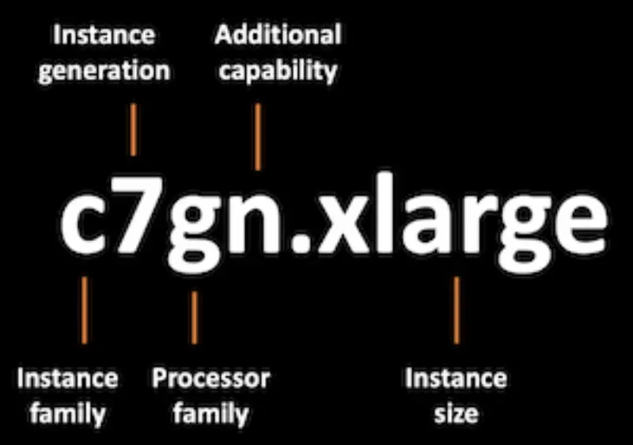

::required-time

:::tip 시작하기 전에
이 섹션을 위한 환경을 준비하세요:

```bash
$ prepare-environment fundamentals/mng/graviton
```

:::

온디맨드 또는 스팟 인스턴스를 사용하든, AWS는 EC2 및 EC2 기반 EKS 관리형 노드 그룹을 위한 3가지 프로세서 유형을 제공합니다. 고객은 Intel, AMD, ARM(AWS Graviton) 프로세서 중에서 선택할 수 있습니다. [AWS Graviton 프로세서](https://aws.amazon.com/ec2/graviton/)는 Amazon EC2에서 실행되는 클라우드 워크로드에 대해 최상의 가격 대비 성능을 제공하도록 AWS가 설계했습니다.

그라비톤 기반 인스턴스는 [인스턴스 유형 명명 규칙](https://docs.aws.amazon.com/AWSEC2/latest/UserGuide/instance-types.html#instance-type-names)의 프로세서 제품군 섹션에서 문자 `g`로 식별할 수 있습니다.



AWS Graviton 프로세서는 [AWS Nitro System](https://aws.amazon.com/ec2/nitro/?p=pm&pd=graviton&z=3)을 기반으로 구축되었습니다. AWS는 호스트 하드웨어의 거의 모든 컴퓨팅 및 메모리 리소스를 인스턴스에 제공하기 위해 AWS Nitro System을 구축했습니다. 이는 하이퍼바이저 기능과 관리 기능을 호스트에서 분리하여 전용 하드웨어와 소프트웨어로 오프로드함으로써 달성됩니다. 가상 머신과 동일한 물리적 호스트에서 하이퍼바이저 소프트웨어를 실행하는 전통적인 가상화 플랫폼과 달리 더 나은 전반적인 성능을 제공합니다. AWS Nitro System은 인기 있는 Linux 운영 체제와 함께 AWS 및 독립 소프트웨어 벤더의 많은 인기 있는 애플리케이션 및 서비스를 지원합니다.

## Graviton 프로세서를 통한 다중 아키텍처 (Multi-Architecture)

:::info
AWS Graviton은 ARM 호환 컨테이너 이미지가 필요하며, 이상적으로는 Graviton과 x86 인스턴스 유형 모두와 호환되는 다중 아키텍처(ARM64 및 AMD64) 이미지가 필요합니다.
:::

Graviton 프로세서는 비교 가능한 5세대 x86 기반 인스턴스보다 최대 20% 낮은 비용, 최대 40% 더 나은 가격 대비 성능, 최대 60% 적은 에너지 소비를 제공하는 인스턴스로 관리형 노드 그룹의 EKS 경험을 향상시킵니다. Graviton 기반 EKS 관리형 노드 그룹은 Graviton 프로세서가 있는 EC2 Auto Scaling Group을 시작합니다.

EKS 관리형 노드 그룹에 Graviton 기반 인스턴스를 추가하면 다중 아키텍처 인프라가 도입되고 애플리케이션이 서로 다른 CPU에서 실행되어야 합니다. 이는 애플리케이션 코드가 서로 다른 명령어 세트 아키텍처(ISA) 구현으로 제공되어야 함을 의미합니다. 팀이 Graviton 기반 인스턴스로 애플리케이션을 계획하고 이식하는 데 도움이 되는 다양한 리소스가 있습니다. 유용한 리소스는 [Graviton 도입 계획](https://pages.awscloud.com/rs/112-TZM-766/images/Graviton%20Challenge%20Plan.pdf)과 [Graviton용 이식 어드바이저](https://github.com/aws/porting-advisor-for-graviton)를 확인하세요.


:::tip
[Retail Store 샘플 웹 애플리케이션](https://github.com/aws-containers/retail-store-sample-app/tree/main#application-architecture) 아키텍처에는 [x86-64와 ARM64 CPU 아키텍처 모두를 위한 미리 빌드된 컨테이너 이미지](https://gallery.ecr.aws/aws-containers/retail-store-sample-ui)가 포함되어 있습니다.
:::

Graviton 인스턴스를 사용할 때는 ARM CPU 아키텍처용으로 빌드된 컨테이너만 Graviton 인스턴스에 스케줄링되도록 해야 합니다. 여기서 테인트(Taints)와 톨러레이션(Tolerations)이 도움이 됩니다.

## 테인트(Taint)와 토러레이션(Toleration)

테인트(Taint)는 특정 Pod를 배척하는 노드의 속성입니다. 톨러레이션(Toleration)은 일치하는 테인트가 있는 노드에 스케줄링을 허용하기 위해 pod에 적용됩니다. 테인트와 톨러레이션은 함께 작동하여 Pod가 부적절한 노드에 스케줄링되지 않도록 합니다.

테인트된 노드의 구성은 특정  Pod만 특수 하드웨어(Graviton 기반 인스턴스나 부착된 GPU와 같은)가 있는 특정 노드 그룹에 스케줄링되어야 하는 시나리오에서 유용합니다. 이 실습에서는 관리형 노드 그룹에 대한 테인트를 구성하는 방법과 Graviton 기반 프로세서에서 실행되는 테인트된 노드를 사용하도록 애플리케이션을 설정하는 방법을 배울 것입니다.
