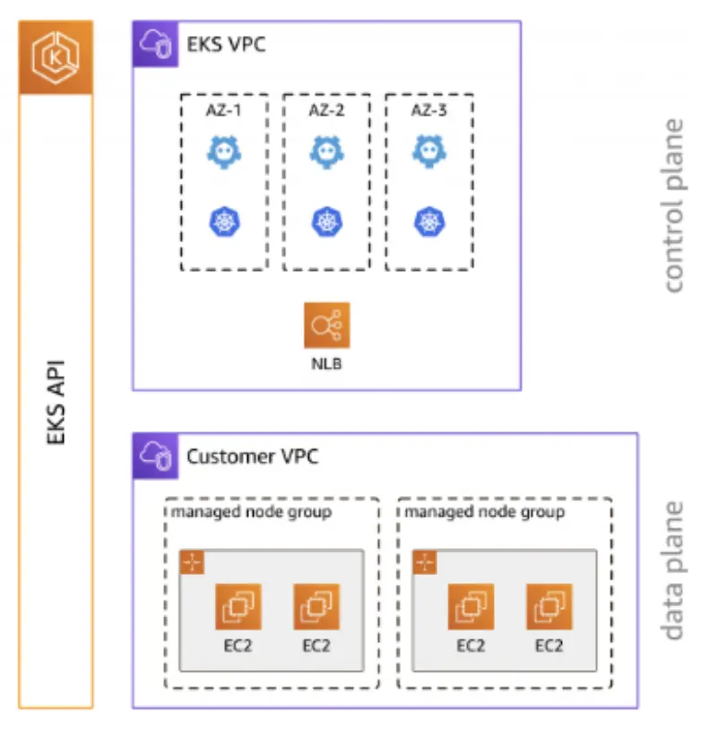

EKS 클러스터는 Pod가 스케줄링되는 하나 이상의 EC2 노드를 포함합니다. EKS 노드는 AWS 계정에서 실행되며 클러스터 API 서버 엔드포인트를 통해 클러스터의 컨트롤 플레인에 연결됩니다. 노드 그룹에 하나 이상의 노드를 배포합니다. 노드 그룹은 EC2 Auto Scaling Group에 배포된 하나 이상의 EC2 인스턴스입니다.

EKS 노드는 표준 Amazon EC2 인스턴스입니다. EC2 가격을 기준으로 요금이 청구됩니다. 자세한 내용은 [Amazon EC2 요금](https://aws.amazon.com/ec2/pricing/)을 참조하세요.

[Amazon EKS 관리형 노드 그룹](https://docs.aws.amazon.com/eks/latest/userguide/managed-node-groups.html)은 Amazon EKS 클러스터의 노드 프로비저닝과 수명 주기 관리를 자동화합니다. 이는 새로운 AMI나 Kubernetes 버전 배포를 위한 롤링 업데이트와 같은 운영 활동을 크게 단순화합니다.

Amazon EKS 관리형 노드 그룹(MNG) 실행의 장점은 다음과 같습니다:

* Amazon EKS 콘솔, `eksctl`, AWS CLI, AWS API, AWS CloudFormation 및 Terraform을 포함한 인프라스트럭처 코드 도구를 사용하여 단일 작업으로 노드를 생성, 자동 업데이트 또는 종료
* 최신 Amazon EKS 최적화 AMI를 사용하여 프로비저닝된 노드 실행
* MNG의 일부로 프로비저닝된 노드는 가용 영역, CPU 아키텍처 및 인스턴스 유형과 같은 메타데이터로 자동 태그 지정
* 노드 업데이트 및 종료 시 애플리케이션이 계속 사용 가능하도록 자동으로 정상적인 노드 드레이닝 수행
* Amazon EKS 관리형 노드 그룹 사용에 대한 추가 비용 없음, 프로비저닝된 AWS 리소스에 대해서만 비용 지불

이 섹션의 실습은 EKS 관리형 노드 그룹을 사용하여 클러스터에 컴퓨팅 용량을 제공하는 다양한 방법을 다룹니다.
