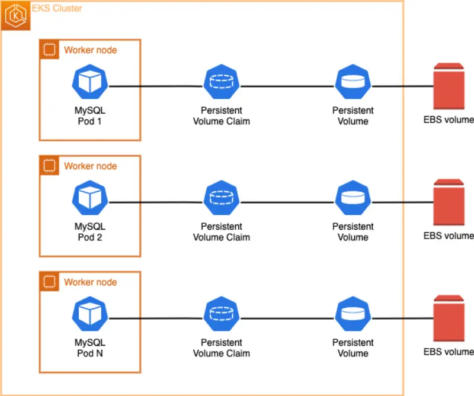
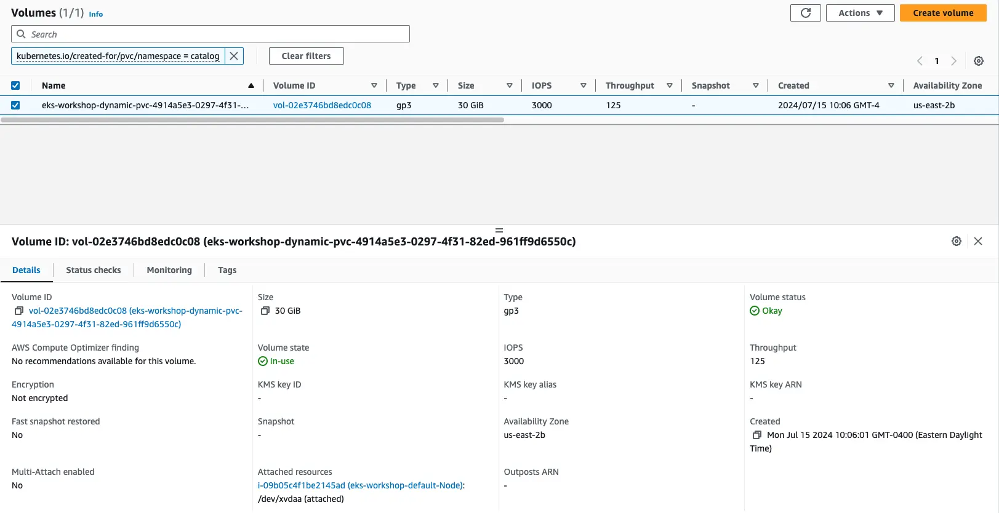

이제 [StatefulSets](https://kubernetes.io/docs/concepts/workloads/controllers/statefulset/)와 [동적 볼륨 프로비저닝](https://kubernetes.io/docs/concepts/storage/dynamic-provisioning/)을 이해했으니, Catalog 마이크로서비스의 MySQL DB를 변경하여 데이터베이스 파일을 영구적으로 저장할 새로운 EBS 볼륨을 프로비저닝 해 보겠습니다.



Kustomize를 사용하여 다음 두 가지를 수행할 것입니다:

* EBS 볼륨을 사용하는 catalog 컴포넌트의 MySQL 데이터베이스를 위한 새로운 StatefulSet 생성
* 이 새로운 버전의 데이터베이스를 사용하도록 `catalog` 컴포넌트 업데이트

:::info
왜 기존 StatefulSet을 업데이트하지 않나요? 업데이트 해야 하는 필드들이 불변이어서 변경할 수 없기 때문입니다.
:::

다음은 새로운 `catalog` 데이터베이스 StatefulSet입니다:

```file
manifests/modules/fundamentals/storage/ebs/statefulset-mysql.yaml
```

`volumeClaimTemplates` 필드를 보면 Kubernetes에게 동적 볼륨 프로비저닝을 사용하여 새로운 EBS 볼륨, [영구 볼륨(PV)](https://kubernetes.io/docs/concepts/storage/persistent-volumes/), [영구 볼륨 클레임(PVC)](https://kubernetes.io/docs/concepts/storage/persistent-volumes/#persistentvolumeclaims)을 모두 자동으로 생성하도록 지시하고 있습니다.

다음은 새로운 StatefulSet을 사용하도록 catalog 컴포넌트 자체를 재구성하는 방법입니다:

```kustomization
modules/fundamentals/storage/ebs/deployment.yaml
Deployment/catalog
```

변경사항을 적용하고 새로운 Pod가 배포될 때까지 기다립니다:

```bash
$ kubectl apply -k ~/environment/eks-workshop/modules/fundamentals/storage/ebs/
$ kubectl rollout status --timeout=100s statefulset/catalog-mysql-ebs -n catalog
```

이제 새로 배포된 StatefulSet이 실행 중인지 확인해보겠습니다:

```bash
$ kubectl get statefulset -n catalog catalog-mysql-ebs
NAME                READY   AGE
catalog-mysql-ebs   1/1     79s
```

`catalog-mysql-ebs` StatefulSet을 검사해보면, 이제 30GiB 크기와 `storageClassName`이 ebs-csi-driver인 PersistentVolumeClaim이 연결되어 있는 것을 볼 수 있습니다.

```bash
$ kubectl get statefulset -n catalog catalog-mysql-ebs \
  -o jsonpath='{.spec.volumeClaimTemplates}' | jq .
[
  {
    "apiVersion": "v1",
    "kind": "PersistentVolumeClaim",
    "metadata": {
      "creationTimestamp": null,
      "name": "data"
    },
    "spec": {
      "accessModes": [
        "ReadWriteOnce"
      ],
      "resources": {
        "requests": {
          "storage": "30Gi"
        }
      },
      "storageClassName": "ebs-csi-default-sc",
      "volumeMode": "Filesystem"
    },
    "status": {
      "phase": "Pending"
    }
  }
]
```

동적 볼륨 프로비저닝이 어떻게 자동으로 영구 볼륨(PV)을 생성했는지 분석할 수 있습니다:

```bash
$ kubectl get pv | grep -i catalog
pvc-1df77afa-10c8-4296-aa3e-cf2aabd93365   30Gi       RWO            Delete           Bound         catalog/data-catalog-mysql-ebs-0          gp2                            10m
```

[AWS CLI](https://aws.amazon.com/cli/)를 사용하여 자동으로 생성된 Amazon EBS 볼륨을 확인할 수 있습니다:

```bash
$ aws ec2 describe-volumes \
    --filters Name=tag:kubernetes.io/created-for/pvc/name,Values=data-catalog-mysql-ebs-0 \
    --query "Volumes[*].{ID:VolumeId,Tag:Tags}" \
    --no-cli-pager
```

원하시면 [AWS 콘솔](https://console.aws.amazon.com/ec2/home#Volumes)에서도 확인할 수 있습니다. 키가 `kubernetes.io/created-for/pvc/name`이고 값이 `data-catalog-mysql-ebs-0`인 태그가 있는 EBS 볼륨을 찾아보세요:



새로 연결된 EBS 볼륨을 Linux OS에서 확인하려면, 다음 지침을 실행하여 `catalog-mysql-ebs` 컨테이너에서 셸 명령을 실행하세요. 마운트된 파일 시스템을 검사할 것입니다:

```bash
$ kubectl exec --stdin catalog-mysql-ebs-0  -n catalog -- bash -c "df -h"
Filesystem      Size  Used Avail Use% Mounted on
overlay         100G  7.6G   93G   8% /
tmpfs            64M     0   64M   0% /dev
tmpfs           3.8G     0  3.8G   0% /sys/fs/cgroup
/dev/nvme0n1p1  100G  7.6G   93G   8% /etc/hosts
shm              64M     0   64M   0% /dev/shm
/dev/nvme1n1     30G  211M   30G   1% /var/lib/mysql
tmpfs           7.0G   12K  7.0G   1% /run/secrets/kubernetes.io/serviceaccount
tmpfs           3.8G     0  3.8G   0% /proc/acpi
tmpfs           3.8G     0  3.8G   0% /sys/firmware
```

`/var/lib/mysql`에 현재 마운트되어 있는 디스크를 확인해보세요. 이는 영구적으로 저장되는 상태 저장 MySQL 데이터베이스 파일을 위한 EBS 볼륨입니다.

이제 우리의 데이터가 실제로 영구적인지 테스트해보겠습니다. 이 모듈의 첫 번째 섹션에서 했던 것과 똑같은 방법으로 `test.txt` 파일을 생성해보겠습니다:

```bash
$ kubectl exec catalog-mysql-ebs-0 -n catalog -- bash -c  "echo 123 > /var/lib/mysql/test.txt"
```

이제`/var/lib/mysql` 디렉토리에 `test.txt` 파일이 생성되었는지 확인해보겠습니다:

```bash
$ kubectl exec catalog-mysql-ebs-0 -n catalog -- ls -larth /var/lib/mysql/ | grep -i test
-rw-r--r-- 1 root  root     4 Oct 18 13:57 test.txt
```

이제 현재 `catalog-mysql-ebs` Pod를 제거하면, StatefulSet 컨트롤러가 자동으로 재생성하도록 할 것입니다:

```bash
$ kubectl delete pods -n catalog catalog-mysql-ebs-0
pod "catalog-mysql-ebs-0" deleted
```

몇 초 기다린 후, 아래 명령을 실행하여 `catalog-mysql-ebs` Pod가 재생성되었는지 확인해보세요:

```bash
$ kubectl wait --for=condition=Ready pod -n catalog \
  -l app.kubernetes.io/component=mysql-ebs --timeout=60s
pod/catalog-mysql-ebs-0 condition met
$ kubectl get pods -n catalog -l app.kubernetes.io/component=mysql-ebs
NAME                  READY   STATUS    RESTARTS   AGE
catalog-mysql-ebs-0   1/1     Running   0          29s
```

마지막으로, MySQL 컨테이너 셸로 다시 들어가서 `/var/lib/mysql` 경로에서 `ls` 명령을 실행하여 우리가 생성한 `test.txt` 파일을 찾아보고, 파일이 유지되었는지 확인해보겠습니다:

```bash
$ kubectl exec catalog-mysql-ebs-0 -n catalog -- ls -larth /var/lib/mysql/ | grep -i test
-rw-r--r-- 1 mysql root     4 Oct 18 13:57 test.txt
$ kubectl exec catalog-mysql-ebs-0 -n catalog -- cat /var/lib/mysql/test.txt
123
```

보시다시피 Pod를 삭제하고 재시작한 후에도 `test.txt` 파일이 여전히 사용 가능하며 `123`이라는 올바른 텍스트가 들어있습니다. 이것이 영구 볼륨(PV)의 주요 기능입니다. Amazon EBS가 데이터를 저장하고 AWS 가용 영역 내에서 우리의 데이터를 안전하고 사용 가능하게 유지하고 있습니다.
