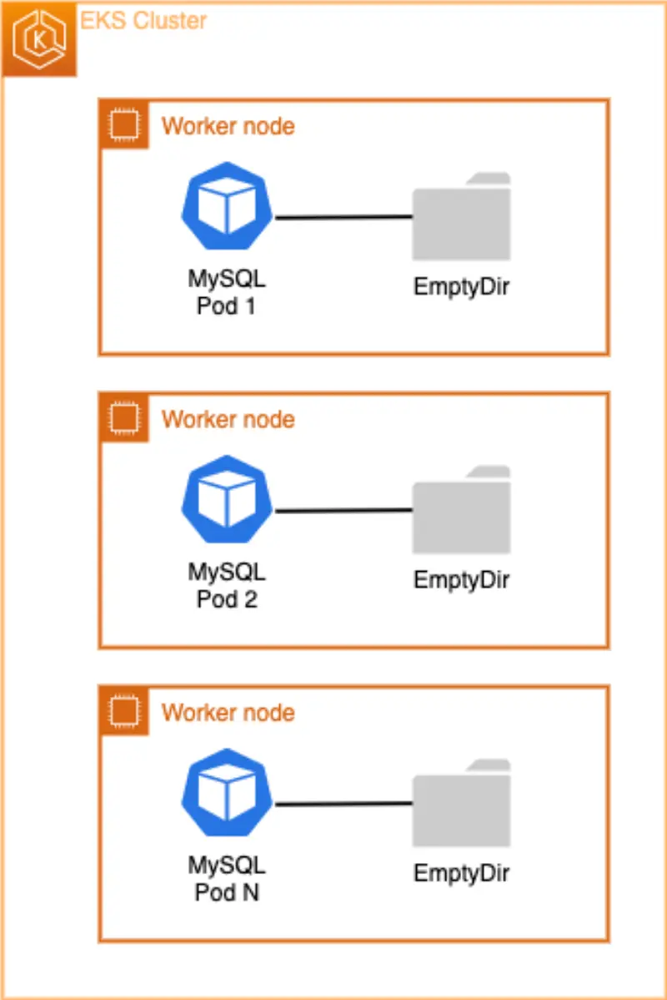

Deployment와 마찬가지로,[StatefulSets](https://kubernetes.io/docs/concepts/workloads/controllers/statefulset/)은 동일한 컨테이너 스펙을 기반으로 하는 Pod들을 관리합니다. 하지만 Deployment와 달리, StatefulSet은 각 Pod에 대해 고정된 ID를 유지합니다. 이러한 Pod들은 동일한 스펙으로 생성되지만, 재스케줄링 이벤트에서도 유지되는 영구적인 식별자를 각각 가지고 있어 서로 교체할 수 없습니다.

워크로드에 대한 영구성을 제공하기 위해 스토리지 볼륨을 사용하려면, 솔루션의 일부로 StatefulSet을 사용할 수 있습니다. StatefulSet의 개별 Pod가 실패할 수 있지만, 영구적인 Pod 식별자를 통해 기존 볼륨을 실패한 Pod를 대체하는 새로운 Pod와 더 쉽게 매칭할 수 있습니다.

StatefulSet은 다음 중 하나 이상이 필요한 애플리케이션에 유용합니다:

- 안정적이고 고유한 네트워크 식별자
- 안정적이고 영구적인 스토리지
- 순서가 있는 우아한 배포와 확장
- 순서가 있는 자동화된 롤링 업데이트

우리의 전자상거래 애플리케이션에서는 Catalog 마이크로서비스의 일부로 이미 StatefulSet이 배포되어 있습니다. Catalog 마이크로서비스는 EKS에서 실행되는 MySQL 데이터베이스를 사용합니다. 데이터베이스는 영구 스토리지가 필요하기 때문에 StatefulSet 사용의 좋은 예입니다. MySQL 데이터베이스 Pod를 분석하여 현재 볼륨 구성을 확인할 수 있습니다:

```bash
$ kubectl describe statefulset -n catalog catalog-mysql
Name:               catalog-mysql
Namespace:          catalog
[...]
  Containers:
   mysql:
    Image:      public.ecr.aws/docker/library/mysql:8.0
    Port:       3306/TCP
    Host Port:  0/TCP
    Environment:
      MYSQL_ROOT_PASSWORD:  my-secret-pw
      MYSQL_USER:           <set to the key 'username' in secret 'catalog-db'>  Optional: false
      MYSQL_PASSWORD:       <set to the key 'password' in secret 'catalog-db'>  Optional: false
      MYSQL_DATABASE:       <set to the key 'name' in secret 'catalog-db'>      Optional: false
    Mounts:
      /var/lib/mysql from data (rw)
  Volumes:
   data:
    Type:       EmptyDir (a temporary directory that shares a pod's lifetime)
    Medium:
    SizeLimit:  <unset>
Volume Claims:  <none>
[...]
```

보시다시피 우리 StatefulSet의 [`Volumes`](https://kubernetes.io/docs/concepts/storage/volumes/#emptydir-configuration-example) 섹션은 "Pod의 수명을 공유하는" [EmptyDir 볼륨 타입](https://kubernetes.io/docs/concepts/storage/volumes/#emptydir)만 사용하고 있음을 보여줍니다.



`emptyDir` 볼륨은 Pod가 노드에 할당될 때 처음 생성되며, 해당 Pod가 해당 노드에서 실행되는 동안 존재합니다. 이름에서 알 수 있듯이, emptyDir 볼륨은 처음에는 비어 있습니다. Pod의 모든 컨테이너는 emptyDir 볼륨의 동일한 파일을 읽고 쓸 수 있지만, 각 컨테이너에서 동일하거나 다른 경로에 볼륨을 마운트할 수 있습니다. **어떤 이유로든 노드에서 Pod가 제거되면, emptyDir의 데이터는 영구적으로 삭제됩니다.** 따라서 EmptyDir는 MySQL 데이터베이스에 적합하지 않습니다.

MySQL 컨테이너 내부에서 셸 세션을 시작하고 테스트 파일을 생성하여 이를 시연할 수 있습니다. 그런 다음 StatefulSet에서 실행 중인 Pod를 삭제할 것입니다. Pod가 영구 볼륨(PV)이 아닌 emptyDir를 사용하고 있기 때문에, Pod가 재시작되면 파일은 유지되지 않습니다. 먼저 MySQL 컨테이너 내부에서 명령을 실행하여 emptyDir`/var/lib/mysql` 경로(MySQL이 데이터베이스 파일을 저장하는 위치)에 파일을 생성해보겠습니다:

```bash
$ kubectl exec catalog-mysql-0 -n catalog -- bash -c  "echo 123 > /var/lib/mysql/test.txt"
```

이제 **`/var/lib/mysql` 디렉토리에** `test.txt` 파일이 생성되었는지 확인해보겠습니다:

```bash
$ kubectl exec catalog-mysql-0 -n catalog -- ls -larth /var/lib/mysql/ | grep -i test
-rw-r--r-- 1 root  root     4 Oct 18 13:38 test.txt
```

이제 현재 `catalog-mysql` Pod를 제거해보겠습니다. 이렇게 하면 StatefulSet 컨트롤러가 자동으로 새로운 catalog-mysql Pod를 재생성하게 됩니다:

```bash
$ kubectl delete pods -n catalog -l app.kubernetes.io/component=mysql
pod "catalog-mysql-0" deleted
```

몇 초 기다린 후 아래 명령을 실행하여 `catalog-mysql` Pod가 재생성되었는지 확인해보세요:

```bash
$ kubectl wait --for=condition=Ready pod -n catalog \
  -l app.kubernetes.io/component=mysql --timeout=30s
pod/catalog-mysql-0 condition met
$ kubectl get pods -n catalog -l app.kubernetes.io/component=mysql
NAME              READY   STATUS    RESTARTS   AGE
catalog-mysql-0   1/1     Running   0          29s
```

마지막으로, MySQL 컨테이너 셸로 다시 들어가서 `/var/lib/mysql` 경로에서 `ls` 명령을 실행하여 이전에 생성한 `test.txt` 파일을 찾아보겠습니다:

```bash
$ kubectl exec catalog-mysql-0 -n catalog -- cat /var/lib/mysql/test.txt
cat: /var/lib/mysql/test.txt: No such file or directory
command terminated with exit code 1
```

보시다시피 `emptyDir` 볼륨이 임시적이기 때문에 `test.txt` 파일이 더 이상 존재하지 않습니다. 이후 섹션에서는 동일한 실험을 실행하고 영구 볼륨(PV)이 어떻게 `test.txt` 파일을 유지하고 Pod 재시작 및/또는 실패에서 살아남는지 보여줄 것입니다.

다음 페이지에서는 Kubernetes의 스토리지에 대한 주요 개념과 AWS 클라우드 생태계와의 통합에 대해 이해해보겠습니다.
