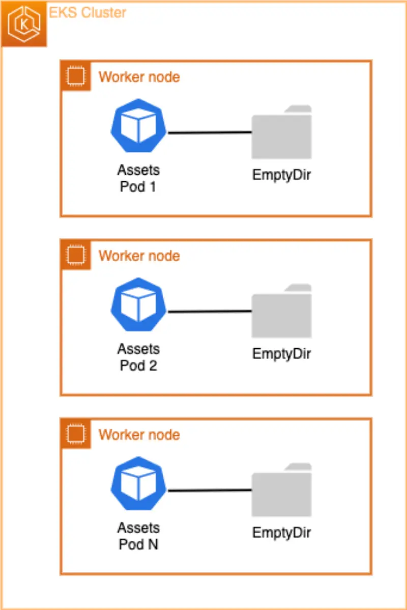
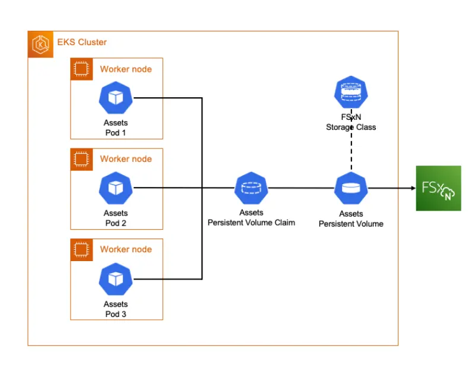

우리의 전자상거래 애플리케이션에서는 이미 assets 마이크로서비스의 일부로 배포를 생성했습니다. assets 마이크로서비스는 EKS에서 실행되는 웹 서버를 사용합니다. 웹 서버는 **수평적으로 확장할 수 있고** Pod의 **새로운 상태를 선언**할 수 있기 때문에 배포의 좋은 예시입니다.

`assets` 컴포넌트는 제품의 정적 이미지를 제공하는 컨테이너이며, 이러한 제품 이미지는 컨테이너 이미지 빌드의 일부로 추가됩니다. 하지만 이 설정에서는 팀이 제품 이미지를 업데이트하고 싶을 때마다 컨테이너 이미지를 재생성하고 재배포해야 합니다. 이 실습에서는 [Amazon FSx for NetApp ONTAP 파일 시스템](https://docs.aws.amazon.com/fsx/latest/ONTAPGuide/what-is-fsx-ontap.html)과 Kubernetes [영구 볼륨](https://kubernetes.io/docs/concepts/storage/persistent-volumes/)을 사용하여 컨테이너 이미지를 재빌드하지 않고도, 기존 제품 이미지를 업데이트하고 새로운 제품 이미지를 추가할 수 있도록 할 것입니다.

배포를 설명하여 초기 볼륨 구성을 살펴보는 것으로 시작할 수 있습니다:

```bash
$ kubectl describe deployment -n assets
Name:                   assets
Namespace:              assets
[...]
  Containers:
   assets:
    Image:      public.ecr.aws/aws-containers/retail-store-sample-assets:latest
    Port:       8080/TCP
    Host Port:  0/TCP
    Limits:
      memory:  128Mi
    Requests:
      cpu:     128m
      memory:  128Mi
    Liveness:  http-get http://:8080/health.html delay=30s timeout=1s period=3s #success=1 #failure=3
    Environment Variables from:
      assets      ConfigMap  Optional: false
    Environment:  <none>
    Mounts:
      /tmp from tmp-volume (rw)
  Volumes:
   tmp-volume:
    Type:       EmptyDir (a temporary directory that shares a pod's lifetime)
    Medium:     Memory
    SizeLimit:  <unset>
[...]
```

보시다시피 StatefulSet의 [`Volumes`](https://kubernetes.io/docs/concepts/storage/volumes/#emptydir-configuration-example) 섹션은 "Pod의 수명을 공유하는" [EmptyDir 볼륨 타입](https://kubernetes.io/docs/concepts/storage/volumes/#emptydir)만 사용하고 있음을 보여줍니다.



`emptyDir` 볼륨은 Pod가 노드에 할당될 때 처음 생성되며, 해당 Pod가 해당 노드에서 실행되는 동안 존재합니다. 이름에서 알 수 있듯이, emptyDir 볼륨은 처음에는 비어 있습니다. Pod의 모든 컨테이너는 emptyDir 볼륨의 동일한 파일을 읽고 쓸 수 있지만, 각 컨테이너에서 동일하거나 다른 경로에 볼륨을 마운트할 수 있습니다. **어떤 이유로든 노드에서 Pod가 제거되면, emptyDir의 데이터는 영구적으로 삭제됩니다.** 이는 동일한 배포의 여러 Pod 간에 데이터를 공유하고 해당 데이터를 변경하려는 경우 EmptyDir가 적합하지 않다는 것을 의미합니다.

컨테이너에는 `/usr/share/nginx/html/assets` 폴더 아래에 컨테이너 빌드의 일부로 복사된 초기 제품 이미지가 있습니다. 아래 명령을 실행하여 확인할 수 있습니다:

```bash
$ kubectl exec --stdin deployment/assets \
  -n assets -- bash -c "ls /usr/share/nginx/html/assets/"
chrono_classic.jpg
gentleman.jpg
pocket_watch.jpg
smart_1.jpg
smart_2.jpg
wood_watch.jpg
```

먼저 `assets` 배포를 확장하여 여러 복제본을 가지도록 해보겠습니다:

```bash
$ kubectl scale -n assets --replicas=2 deployment/assets
$ kubectl rollout status -n assets deployment/assets --timeout=60s
```

이제 아래 명령을 사용하여 첫 번째 Pod의 `/usr/share/nginx/html/assets` 디렉토리에 `newproduct.png`라는 새로운 제품 이미지를 넣어보겠습니다:

```bash
$ POD_NAME=$(kubectl -n assets get pods -o jsonpath='{.items[0].metadata.name}')
$ kubectl exec $POD_NAME \
  -n assets -- bash -c 'touch /usr/share/nginx/html/assets/newproduct.png'
```

이제 두 번째 Pod의 파일 시스템에 새로운 제품 이미지 `newproduct.png`가 없는지 확인해보겠습니다:

```bash
$ POD_NAME=$(kubectl -n assets get pods -o jsonpath='{.items[1].metadata.name}')
$ kubectl exec $POD_NAME \
  -n assets -- bash -c 'ls /usr/share/nginx/html/assets'
```

보시다시피 새로 생성된 이미지 `newproduct.png`는 두 번째 Pod에 존재하지 않습니다. 이 문제를 해결하기 위해서는 서비스가 수평적으로 확장될 때 여러 Pod 간에 공유할 수 있고 재배포 없이도 파일을 업데이트할 수 있는 파일 시스템이 필요합니다.


