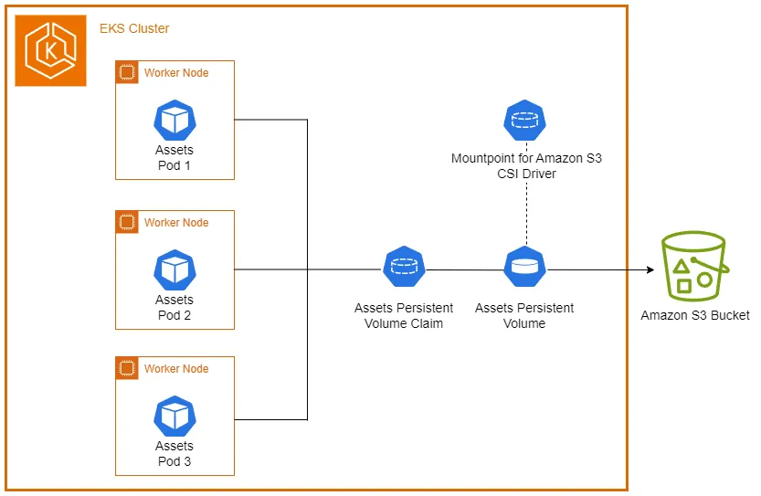

Before proceeding with this section, it's important to understand the Kubernetes storage concepts (volumes, persistent volumes (PV), persistent volume claims (PVC), dynamic provisioning, and ephemeral storage) that were covered in the [Storage](../index.md) main section.

The [Mountpoint for Amazon S3 Container Storage Interface (CSI) Driver](https://github.com/awslabs/mountpoint-s3-csi-driver) enables Kubernetes applications to access Amazon S3 objects using a standard file system interface. Built on [Mountpoint for Amazon S3](https://github.com/awslabs/mountpoint-s3), the Mountpoint CSI driver exposes an Amazon S3 bucket as a storage volume that containers in your Kubernetes cluster can access. The driver implements the [CSI](https://github.com/container-storage-interface/spec/blob/master/spec.md) specification, allowing container orchestrators (CO) to manage storage volumes effectively.

The following architecture diagram illustrates how we will use Mountpoint for Amazon S3 as persistent storage for our EKS pods:



Let's begin by creating a staging directory for the images needed by our image hosting web application:

```bash
$ mkdir ~/environment/assets-images/
$ cd ~/environment/assets-images/
$ curl --remote-name-all https://raw.githubusercontent.com/aws-containers/retail-store-sample-app/main/src/assets/public/assets/{chrono_classic.jpg,gentleman.jpg,pocket_watch.jpg,smart_2.jpg,wood_watch.jpg}
  % Total    % Received % Xferd  Average Speed   Time    Time     Time  Current
                                 Dload  Upload   Total   Spent    Left  Speed
100 98157  100 98157    0     0   242k      0 --:--:-- --:--:-- --:--:--  242k
  % Total    % Received % Xferd  Average Speed   Time    Time     Time  Current
                                 Dload  Upload   Total   Spent    Left  Speed
100 58439  100 58439    0     0   214k      0 --:--:-- --:--:-- --:--:--  214k
  % Total    % Received % Xferd  Average Speed   Time    Time     Time  Current
                                 Dload  Upload   Total   Spent    Left  Speed
100 58655  100 58655    0     0   260k      0 --:--:-- --:--:-- --:--:--  260k
  % Total    % Received % Xferd  Average Speed   Time    Time     Time  Current
                                 Dload  Upload   Total   Spent    Left  Speed
100 20795  100 20795    0     0  96273      0 --:--:-- --:--:-- --:--:-- 96273
  % Total    % Received % Xferd  Average Speed   Time    Time     Time  Current
                                 Dload  Upload   Total   Spent    Left  Speed
100 43122  100 43122    0     0   244k      0 --:--:-- --:--:-- --:--:--  243k
$ ls
chrono_classic.jpg  gentleman.jpg  pocket_watch.jpg  smart_2.jpg  wood_watch.jpg
```

Next, we'll copy these image assets to our S3 bucket using the `aws s3 cp` command:

```bash
$ cd ~/environment/
$ aws s3 cp ~/environment/assets-images/ s3://$BUCKET_NAME/ --recursive
upload: assets-images/smart_2.jpg to s3://eks-workshop-mountpoint-s320241014192132282600000002/smart_2.jpg
upload: assets-images/wood_watch.jpg to s3://eks-workshop-mountpoint-s320241014192132282600000002/wood_watch.jpg
upload: assets-images/gentleman.jpg to s3://eks-workshop-mountpoint-s320241014192132282600000002/gentleman.jpg
upload: assets-images/pocket_watch.jpg to s3://eks-workshop-mountpoint-s320241014192132282600000002/pocket_watch.jpg
upload: assets-images/chrono_classic.jpg to s3://eks-workshop-mountpoint-s320241014192132282600000002/chrono_classic.jpg
```

We can verify the uploaded objects in our bucket using the `aws s3 ls` command:

```bash
$ aws s3 ls $BUCKET_NAME
2024-10-14 19:29:05      98157 chrono_classic.jpg
2024-10-14 19:29:05      58439 gentleman.jpg
2024-10-14 19:29:05      58655 pocket_watch.jpg
2024-10-14 19:29:05      20795 smart_2.jpg
2024-10-14 19:29:05      43122 wood_watch.jpg
```

With our initial objects now in the Amazon S3 bucket, we'll configure the Mountpoint for Amazon S3 CSI driver to provide persistent, shared storage for our pods.

Let's install the Mountpoint for Amazon S3 CSI addon to our EKS cluster. This operation will take a few minutes to complete:

```bash
$ aws eks create-addon --cluster-name $EKS_CLUSTER_NAME --addon-name aws-mountpoint-s3-csi-driver \
  --service-account-role-arn $S3_CSI_ADDON_ROLE
$ aws eks wait addon-active --cluster-name $EKS_CLUSTER_NAME --addon-name aws-mountpoint-s3-csi-driver
```

Once completed, we can verify what the addon created in our EKS cluster:

```bash
$ kubectl get daemonset s3-csi-node -n kube-system
NAME          DESIRED   CURRENT   READY   UP-TO-DATE   AVAILABLE   NODE SELECTOR            AGE
s3-csi-node   3         3         3       3            3           kubernetes.io/os=linux   61s
```
