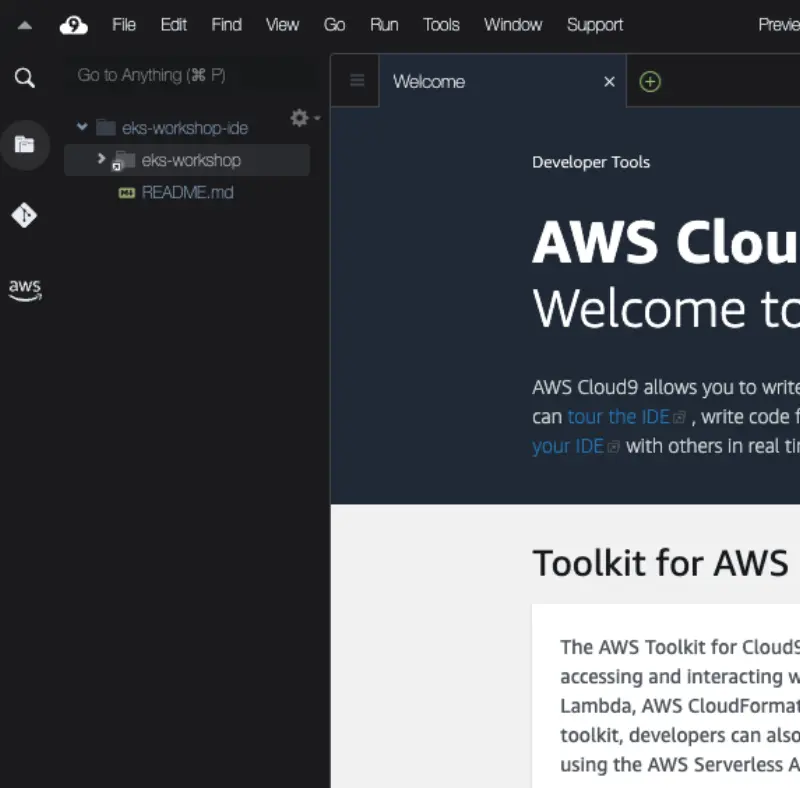
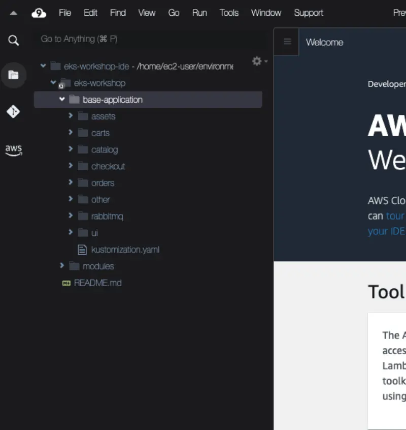
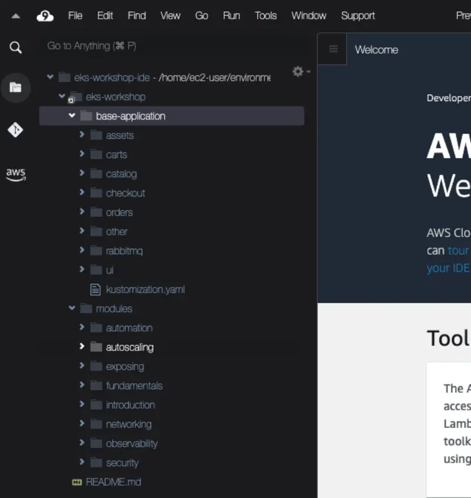

샘플 애플리케이션은 Kustomize를 사용하여 쉽게 적용할 수 있도록 구성된 Kubernetes 매니페스트 세트로 구성되어 있습니다. Kustomize는 오픈 소스 도구이며 `kubectl` CLI의 기본 기능으로도 제공됩니다. 이 워크샵에서는 Kustomize를 사용하여 Kubernetes 매니페스트를 변경하므로, YAML을 수동으로 편집할 필요 없이 매니페스트 파일의 변경 사항을 쉽게 이해할 수 있습니다. 이 워크샵의 다양한 모듈을 진행하면서 Kustomize를 사용하여 오버레이와 패치를 점진적으로 적용할 것입니다.

IDE의 파일 브라우저를 사용하는 것이 이 워크샵의 샘플 애플리케이션과 모듈에 대한 YAML 매니페스트를 탐색하는 가장 쉬운 방법입니다:



`eks-workshop`와 `base-application` 항목을 확장하면 샘플 애플리케이션의 초기 상태를 구성하는 매니페스트를 탐색할 수 있습니다:



구조는 [셈플 어플리케이션](./about) 섹션에서 설명한 각 애플리케이션 컴포넌트의 디렉토리로 구성되어 있습니다.

`modules` 디렉토리에는 이후 실습 과정에서 클러스터에 적용할 매니페스트 세트가 포함되어 있습니다:



먼저 EKS 클러스터의 현재 Namespace를 검사해보겠습니다:

```bash
$ kubectl get namespaces
NAME                            STATUS   AGE
default                         Active   1h
kube-node-lease                 Active   1h
kube-public                     Active   1h
kube-system                     Active   1h
```

나열된 모든 항목은 사전 설치된 시스템 컴포넌트의 Namespace입니다. [Kubernetes 레이블](https://kubernetes.io/docs/concepts/overview/working-with-objects/labels/)을 사용하여 우리가 생성한 Namespace만 필터링하여 이들을 무시할 것입니다:

```bash
$ kubectl get namespaces -l app.kubernetes.io/created-by=eks-workshop
No resources found
```

첫 번째로 catalog 컴포넌트를 단독으로 배포할 것입니다. 이 컴포넌트의 매니페스트는 `~/environment/eks-workshop/base-application/catalog`에서 찾을 수 있습니다.

```bash
$ ls ~/environment/eks-workshop/base-application/catalog
configMap.yaml
deployment.yaml
kustomization.yaml
namespace.yaml
secrets.yaml
service-mysql.yaml
service.yaml
serviceAccount.yaml
statefulset-mysql.yaml
```

이 매니페스트에는 `catalog` API의 Deployment가 포함됩니다:

```file
manifests/base-application/catalog/deployment.yaml
```

이 Deployment는 `catalog` API 컴포넌트의 원하는 상태를 표현합니다:

- `public.ecr.aws/aws-containers/retail-store-sample-catalog` 컨테이너 이미지 사용 주석
- 단일 복제본 실행
- `http`라는 이름으로 포트 `8080` 노출
- `/health` 경로에 대해 [탐색/헬스체크](https://kubernetes.io/docs/tasks/configure-pod-container/configure-liveness-readiness-startup-probes/)실행
- Kubernetes 스케줄러가 충분한 가용 리소스가 있는 노드에 배치할 수 있도록 특정 CPU와 메모리 양을 [요청](https://kubernetes.io/docs/concepts/configuration/manage-resources-containers/)
- 다른 리소스가 참조할 수 있도록 Pod에 레이블 적용

매니페스트에는 다른 컴포넌트들이 catalog API에 접근하는 데 사용하는 Service도 포함됩니다:

```file
manifests/base-application/catalog/service.yaml
```

이 Service는:

- 위의 Deployment에서 표현한 것과 일치하는 레이블을 사용하여 `catalog` Pod 선택
- 포트 `80`에서 자신을 노출
- Deployment에서 노출한 `http` 포트(포트 `8080`로 변환)를 대상으로 함

`catalog` 컴포넌트를 생성해보겠습니다

```bash
$ kubectl apply -k ~/environment/eks-workshop/base-application/catalog
namespace/catalog created
serviceaccount/catalog created
configmap/catalog created
secret/catalog-db created
service/catalog created
service/catalog-mysql created
deployment.apps/catalog created
statefulset.apps/catalog-mysql created
```

이제 새로운 Namespace가 보일 것입니다:

```bash
$ kubectl get namespaces -l app.kubernetes.io/created-by=eks-workshop
NAME      STATUS   AGE
catalog   Active   15s
```

이 Namespace에서 실행 중인 Pod들을 살펴보겠습니다:

```bash
$ kubectl get pod -n catalog
NAME                       READY   STATUS    RESTARTS      AGE
catalog-846479dcdd-fznf5   1/1     Running   2 (43s ago)   46s
catalog-mysql-0            1/1     Running   0             46s
```

`catalog` API용 Pod와 MySQL 데이터베이스용 Pod가 있는 것을 확인할 수 있습니다. `catalog` Pod가 `CrashLoopBackOff` 상태를 보이는 경우, 시작하기 전에 `catalog-mysql` Pod에 연결할 수 있어야 합니다. Kubernetes는 이 조건이 충족될 때까지 계속해서 재시작할 것입니다. 이 경우, [kubectl wait](https://kubernetes.io/docs/reference/generated/kubectl/kubectl-commands#wait)를 사용하여 특정 Pod가 Ready 상태가 될 때까지 모니터링할 수 있습니다:

```bash
$ kubectl wait --for=condition=Ready pods --all -n catalog --timeout=180s
```

Pod가 실행 중이면 [로그를 확인](https://kubernetes.io/docs/reference/generated/kubectl/kubectl-commands#logs)할 수 있습니다. 예를 들어 `catalog` API의 경우:

:::tip

명령어에 '-f' 옵션을 사용하여 [kubectl logs 출력을 "follow"](https://kubernetes.io/docs/reference/kubectl/quick-reference/)할 수 있습니다. (CTRL-C를 사용하여 팔로우를 중지할 수 있습니다)

:::

```bash
$ kubectl logs -n catalog deployment/catalog
```

Kubernetes는 또한 `catalog` Pod의 수를 수평적으로 쉽게 확장할 수 있게 해줍니다:

```bash
$ kubectl scale -n catalog --replicas 3 deployment/catalog
deployment.apps/catalog scaled
$ kubectl wait --for=condition=Ready pods --all -n catalog --timeout=180s
```

우리가 적용한 매니페스트는 클러스터의 다른 컴포넌트들이 연결하는 데 사용할 수 있는 애플리케이션과 MySQL Pod를 위한 Service도 각각 생성합니다:

```bash
$ kubectl get svc -n catalog
NAME            TYPE        CLUSTER-IP       EXTERNAL-IP   PORT(S)    AGE
catalog         ClusterIP   172.20.83.84     <none>        80/TCP     2m48s
catalog-mysql   ClusterIP   172.20.181.252   <none>        3306/TCP   2m48s
```

이러한 Service들은 클러스터 내부용이므로, 인터넷이나 VPC에서도 접근할 수 없습니다. 하지만 [exec](https://kubernetes.io/docs/tasks/debug/debug-application/get-shell-running-container/)를 사용하여 EKS 클러스터의 기존 Pod에 접근하여 `catalog` API가 작동하는지 확인할 수 있습니다:

```bash
$ kubectl -n catalog exec -it \
  deployment/catalog -- curl catalog.catalog.svc/catalogue | jq .
```

제품 정보가 포함된 JSON 페이로드를 받아야 합니다. 축하합니다, EKS에서 Kubernetes로 첫 번째 마이크로서비스를 배포하셨습니다!