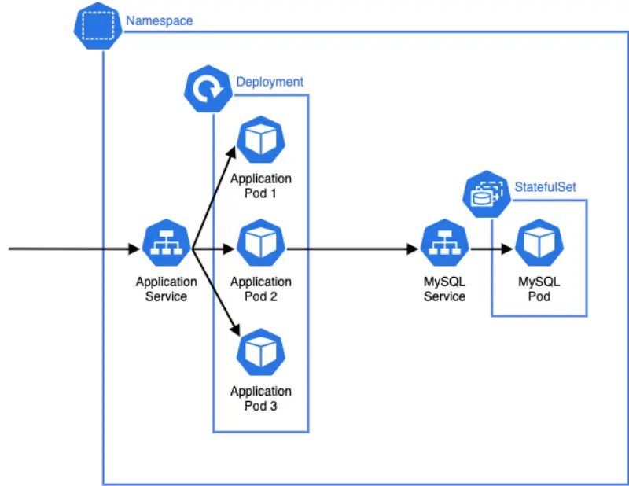
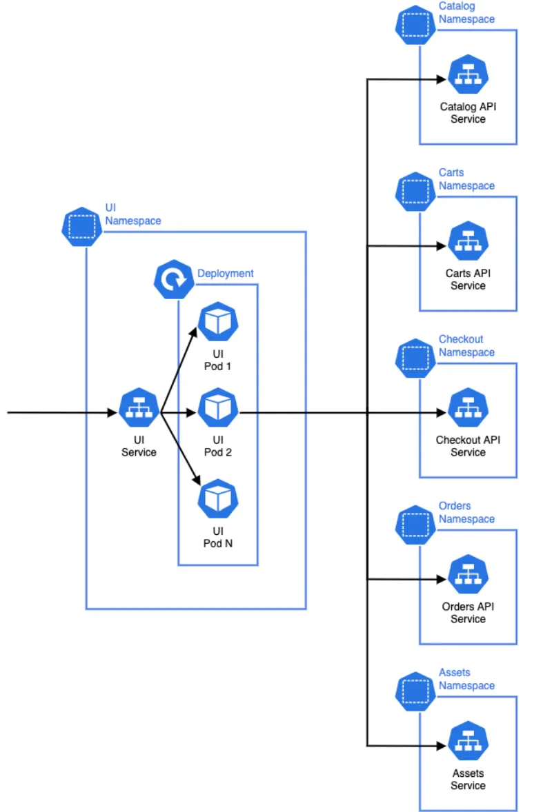

이제 샘플 애플리케이션의 전체 아키텍처에 대해 알게 되었으니, 이를 EKS에 어떻게 초기 배포할까요? `catalog` 컴포넌트를 살펴보면서 Kubernetes의 기본 구성 요소들을 알아보겠습니다:

이 다이어그램에서 고려해야 할 사항들이 있습니다:

- Catalog API를 제공하는 애플리케이션은 [Pod](https://kubernetes.io/docs/concepts/workloads/pods/)로 실행되며, Pod는 Kubernetes에서 가장 작은 배포 단위입니다. 애플리케이션 Pod는 이전 섹션에서 설명한 컨테이너 이미지를 실행합니다.
- catalog 컴포넌트를 위한 Pod는 [Deployment](https://kubernetes.io/docs/concepts/workloads/controllers/deployment/)에 의해 생성되며, 수평적 확장이 가능하도록 catalog Pod의 하나 이상의 "복제본"을 관리할 수 있습니다.
- [Service](https://kubernetes.io/docs/concepts/services-networking/service/)는 Pod 집합으로 실행되는 애플리케이션을 노출하는 추상적인 방법이며, 이를 통해 Kubernetes 클러스터 내의 다른 컴포넌트들이 catalog API를 호출할 수 있습니다. 각 Service는 고유한 DNS 항목을 가집니다.
- 이 워크샵은 상태 저장 워크로드를 관리하도록 설계된 [StatefulSet](https://kubernetes.io/docs/concepts/workloads/controllers/statefulset/)으로 Kubernetes 클러스터 내에서 실행되는 MySQL 데이터베이스로 시작합니다.
- 이러한 모든 Kubernetes 구성요소들은 전용 catalog Namespace에 그룹화됩니다. 각 애플리케이션 컴포넌트는 자체 Namespace를 가집니다.

마이크로서비스 아키텍처의 각 컴포넌트는 개념적으로 catalog와 유사하며, Deployment를 사용하여 애플리케이션 워크로드 Pod를 관리하고 Service를 사용하여 해당 Pod로 트래픽을 라우팅합니다. 아키텍처를 더 넓게 살펴보면 전체 시스템에서 트래픽이 어떻게 라우팅되는지 알 수 있습니다:

**Ui** 컴포넌트는 사용자의 브라우저와 같은 곳에서 HTTP 요청을 받습니다. 그런 다음 해당 요청을 처리하기 위해 아키텍처의 다른 API 컴포넌트들에 HTTP 요청을 보내고 사용자에게 응답을 반환합니다. 각각의 하위 컴포넌트들은 자체 데이터 스토어나 다른 인프라를 가질 수 있습니다. Namespace는 각 마이크로서비스의 리소스를 논리적으로 그룹화하고 소프트 격리 경계로도 작용하며, 이는 Kubernetes RBAC와 네트워크 정책을 사용하여 효과적으로 제어를 구현하는 데 사용될 수 있습니다.