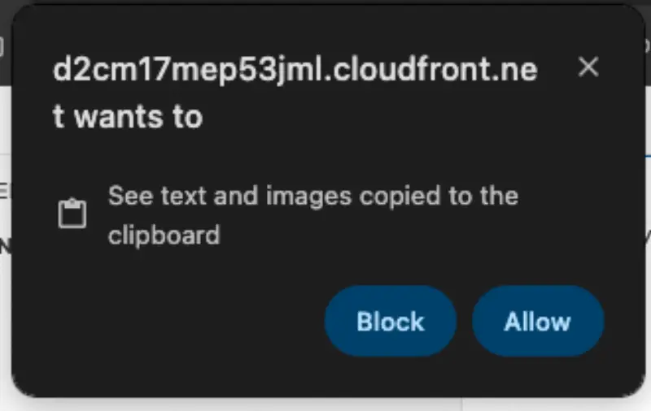

import Tabs from '@theme/Tabs';
import TabItem from '@theme/TabItem';

이 웹사이트와 제공된 콘텐츠를 탐색하는 방법을 살펴보겠습니다.

## 구조

이 워크샵의 콘텐츠는 다음과 같이 구성되어 있습니다:

1. 개별 실습 과정
2. 실습과 관련된 개념을 설명하는 지원 콘텐츠

실습 과정은 모든 모듈을 독립적인 실습으로 실행할 수 있도록 설계되었습니다. 실습 과정은 여기 보이는 아이콘("LAB")으로 표시됩니다:


이 모듈에는 화면 왼쪽에 표시되는 '[**시작하기**](/o/ihOxGoj6RUixHGUrQEbm/s/DOGGWuHTz1iyK4Etj3es/~/changes/11/undefined/index-1)' 라는 단일 실습이 포함되어 있습니다

:::caution
You should start each lab from the page indicated by this badge. Starting in the middle of a lab will cause unpredictable behavior.
:::

Depending on your browser the first time you copy/paste content in to the VSCode terminal you may be presented with a prompt that looks like this:



## Terminal commands

Most of the interaction you will do in this workshop will be done with terminal commands, which you can either manually type or copy/paste to the IDE terminal. You will see this terminal commands displayed like this:

```bash test=false
$ echo "This is an example command"
```

Hover your mouse over `echo "This is an example command"` and click to copy that command to your clipboard.

You will also come across commands with sample output like this:

```bash test=false
$ date
Fri Aug 30 12:25:58 MDT 2024
```

Using the 'click to copy' function will only copy the command and ignore the sample output.

Another pattern used in the content is presenting several commands in a single terminal:

```bash test=false
$ echo "This is an example command"
This is an example command
$ date
Fri Aug 30 12:26:58 MDT 2024
```

In this case you can either copy each command individually or copy all of the commands using the clipboard icon in the top right of the terminal window. Give it a shot!

## Resetting your EKS cluster

In the event that you accidentally configure your cluster in a way that is not functioning you have been provided with a mechanism to reset your EKS cluster as best we can which can be run at any time. Simply run the command `prepare-environment` and wait until it completes. This may take several minutes depending on the state of your cluster when it is run.

## Next Steps

Now that you're familiar with the format of this workshop, head to the [Getting started](/docs/introduction/getting-started) lab or skip ahead to any module in the workshop with the top navigation bar.