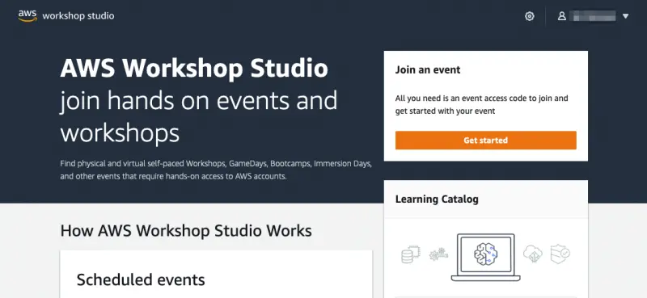
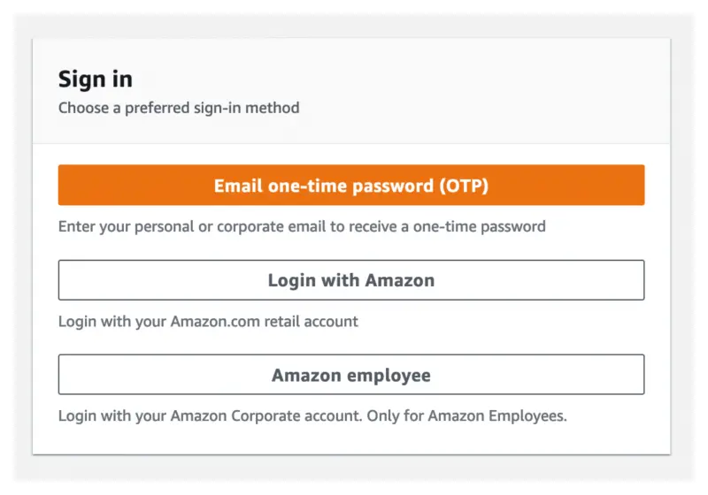
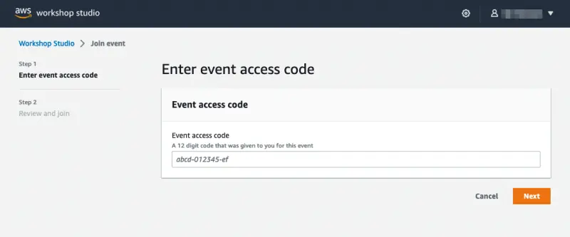
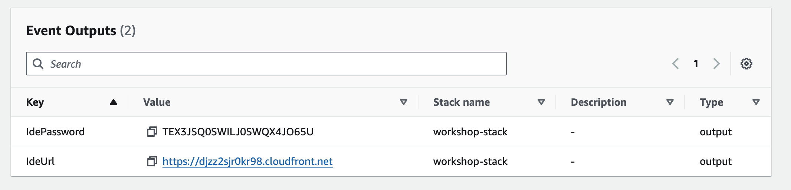
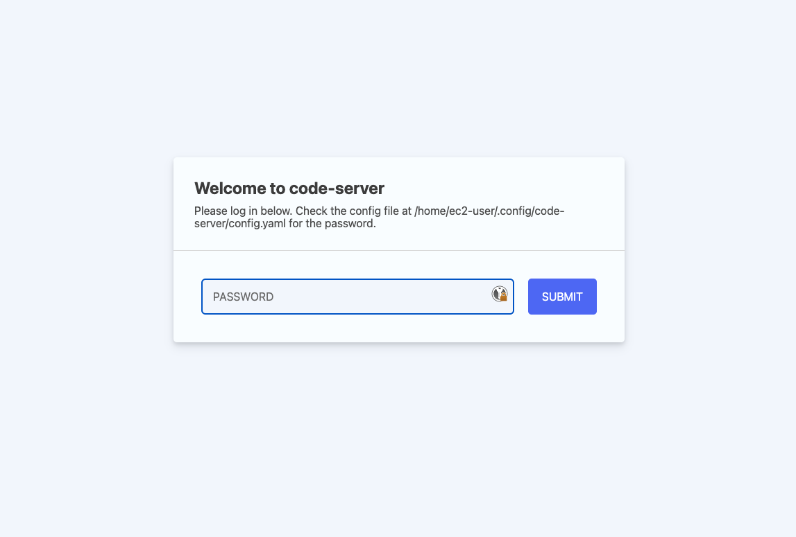
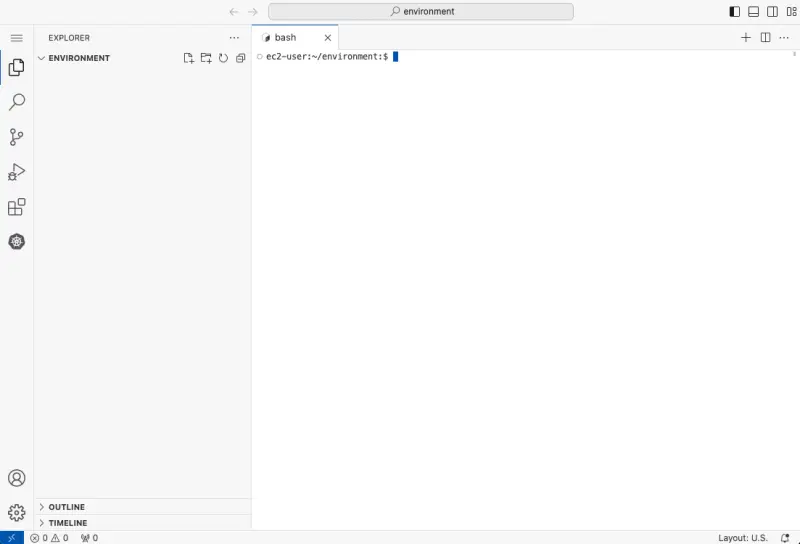
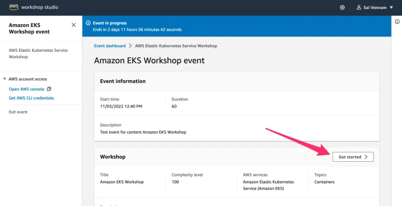

이 워크샵에 참여하시면 실습 자료를 완료하는데 사용할 AWS 계정이 제공됩니다. https://catalog.workshops.aws/ 로 이동하여 포털에 접속하세요. **Get Started** 를 클릭하세요.

로그인 화면이 나타나면 **Email One-Time Password(OTP)** 옵션을 선택하세요.

이메일 주소를 입력하고 **Send passcode**를 누르면 일회용 패스코드가 귀하의 받은 편지함으로 전송됩니다. 이메일을 받으면 패스코드를 입력하고 로그인하실 수 있습니다.

강사가 이 실습을 시작하기 전에 **Event access code**를 제공했을 것입니다. 제공받은 해시를 텍스트 상자에 입력하고 **Next**를 클릭하세요.

이용 약관을 읽고 동의한 후 **Join event**를 클릭하여 계속 진행하세요.

개인 대시보드가 표시됩니다. **Open AWS Console** 버튼을 선택하여 AWS 계정 콘솔로 이동하세요:

다시 개인 대시보드 페이지로 돌아가서 **Event Outputs** 섹션으로 스크롤하세요. **IdeUrl** 필드의 URL을 복사하여 새 브라우저 탭에서 여세요:

비밀번호를 입력하라는 메시지가 표시됩니다:

출력된 **IdePassword** 값을 입력하면 IDE가 로드됩니다.

**Get started**를 눌러 워크샵 시작 페이지에 접속하세요:

이제 [실습 탐색 섹션](/docs/introduction/navigating-labs)으로 진행하실 수 있습니다.