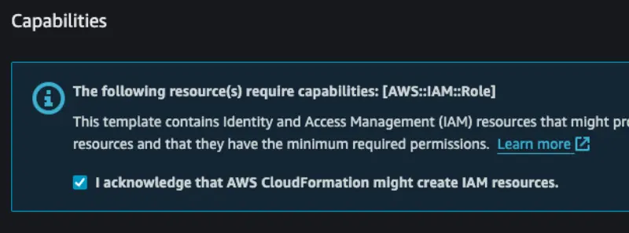
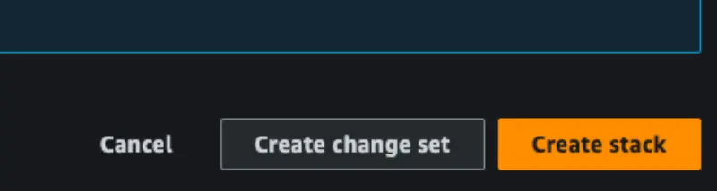
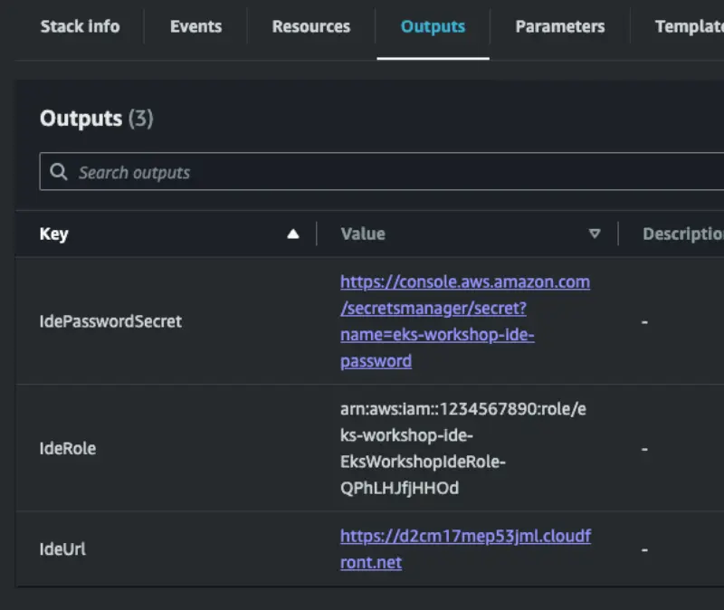
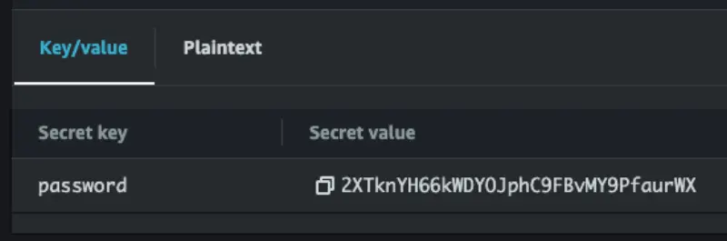
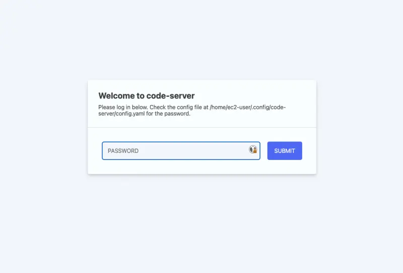

import Tabs from '@theme/Tabs';
import TabItem from '@theme/TabItem';

:::danger Warning\
귀하의 AWS 계정에 이 워크샵 환경을 프로비저닝하면 리소스가 생성되며 **비용이 발생할 수 있습니다**. [CleanUp 섹션](cleanup)에서는 추가 요금을 방지하기 위해 리소스를 제거하는 방법을 안내합니다.\
:::

이 섹션에서는 자신의 AWS 계정에서 실습을 실행하기 위한 환경 설정 방법을 설명합니다.

첫 번째 단계는 제공된 CloudFormation 템플릿을 사용하여 IDE를 생성하는 것입니다. 아래의 AWS CloudFormation 빠른 생성 링크를 사용하여 적절한 AWS 지역에서 원하는 템플릿을 시작하세요.

| Region           | Link                                                                                                                                                                                                                                                                                                                              |
| ---------------- | --------------------------------------------------------------------------------------------------------------------------------------------------------------------------------------------------------------------------------------------------------------------------------------------------------------------------------- |
| `us-west2`       | [Launch](https://us-west-2.console.aws.amazon.com/cloudformation/home#/stacks/quickcreate?templateUrl=https://ws-assets-prod-iad-r-pdx-f3b3f9f1a7d6a3d0.s3.us-west-2.amazonaws.com/39146514-f6d5-41cb-86ef-359f9d2f7265/eks-workshop-vscode-cfn.yaml&stackName=eks-workshop-ide&param_RepositoryRef=VAR::MANIFESTS_REF)           |
| `eu-west-1`      | [Launch](https://eu-west-1.console.aws.amazon.com/cloudformation/home#/stacks/quickcreate?templateUrl=https://ws-assets-prod-iad-r-dub-85e3be25bd827406.s3.eu-west-1.amazonaws.com/39146514-f6d5-41cb-86ef-359f9d2f7265/eks-workshop-vscode-cfn.yaml&stackName=eks-workshop-ide&param_RepositoryRef=VAR::MANIFESTS_REF)           |
| `ap-southeast-1` | [Launch](https://ap-southeast-1.console.aws.amazon.com/cloudformation/home#/stacks/quickcreate?templateUrl=https://ws-assets-prod-iad-r-sin-694a125e41645312.s3.ap-southeast-1.amazonaws.com/39146514-f6d5-41cb-86ef-359f9d2f7265/eks-workshop-vscode-cfn.yaml&stackName=eks-workshop-ide&param_RepositoryRef=VAR::MANIFESTS_REF) |

위의 AWS 리전에서 이 지침들은 테스트되었으며, 다른 리전에서는 수정 없이 작동할 것을 보장하지 않습니다.

:::warning

워크숍 자료의 특성상 IDE EC2 인스턴스가 계정 내에서 광범위한 IAM 권한을 필요로 합니다. 예를 들어, IAM 역할 생성 등이 있습니다. 계속 진행하기 전에 CloudFormation 템플릿에서 IDE 인스턴스에 제공될 IAM 권한을 검토하십시오.

IAM 권한 최적화를 위해 지속적으로 노력하고 있습니다. 개선 제안 사항이 있으면 [GitHub 이슈](https://github.com/aws-samples/eks-workshop-v2/issues)를 제기해 주세요

:::

화면 하단으로 스크롤하여 IAM 공지를 확인합니다:

그런 다음 **Create s** 버튼을 클릭합니다.

The CloudFormation stack will take roughly 5 minutes to deploy, and once completed you can retrieve information required to continue from the **Outputs** tab:

The `IdeUrl` output contains the URL to enter in your browser to access the IDE. The `IdePasswordSecret` contains a link to an AWS Secrets Manger secret that contains a generated password for the IDE.

To retrieve the password open that URL and click the **Retrieve** button:

The password will then be available for you to copy:

Open the IDE URL provided and you will be prompted for the password:

After submitting your password you will be presented with the initial VSCode screen:

The next step is to create an EKS cluster to perform the lab exercises in. Please follow one of the guides below to provision a cluster that meets the requirements for these labs:

- **(Recommended)** [eksctl](./using-eksctl.md)
- [Terraform](./using-terraform.md)
- (Coming soon!) CDK