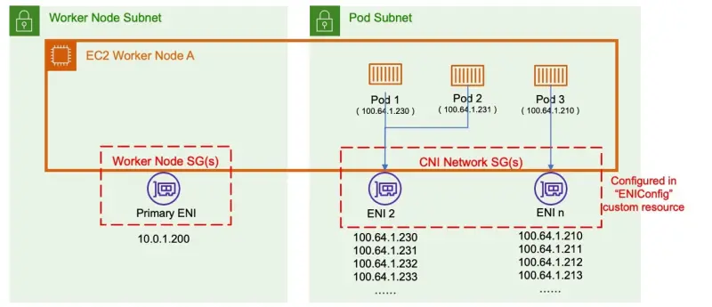

::required-time{estimatedLabExecutionTimeMinutes="10"}

:::tip 시작하기 전에
이 섹션을 위해 환경을 준비하세요:

```bash wait=30 timeout=300
$ prepare-environment networking/custom-networking
```

이는 실습 환경에 다음과 같은 변경사항을 적용합니다:

- VPC에 보조 CIDR 범위 연결
- 보조 CIDR 범위에서 세 개의 추가 서브넷 생성

이러한 변경사항을 적용하는 Terraform 코드는 [여기](https://github.com/VAR::MANIFESTS_OWNER/VAR::MANIFESTS_REPOSITORY/tree/VAR::MANIFESTS_REF/manifests/modules/networking/custom-networking/.workshop/terraform)에서 확인할 수 있습니다.

:::

기본적으로 Amazon VPC CNI는 기본 서브넷에서 선택된 IP 주소를 파드에 할당합니다. 기본 서브넷은 기본 ENI가 연결된 서브넷 CIDR로, 일반적으로 노드/호스트의 서브넷입니다.

서브넷 CIDR이 너무 작은 경우, CNI가 파드에 할당할 충분한 보조 IP 주소를 확보하지 못할 수 있습니다. 이는 EKS IPv4 클러스터에서 흔히 발생하는 문제입니다.

커스텀 네트워킹은 이 문제를 해결하는 한 가지 방법입니다.

커스텀 네트워킹은 보조 VPC 주소 공간(CIDR)에서 파드 IP를 할당함으로써 IP 고갈 문제를 해결합니다. 커스텀 네트워킹은 ENIConfig 커스텀 리소스를 지원합니다. ENIConfig에는 대체 서브넷 CIDR 범위(보조 VPC CIDR에서 분할됨)와 파드가 속할 보안 그룹이 포함됩니다. 커스텀 네트워킹이 활성화되면, VPC CNI는 ENIConfig에 정의된 서브넷에 보조 ENI를 생성합니다. CNI는 ENIConfig CRD에 정의된 CIDR 범위에서 파드에 IP 주소를 할당합니다.

