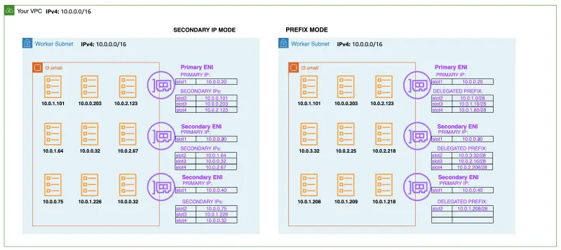
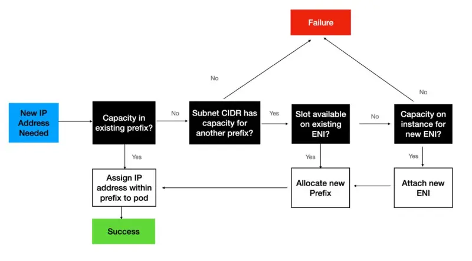

::required-time

:::tip 시작하기 전에
이 섹션을 위해 환경을 준비하세요:

```bash timeout=300 wait=30
$ prepare-environment networking/prefix
```

:::

Amazon VPC CNI는 노드에서 사용 가능한 IP 주소 수를 늘리고 노드당 파드 밀도를 높이기 위해 [Amazon EC2 네트워크 인터페이스](https://docs.aws.amazon.com/AWSEC2/latest/UserGuide/ec2-prefix-eni.html)에 네트워크 프리픽스를 할당합니다. Amazon VPC CNI 애드온 버전 1.9.0 이상에서는 네트워크 인터페이스에 개별 보조 IP 주소를 할당하는 대신 프리픽스를 할당하도록 구성할 수 있습니다.

프리픽스 할당 모드에서는 인스턴스 유형별 최대 탄력적 네트워크 인터페이스 수는 동일하게 유지되지만, 이제 nitro EC2 인스턴스 유형의 네트워크 인터페이스 슬롯에 개별 IPv4 주소를 할당하는 대신 /28(16개의 IP 주소) IPv4 주소 프리픽스를 할당하도록 Amazon VPC CNI를 구성할 수 있습니다. `ENABLE_PREFIX_DELEGATION`이 true로 설정되면 VPC CNI는 ENI에 할당된 프리픽스에서 파드에 IP 주소를 할당합니다.



작업자 노드 초기화 중에 VPC CNI는 기본 ENI에 하나 이상의 프리픽스를 할당합니다. CNI는 웜 풀을 유지하여 더 빠른 파드 시작을 위해 프리픽스를 미리 할당합니다.

더 많은 파드가 스케줄링되면 기존 ENI에 추가 프리픽스가 요청됩니다. 먼저 VPC CNI는 기존 ENI에 새 프리픽스를 할당하려고 시도합니다. ENI가 용량에 도달하면 VPC CNI는 노드에 새 ENI를 할당하려고 시도합니다. 최대 ENI 제한(인스턴스 유형에 의해 정의됨)에 도달할 때까지 새로운 ENI가 연결됩니다. 새로운 ENI가 연결되면 ipamd는 웜 풀 설정을 유지하는 데 필요한 하나 이상의 프리픽스를 할당합니다.



프리픽스 모드에서 VPC CNI 사용에 대한 권장 사항 목록은 [EKS 모범 사례 가이드](https://aws.github.io/aws-eks-best-practices/networking/prefix-mode/index_linux/)를 참조하세요.