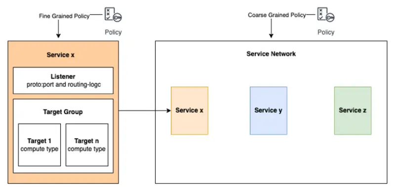

::required-time

:::caution Preview

이 모듈은 현재 프리뷰 상태입니다. [문제가 발생하면 보고](https://github.com/aws-samples/eks-workshop-v2/issues)해 주시기 바랍니다.

:::

:::tip 시작하기 전에
이 섹션을 위해 환경을 준비하세요:

```bash timeout=300 wait=30
$ prepare-environment networking/vpc-lattice
```

이는 실습 환경에 다음과 같은 변경사항을 적용합니다:

- AWS API에 접근하기 위한 Gateway API 컨트롤러용 IAM 역할 생성
- Amazon EKS 클러스터에 AWS Load Balancer 컨트롤러 설치

이러한 변경사항을 적용하는 Terraform 코드는 [여기](https://github.com/VAR::MANIFESTS_OWNER/VAR::MANIFESTS_REPOSITORY/tree/VAR::MANIFESTS_REF/manifests/modules/networking/vpc-lattice/.workshop/terraform)에서 확인할 수 있습니다.

:::

[Amazon VPC Lattice](https://aws.amazon.com/vpc/lattice/)는 네트워킹 전문 지식 없이도 서비스 간 통신을 연결, 보안 및 모니터링할 수 있는 일관된 방법을 제공하는 애플리케이션 계층 네트워킹 서비스입니다. VPC Lattice를 사용하면 VPC와 계정 전반에 걸쳐 Kubernetes 클러스터를 포함한 기본 컴퓨팅 유형에 관계없이 일관되게 서비스 간 통신을 가능하게 하는 네트워크 액세스, 트래픽 관리 및 네트워크 모니터링을 구성할 수 있습니다.

Amazon VPC Lattice는 개발자가 추가 소프트웨어나 코드를 통해 직접 수행할 필요 없이 구성 요소 검색, 개별 워크로드 간 트래픽 라우팅, 액세스 권한 부여와 같은 일반적인 네트워킹 작업을 처리합니다. 개발자는 몇 번의 클릭이나 API 호출만으로 네트워킹 전문 지식 없이도 애플리케이션이 통신하는 방식을 정의하는 정책을 구성할 수 있습니다.

Lattice를 사용하는 주요 이점은 다음과 같습니다:

- **개발자 생산성 향상**: Lattice는 개발자가 비즈니스에 중요한 기능 구축에 집중할 수 있게 하며, 모든 컴퓨팅 플랫폼에서 네트워킹, 보안 및 관찰 가능성 문제를 균일한 방식으로 처리합니다
- **보안 태세 개선**: Lattice를 통해 개발자는 현재 메커니즘(예: 인증서 관리)의 운영 부담 없이 애플리케이션 간 통신을 쉽게 인증하고 보호할 수 있습니다. Lattice 액세스 정책을 통해 개발자와 클라우드 관리자는 세분화된 액세스 제어를 적용할 수 있습니다. Lattice는 전송 중인 트래픽에 대한 암호화를 적용하여 보안 태세를 더욱 강화할 수 있습니다
- **애플리케이션 확장성 및 복원력 향상**: Lattice를 사용하면 풍부한 라우팅, 인증, 권한 부여, 모니터링 등을 갖춘 배포된 애플리케이션 네트워크를 쉽게 만들 수 있습니다. Lattice는 워크로드에 리소스 오버헤드 없이 이러한 모든 이점을 제공하며 상당한 지연 시간을 추가하지 않고 대규모 배포와 초당 많은 요청을 지원할 수 있습니다
- **이기종 인프라를 통한 배포 유연성**: Lattice는 EC2, ECS, EKS, Lambda와 같은 모든 컴퓨팅 서비스에서 일관된 기능을 제공하며 온프레미스에 있는 서비스도 포함할 수 있어 조직이 사용 사례에 최적화된 컴퓨팅 인프라를 선택할 수 있는 유연성을 제공합니다.

Amazon VPC Lattice의 [구성 요소](https://docs.aws.amazon.com/vpc-lattice/latest/ug/what-is-vpc-service-network.html#vpc-service-network-components-overview)는 다음과 같습니다:

- **서비스 네트워크**:
  서비스와 정책을 포함하는 공유 가능한 관리형 논리적 그룹입니다.

- **서비스**:
  DNS 이름을 가진 애플리케이션 단위를 나타내며 인스턴스, 컨테이너, 서버리스 등 모든 컴퓨팅에 걸쳐 확장될 수 있습니다. 리스너, 대상 그룹, 대상으로 구성됩니다.

- **서비스 디렉터리**:
  버전별 서비스와 해당 DNS 이름의 전역 뷰를 보유하는 AWS 계정 내의 레지스트리입니다.

- **보안 정책**:
  서비스가 통신하도록 허용되는 방식을 결정하는 선언적 정책입니다. 이는 서비스 수준 또는 서비스 네트워크 수준에서 정의될 수 있습니다.

