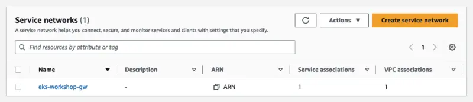

Gateway API 컨트롤러는 VPC Lattice 서비스 네트워크를 생성하고 Kubernetes 클러스터 VPC를 자동으로 연결하도록 구성되어 있습니다. 서비스 네트워크는 서비스 검색과 연결을 자동으로 구현하고 서비스 모음에 대한 접근 및 관찰 가능성 정책을 적용하는 데 사용되는 논리적 경계입니다. VPC 내에서 HTTP, HTTPS 및 gRPC 프로토콜을 통한 애플리케이션 간 연결을 제공합니다. 현재 컨트롤러는 HTTP와 HTTPS를 지원합니다.

`Gateway`를 생성하기 전에, [GatewayClass](https://gateway-api.sigs.k8s.io/concepts/api-overview/#gatewayclass)를 통해 Kubernetes 리소스 모델에서 사용 가능한 로드 밸런싱 구현 유형을 공식화해야 합니다. Gateway API를 수신하는 컨트롤러는 사용자가 자신의 `Gateway`에서 참조할 수 있는 관련 `GatewayClass` 리소스에 의존합니다:

```file
manifests/modules/networking/vpc-lattice/controller/gatewayclass.yaml
```

`GatewayClass`를 생성해 보겠습니다:

```bash
$ kubectl apply -f ~/environment/eks-workshop/modules/networking/vpc-lattice/controller/gatewayclass.yaml
```

다음 YAML은 VPC Lattice **서비스 네트워크**와 연결된 Kubernetes `Gateway` 리소스를 생성합니다.

```file
manifests/modules/networking/vpc-lattice/controller/eks-workshop-gw.yaml
```

다음 명령으로 적용하십시오:

```bash
$ cat ~/environment/eks-workshop/modules/networking/vpc-lattice/controller/eks-workshop-gw.yaml \
  | envsubst | kubectl apply -f -
```

`eks-workshop` 게이트웨이가 생성되었는지 확인하십시오:

```bash
$ kubectl get gateway -n checkout
NAME                CLASS                ADDRESS   PROGRAMMED   AGE
eks-workshop        amazon-vpc-lattice             True         29s
```

게이트웨이가 생성되면 VPC Lattice 서비스 네트워크를 찾으십시오. 상태가 `Reconciled`가 될 때까지 기다리십시오(약 5분 정도 소요될 수 있습니다).

```bash
$ kubectl describe gateway ${EKS_CLUSTER_NAME} -n checkout
apiVersion: gateway.networking.k8s.io/v1beta1
kind: Gateway
status:
   conditions:
      message: 'aws-gateway-arn: arn:aws:vpc-lattice:us-west-2:1234567890:servicenetwork/sn-03015ffef38fdc005'
      reason: Programmed
      status: "True"

$ kubectl wait --for=condition=Programmed gateway/${EKS_CLUSTER_NAME} -n checkout
```

이제 [AWS 콘솔](https://console.aws.amazon.com/vpc/home#ServiceNetworks)의 Lattice 리소스 아래 VPC 콘솔에서 생성된 관련 **서비스 네트워크**를 볼 수 있습니다.

