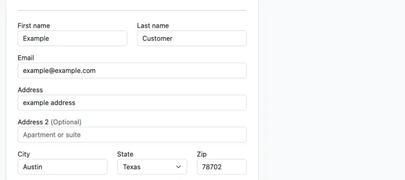
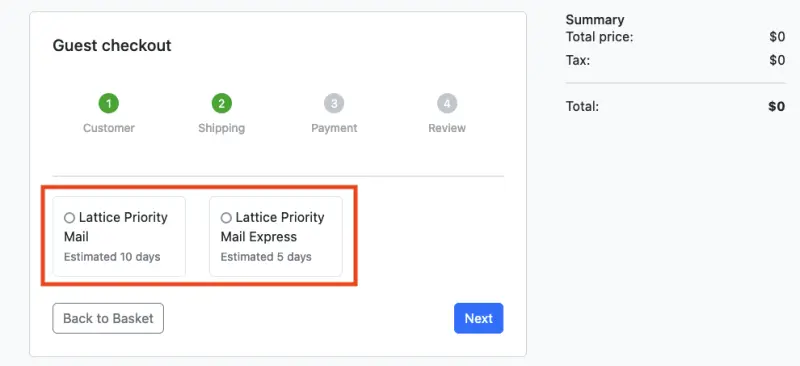

실제 환경에서 카나리 배포는 일부 사용자에게 기능을 출시하기 위해 정기적으로 사용됩니다. 이 시나리오에서는 체크아웃 서비스의 새 버전으로 트래픽의 75%를 인위적으로 라우팅하고 있습니다. 장바구니에 다른 물건들을 담아 체크아웃 절차를 여러 번 완료하면 사용자에게 2가지 버전의 애플리케이션이 표시됩니다.

먼저 Kubernetes `exec`를 사용하여 UI 파드에서 Lattice 서비스 URL이 작동하는지 확인해 보겠습니다. 이는 `HTTPRoute` 리소스의 어노테이션에서 얻을 수 있습니다:

```bash
$ export CHECKOUT_ROUTE_DNS="http://$(kubectl get httproute checkoutroute -n checkout -o json | jq -r '.metadata.annotations["application-networking.k8s.aws/lattice-assigned-domain-name"]')"
$ echo "Checkout Lattice DNS is $CHECKOUT_ROUTE_DNS"
$ POD_NAME=$(kubectl -n ui get pods -o jsonpath='{.items[0].metadata.name}')
$ kubectl exec $POD_NAME -n ui -- curl -s $CHECKOUT_ROUTE_DNS/health
{"status":"ok","info":{},"error":{},"details":{}}
```

이제 UI 서비스가 VPC Lattice 서비스 엔드포인트를 가리키도록 UI 컴포넌트의 `ConfigMap`을 패치해야 합니다:

```kustomization
modules/networking/vpc-lattice/ui/configmap.yaml
ConfigMap/ui
```

다음과 같이 구성을 변경합니다:

```bash
$ kubectl kustomize ~/environment/eks-workshop/modules/networking/vpc-lattice/ui/ \
  | envsubst | kubectl apply -f -
```

이제 UI 컴포넌트 파드를 재시작합니다:

```bash
$ kubectl rollout restart deployment/ui -n ui
$ kubectl rollout status deployment/ui -n ui
```

브라우저를 사용하여 애플리케이션에 접속해 보겠습니다. `ui` 네임스페이스에 `LoadBalancer` 타입의 서비스인 `ui-nlb`가 프로비저닝되어 있어 이를 통해 애플리케이션의 UI에 접근할 수 있습니다.

```bash
$ kubectl get service -n ui ui-nlb -o jsonpath='{.status.loadBalancer.ingress[*].hostname}{"\n"}'
k8s-ui-uinlb-647e781087-6717c5049aa96bd9.elb.us-west-2.amazonaws.com
```

브라우저에서 이 주소로 접속하여 여러 번 체크아웃을 시도해보세요(장바구니에 다른 물건들을 담아서):



이제 체크아웃이 약 75%의 확률로 "Lattice 체크아웃" 파드를 사용하는 것을 확인할 수 있습니다:

