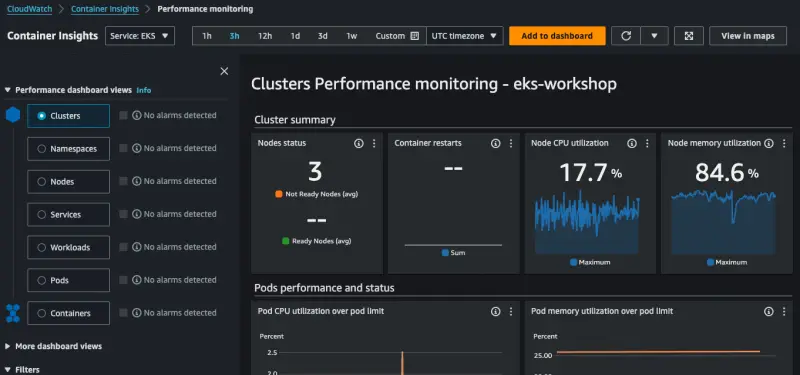

ADOT Collector를 사용하여 EKS 클러스터에 대한 CloudWatch Container Insights 메트릭을 활성화하는 방법을 살펴보겠습니다. 먼저 노드, 파드 및 컨테이너와 같은 클러스터의 다양한 측면과 관련된 메트릭을 수집하기 위해 클러스터에 collector를 생성해야 합니다.

전체 collector 매니페스트는 아래에서 확인할 수 있으며, 이후 자세히 살펴보겠습니다.

<details>
  <summary>전체 collector 매니페스트 보기</summary>

::yaml{file="manifests/modules/observability/container-insights/adot/opentelemetrycollector.yaml"}

</details>

더 잘 이해하기 위해 여러 부분으로 나누어 검토해보겠습니다.

::yaml{file="manifests/modules/observability/container-insights/adot/opentelemetrycollector.yaml" zoomPath="spec.image" zoomAfter="1"}

OpenTelemetry collector는 수집하는 원격 측정 데이터에 따라 여러 가지 모드로 실행될 수 있습니다. 이 경우에는 DaemonSet으로 실행하여 EKS 클러스터의 각 노드에서 파드가 실행되도록 합니다. 이를 통해 노드와 컨테이너 런타임에서 원격 측정 데이터를 수집할 수 있습니다.

이제 collector 구성 자체를 분석해 보겠습니다.

::yaml{file="manifests/modules/observability/container-insights/adot/opentelemetrycollector.yaml" zoomPath="spec.config.receivers.awscontainerinsightreceiver" zoomBefore="2"}

먼저 [AWS Container Insights Receiver](https://github.com/open-telemetry/opentelemetry-collector-contrib/blob/9da7fea0097b991b771e0999bc4cd930edb221e2/receiver/awscontainerinsightreceiver/README.md)를 구성하여 노드에서 메트릭을 수집합니다.

::yaml{file="manifests/modules/observability/container-insights/adot/opentelemetrycollector.yaml" zoomPath="spec.config.processors"}

다음으로 최대 60초 동안 버퍼링된 메트릭을 플러시하여 CloudWatch에 대한 API 호출 수를 줄이기 위해 배치 프로세서를 사용합니다.

::yaml{file="manifests/modules/observability/container-insights/adot/opentelemetrycollector.yaml" zoomPath="spec.config.exporters.awsemf/performance.namespace" zoomBefore="2" zoomAfter="1"}

이제 [AWS CloudWatch EMF Exporter for OpenTelemetry Collector](https://github.com/open-telemetry/opentelemetry-collector-contrib/blob/main/exporter/awsemfexporter/README.md)를 사용하여 OpenTelemetry 메트릭을 [AWS CloudWatch Embedded Metric Format (EMF)](https://docs.aws.amazon.com/AmazonCloudWatch/latest/monitoring/CloudWatch_Embedded_Metric_Format_Specification.html)로 변환한 다음 [PutLogEvents](https://docs.aws.amazon.com/AmazonCloudWatchLogs/latest/APIReference/API_PutLogEvents.html) API를 사용하여 CloudWatch Logs로 직접 전송합니다. 로그 항목은 표시된 CloudWatch Logs 로그 그룹으로 전송되며 메트릭은 `ContainerInsights` 네임스페이스에 나타납니다. 이 섹션의 나머지 부분은 전체를 보기에는 너무 길지만 위의 전체 매니페스트를 참조하십시오.

::yaml{file="manifests/modules/observability/container-insights/adot/opentelemetrycollector.yaml" zoomPath="spec.config.service.pipelines"}

마지막으로 OpenTelemetry 파이프라인을 사용하여 수신기, 프로세서 및 내보내기를 결합해야 합니다.

관리형 IAM 정책 `CloudWatchAgentServerPolicy`를 사용하여 IAM Roles for Service Accounts를 통해 collector에 CloudWatch로 메트릭을 전송하는 데 필요한 IAM 권한을 제공합니다:

```bash
$ aws iam list-attached-role-policies \
  --role-name eks-workshop-adot-collector-ci | jq .
{
  "AttachedPolicies": [
    {
      "PolicyName": "CloudWatchAgentServerPolicy",
      "PolicyArn": "arn:aws:iam::aws:policy/CloudWatchAgentServerPolicy"
    }
  ]
}
```

이 IAM 역할은 collector의 ServiceAccount에 추가됩니다:

```file
manifests/modules/observability/container-insights/adot/serviceaccount.yaml
```

위에서 살펴본 리소스들을 생성합니다:

```bash
$ kubectl kustomize ~/environment/eks-workshop/modules/observability/container-insights/adot \
  | envsubst | kubectl apply -f- && sleep 5
$ kubectl rollout status -n other daemonset/adot-container-ci-collector --timeout=120s
```

DaemonSet에 의해 생성된 Pod를 검사하여 collector가 실행 중인지 확인할 수 있습니다:

```bash hook=metrics
$ kubectl get pod -n other -l app.kubernetes.io/name=adot-container-ci-collector
NAME                               READY   STATUS    RESTARTS   AGE
adot-container-ci-collector-5lp5g  1/1     Running   0          15s
adot-container-ci-collector-ctvgs  1/1     Running   0          15s
adot-container-ci-collector-w4vqs  1/1     Running   0          15s
```

이는 collector가 실행 중이며 클러스터에서 메트릭을 수집하고 있음을 보여줍니다. 메트릭을 보려면 먼저 CloudWatch 콘솔을 열고 Container Insights로 이동하십시오:

:::tip
다음 사항에 유의하세요:

1. CloudWatch에 데이터가 나타나기까지 몇 분이 걸릴 수 있습니다
2. 일부 메트릭이 누락되는 것은 [향상된 관찰성을 갖춘 CloudWatch 에이전트](https://docs.aws.amazon.com/AmazonCloudWatch/latest/monitoring/Container-Insights-EKS-agent.html)에서 제공되기 때문에 예상된 것입니다

:::

<ConsoleButton url="https://console.aws.amazon.com/cloudwatch/home#container-insights:performance/EKS:Cluster?~(query~(controls~(CW*3a*3aEKS.cluster~(~'eks-workshop)))~context~())" service="cloudwatch" label="CloudWatch 콘솔 열기"/>



콘솔을 둘러보면서 클러스터, 네임스페이스 또는 파드별로 메트릭이 표시되는 다양한 방식을 확인할 수 있습니다.