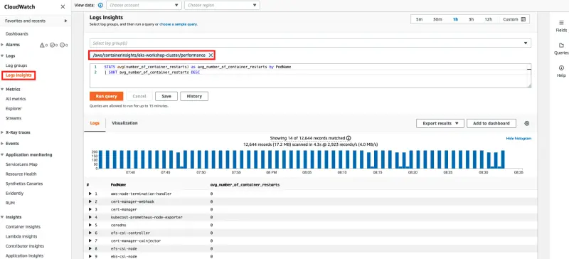

Container Insights는 CloudWatch Logs에 저장된 [임베디드 메트릭 형식](https://docs.aws.amazon.com/AmazonCloudWatch/latest/monitoring/CloudWatch_Embedded_Metric_Format.html)을 사용하여 성능 로그 이벤트를 통해 메트릭을 수집합니다. CloudWatch는 로그에서 여러 메트릭을 자동으로 생성하며 이를 CloudWatch 콘솔에서 확인할 수 있습니다. 또한 CloudWatch Logs Insights 쿼리를 사용하여 수집된 성능 데이터를 더 깊이 분석할 수 있습니다.

먼저 CloudWatch Log Insights 콘솔을 엽니다:

<ConsoleButton url="https://console.aws.amazon.com/cloudwatch/home#logsV2:logs-insights" service="cloudwatch" label="Open CloudWatch console"/>

화면 상단 근처에 쿼리 편집기가 있습니다. CloudWatch Logs Insights를 처음 열면 이 상자에는 가장 최근의 로그 이벤트 20개를 반환하는 기본 쿼리가 포함되어 있습니다.

로그 그룹을 선택하고 쿼리를 실행하면, CloudWatch Logs Insights는 로그 그룹의 데이터에서 필드를 자동으로 감지하여 오른쪽 창의 **발견된 필드**에 표시합니다. 또한 시간에 따른 이 로그 그룹의 로그 이벤트 막대 그래프를 표시합니다. 이 막대 그래프는 테이블에 표시된 이벤트뿐만 아니라 쿼리와 시간 범위에 일치하는 로그 그룹의 이벤트 분포를 보여줍니다. `/performance`로 끝나는 EKS 클러스터의 로그 그룹을 선택하세요.

쿼리 편집기에서 기본 쿼리를 다음 쿼리로 바꾸고 **쿼리 실행**을 선택하세요.

```text
STATS avg(node_cpu_utilization) as avg_node_cpu_utilization by NodeName
| SORT avg_node_cpu_utilization DESC
```


이 쿼리는 평균 노드 CPU 사용률로 정렬된 노드 목록을 보여줍니다.

다른 예시를 시도하려면, 해당 쿼리를 다른 쿼리로 바꾸고 **쿼리 실행**을 선택하세요.

```text
STATS avg(number_of_container_restarts) as avg_number_of_container_restarts by PodName
| SORT avg_number_of_container_restarts DESC
```



이 쿼리는 평균 컨테이너 재시작 횟수로 정렬된 파드 목록을 표시합니다.

다른 쿼리를 시도하고 싶다면, 화면 오른쪽의 목록에 있는 필드를 포함할 수 있습니다. 쿼리 구문에 대한 자세한 내용은 [CloudWatch Logs Insights 쿼리 구문](https://docs.aws.amazon.com/AmazonCloudWatch/latest/logs/CWL_QuerySyntax.html)을 참조하세요.