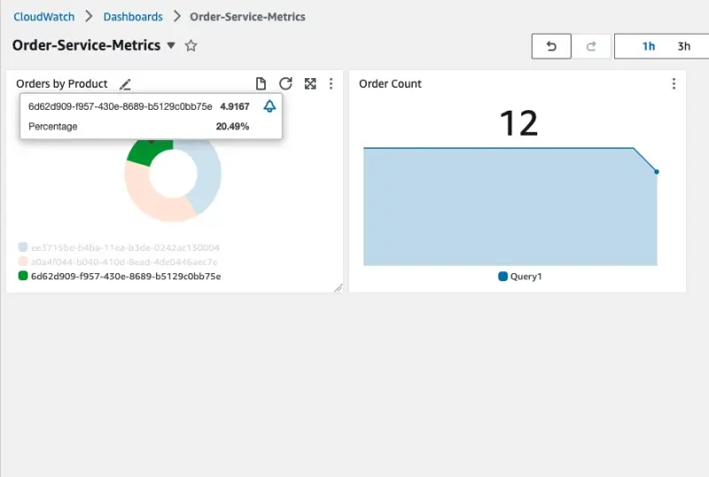
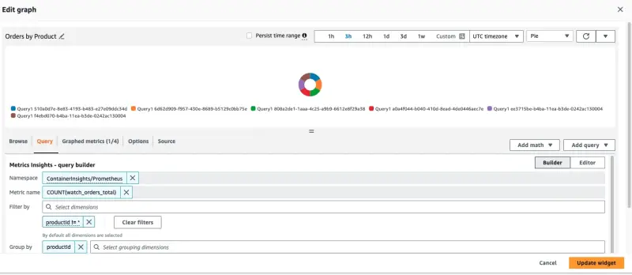

import dashboard from './assets/cw-dashboard.webp';

이 섹션에서는 워크로드가 노출하는 메트릭에 대한 인사이트를 얻고 Amazon CloudWatch Insights Prometheus를 사용하여 이러한 메트릭을 시각화하는 방법을 살펴보겠습니다. 이러한 메트릭의 예시는 다음과 같습니다:

- Java 힙 메트릭이나 데이터베이스 연결 풀 상태와 같은 시스템 메트릭
- 비즈니스 KPI와 관련된 애플리케이션 메트릭

AWS Distro for OpenTelemetry를 사용하여 애플리케이션 메트릭을 수집하고 Amazon CloudWatch를 사용하여 메트릭을 시각화하는 방법을 살펴보겠습니다.

이 워크샵의 각 컴포넌트는 특정 프로그래밍 언어나 프레임워크와 관련된 라이브러리를 사용하여 Prometheus 메트릭을 제공하도록 계측되었습니다. orders 서비스의 이러한 메트릭 예시를 다음과 같이 볼 수 있습니다:

```bash
$ kubectl -n orders exec deployment/orders -- curl http://localhost:8080/actuator/prometheus
[...]
# HELP jdbc_connections_idle Number of established but idle connections.
# TYPE jdbc_connections_idle gauge
jdbc_connections_idle{name="reader",} 10.0
jdbc_connections_idle{name="writer",} 10.0
[...]
# HELP watch_orders_total The number of orders placed
# TYPE watch_orders_total counter
watch_orders_total{productId="510a0d7e-8e83-4193-b483-e27e09ddc34d",} 2.0
watch_orders_total{productId="808a2de1-1aaa-4c25-a9b9-6612e8f29a38",} 1.0
watch_orders_total{productId="*",} 3.0
watch_orders_total{productId="6d62d909-f957-430e-8689-b5129c0bb75e",} 1.0
```

이 명령의 출력은 상세하지만, 이 실습을 위해 watch_orders_total 메트릭에 집중해보겠습니다:

- `watch_orders_total` - 애플리케이션 메트릭 - 리테일 스토어를 통해 주문된 주문 수

checkout 서비스와 같은 다른 컴포넌트에 대해서도 유사한 요청을 실행할 수 있습니다:

```bash
$ kubectl -n checkout exec deployment/checkout -- curl http://localhost:8080/metrics
[...]
# HELP nodejs_heap_size_total_bytes Process heap size from Node.js in bytes.
# TYPE nodejs_heap_size_total_bytes gauge
nodejs_heap_size_total_bytes 48668672
[...]
```

이미 배포한 수집기가 DaemonSet이었다는 것을 기억하실 것입니다. 이는 모든 노드에서 실행된다는 의미입니다. 클러스터의 Pod에서 메트릭을 스크랩할 때는 중복된 메트릭이 발생할 수 있으므로 바람직하지 않습니다. 이제 단일 레플리카로 Deployment로 실행되는 두 번째 수집기를 배포하겠습니다.

<details>
  <summary>전체 수집기 매니페스트 펼치기</summary>

::yaml{file="manifests/modules/observability/container-insights/adot-deployment/opentelemetrycollector.yaml"}

</details>

이를 여러 부분으로 나누어 더 잘 이해해보겠습니다.

::yaml{file="manifests/modules/observability/container-insights/adot-deployment/opentelemetrycollector.yaml" zoomPath="spec.image" zoomAfter="1"}

언급했듯이 이번에는 Deployment를 사용합니다.

이제 수집기 구성 자체를 분석해보겠습니다.

::yaml{file="manifests/modules/observability/container-insights/adot-deployment/opentelemetrycollector.yaml" zoomPath="spec.config.receivers.prometheus" zoomBefore="2"}

AWS Container Insights Receiver 대신 [Prometheus receiver](https://github.com/open-telemetry/opentelemetry-collector-contrib/blob/main/receiver/prometheusreceiver/README.md)를 사용하여 EKS 클러스터의 모든 pod를 스크랩할 것입니다.

::yaml{file="manifests/modules/observability/container-insights/adot-deployment/opentelemetrycollector.yaml" zoomPath="spec.config.processors"}

이전 수집기와 동일한 배치 프로세서를 사용할 것입니다.

::yaml{file="manifests/modules/observability/container-insights/adot-deployment/opentelemetrycollector.yaml" zoomPath="spec.config.exporters.awsemf/prometheus"}

OpenTelemetry Collector용 AWS CloudWatch EMF Exporter를 사용하지만 이번에는 `ContainerInsights/Prometheus` 네임스페이스를 사용할 것입니다.

::yaml{file="manifests/modules/observability/container-insights/adot-deployment/opentelemetrycollector.yaml" zoomPath="spec.config.service.pipelines"}

그리고 이전과 마찬가지로 이들을 파이프라인으로 구성합니다.

위에서 살펴본 리소스들을 생성합니다:

```bash
$ kubectl kustomize ~/environment/eks-workshop/modules/observability/container-insights/adot-deployment \
  | envsubst | kubectl apply -f- && sleep 5
$ kubectl rollout status -n other deployment/adot-container-ci-deploy-collector --timeout=120s
```

DaemonSet이 생성한 Pod를 검사하여 수집기가 실행 중인지 확인할 수 있습니다:

```bash
$ kubectl get pod -n other -l app.kubernetes.io/name=adot-container-ci-deploy-collector
NAME                                      READY   STATUS    RESTARTS   AGE
adot-container-ci-deploy-collector-5lp5g  1/1     Running   0          15s
```

이제 설정이 완료되었으니, 아래 스크립트를 사용하여 스토어를 통해 주문을 생성하고 애플리케이션 메트릭을 생성하는 부하 생성기를 실행하겠습니다:

```bash test=false
$ cat <<EOF | kubectl apply -f -
apiVersion: v1
kind: Pod
metadata:
  name: load-generator
  namespace: other
spec:
  containers:
  - name: artillery
    image: artilleryio/artillery:2.0.0-31
    args:
    - "run"
    - "-t"
    - "http://ui.ui.svc"
    - "/scripts/scenario.yml"
    volumeMounts:
    - name: scripts
      mountPath: /scripts
  initContainers:
  - name: setup
    image: public.ecr.aws/aws-containers/retail-store-sample-utils:load-gen.0.4.0
    command:
    - bash
    args:
    - -c
    - "cp /artillery/* /scripts"
    volumeMounts:
    - name: scripts
      mountPath: "/scripts"
  volumes:
  - name: scripts
    emptyDir: {}
EOF
```

CloudWatch 콘솔을 열고 대시보드 섹션으로 이동합니다:

<ConsoleButton url="https://console.aws.amazon.com/cloudwatch/home#dashboards" service="cloudwatch" label="Open CloudWatch console"/>

**Order-Service-Metrics** 대시보드를 선택하여 대시보드 내의 패널을 검토합니다:



"Orders by Product" 패널의 제목 위에 마우스를 올리고 "Edit" 버튼을 클릭하여 대시보드가 CloudWatch를 쿼리하도록 구성된 방법을 볼 수 있습니다:



이 패널을 생성하는 데 사용된 쿼리는 페이지 하단에 표시됩니다:

```text
SELECT COUNT(watch_orders_total) FROM "ContainerInsights/Prometheus" WHERE productId != '*' GROUP BY productId
```

이는 다음을 수행합니다:

- `watch_orders_total` 메트릭 쿼리
- `productId` 값이 `*`인 메트릭 무시
- 이러한 메트릭을 합산하고 `productId`로 그룹화

메트릭 관찰이 만족스러우면 아래 명령을 사용하여 부하 생성기를 중지할 수 있습니다.

```bash timeout=180 test=false
$ kubectl delete pod load-generator -n other
```