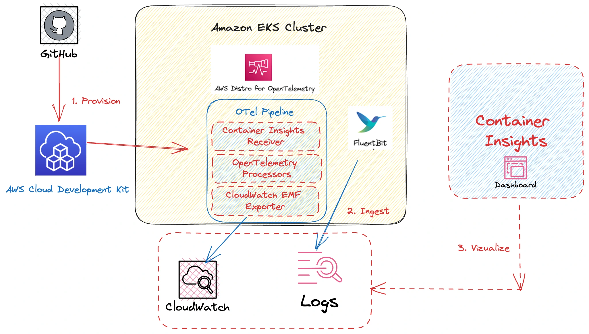

관측성은 잘 설계된 EKS 환경의 기본 요소입니다. AWS는 EKS 환경의 모니터링, 로깅 및 경보를 위한 네이티브(CloudWatch) 및 오픈 소스 관리형(Amazon Managed Service for Prometheus, Amazon Managed Grafana 및 AWS Distro for OpenTelemetry) 솔루션을 제공합니다.

이 장에서는 다음 항목에 대한 가시성을 제공하기 위해 EKS와 통합된 AWS 관측성 솔루션을 사용하는 방법을 다룰 것입니다:

- EKS 콘솔 뷰의 쿠버네티스 리소스
- Fluentbit를 활용한 컨트롤 플레인 및 파드 로그
- CloudWatch Container Insights를 통한 모니터링 메트릭
- AMP와 ADOT를 통한 EKS 메트릭 모니터링

모듈 관리자 중 한 명인 Nirmal Mehta(AWS)와 함께하는 관측성 모듈의 비디오 안내를 여기서 시청하세요:

<ReactPlayer controls url="https://www.youtube.com/watch?v=ajPe7HVypxg" />  

:::info
AWS 관측성 기능에 대해 더 자세히 알아보려면 [One Observability Workshop](https://catalog.workshops.aws/observability/en-US)을 참조하세요
:::

:::info
[AWS Observability Accelerator for CDK](https://aws-observability.github.io/cdk-aws-observability-accelerator/)와 [AWS Observability Accelerator for Terraform](https://aws-observability.github.io/terraform-aws-observability-accelerator/)에서 AWS 환경에 대한 관측성 설정을 돕는 의견이 반영된 인프라스트럭처 as 코드(IaC) 모듈들을 살펴보세요. 이러한 모듈들은 Amazon CloudWatch와 같은 AWS 네이티브 서비스와 Amazon Managed Service for Prometheus, Amazon Managed Grafana, AWS Distro for OpenTelemetry(ADOT)와 같은 AWS 관리형 관측성 서비스와 함께 작동합니다.
:::

