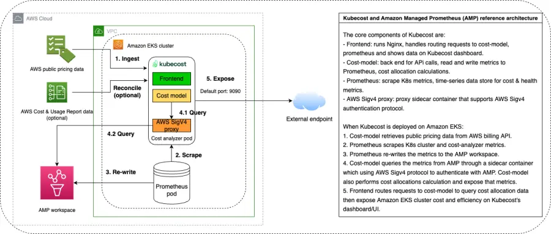

현재 Kubecost는 Kubernetes 클러스터 내에서 자체 호스팅된 Prometheus 인스턴스를 사용하고 있습니다. Kubecost 배포 구성을 업데이트하여 대신 Amazon Managed Service for Prometheus(AMP)를 사용할 수 있습니다.

AMP는 Prometheus와 호환되는 모니터링 및 경고 서비스로, 대규모로 컨테이너화된 애플리케이션과 인프라를 쉽게 모니터링할 수 있게 해줍니다. 오픈 소스 Prometheus 쿼리 언어를 사용하여 기본 모니터링 인프라의 확장을 걱정할 필요 없이 컨테이너화된 워크로드의 성능을 모니터링하고 경고할 수 있습니다. 이 서비스는 워크로드가 증가하거나 감소함에 따라 운영 메트릭의 수집, 저장, 경고 및 쿼리를 자동으로 확장합니다. 또한 AWS 보안 서비스와 통합되어 데이터에 대한 빠르고 안전한 액세스를 가능하게 합니다. 이를 통해 모니터링 스택을 관리하는 대신 워크로드에 집중할 수 있습니다.

아래는 Kubecost가 AMP와 통합되는 방식을 보여주는 이미지입니다. Kubecost는 Signature Version 4(SigV4) 프록시를 사용하여 AMP를 쿼리합니다. SigV4는 HTTP로 전송된 AWS API 요청에 인증 정보를 추가하는 프로세스입니다. 보안을 위해 대부분의 AWS 요청은 액세스 키로 서명되어야 합니다. 액세스 키는 액세스 키 ID와 비밀 액세스 키로 구성되며, 일반적으로 보안 자격 증명이라고 합니다. AWS 서비스가 요청을 받으면 요청에서 보낸 서명을 계산하기 위해 동일한 단계를 수행합니다. 그런 다음 AWS는 계산된 서명을 요청과 함께 보낸 서명과 비교합니다. 서명이 일치하면 요청이 처리됩니다. 서명이 일치하지 않으면 요청이 거부됩니다.

Kubecost와 AMP의 통합을 시작하려면 [다음 블로그 포스트](https://aws.amazon.com/blogs/mt/integrating-kubecost-with-amazon-managed-service-for-prometheus/)를 확인하세요.