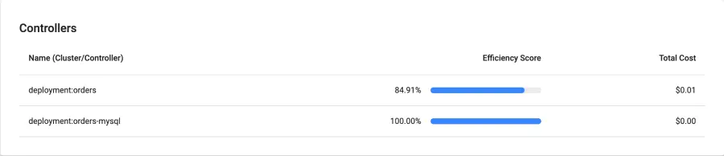

이제 비용 할당에 대해 살펴보겠습니다. <b>Cost Allocation</b>을 클릭하세요.

다음과 같은 대시보드가 표시되어야 합니다:

<Browser url='http://k8s-kubecost-kubecost-e83ecf8fc1-fc26f5c92767520f.elb.us-west-2.amazonaws.com:9090/allocations'>

</Browser>

이 화면을 사용하여 클러스터의 비용 할당을 더 자세히 살펴볼 수 있습니다. 다양한 비용 차원을 볼 수 있습니다:

- 네임스페이스
- 배포
- 파드
- 레이블

소개 섹션에서 설치한 애플리케이션은 이러한 구성 요소 중 여러 개를 생성했습니다. 이 구성 요소들도 있습니다. 다음으로, 이러한 차원을 사용하여 이 애플리케이션의 비용을 자세히 살펴보겠습니다.

이를 위해 오른쪽 상단의 <b>Aggregate by</b> 옆에 있는 설정 버튼을 클릭하세요.

<Browser url='http://k8s-kubecost-kubecost-e83ecf8fc1-fc26f5c92767520f.elb.us-west-2.amazonaws.com:9090/allocations'>

</Browser>

그런 다음 <b>Filters</b> 아래에서 드롭다운 메뉴에서 <b>label</b>을 선택하고, 값으로 `app.kubernetes.io/created-by: eks-workshop`을 입력한 후 플러스 기호를 클릭하세요.

<Browser url='http://k8s-kubecost-kubecost-e83ecf8fc1-fc26f5c92767520f.elb.us-west-2.amazonaws.com:9090/allocations'>

</Browser>

이렇게 하면 `app.kubernetes.io/create-by: eks-workshop` 레이블이 있는 워크로드만 표시하도록 네임스페이스가 필터링됩니다. 이 레이블은 소개 섹션에서 실행한 애플리케이션의 모든 구성 요소에 포함되어 있습니다.

이제 <b>Aggregate by</b>를 클릭하고 <b>Deployment</b>를 선택하세요. 이렇게 하면 네임스페이스 대신 배포별로 비용이 집계됩니다. 아래를 참조하세요.

<Browser url='http://k8s-kubecost-kubecost-e83ecf8fc1-fc26f5c92767520f.elb.us-west-2.amazonaws.com:9090/allocations'>

</Browser>

우리 애플리케이션과 관련된 여러 배포가 있음을 알 수 있습니다. 더 자세히 살펴볼 수 있습니다. 단일 네임스페이스를 살펴보겠습니다. <b>Aggregate by</b>를 다시 <b>Namespace</b>로 설정하고, 필터를 제거한 다음 테이블에서 네임스페이스 중 하나를 클릭하세요. 우리는 orders 네임스페이스를 선택했습니다.

<Browser url='http://k8s-kubecost-kubecost-e83ecf8fc1-fc26f5c92767520f.elb.us-west-2.amazonaws.com:9090/allocations'>

</Browser>

이 뷰에서는 이 네임스페이스에서 실행 중인 Kubernetes 리소스와 관련된 모든 비용을 볼 수 있습니다. 이는 다중 테넌트 클러스터가 있고 고객별로 네임스페이스가 있는 경우 유용한 뷰가 될 수 있습니다.

또한 이 네임스페이스에서 실행 중인 다양한 리소스와 관련 비용을 볼 수 있습니다.

<b>Controllers</b> 아래의 항목 중 하나를 클릭하세요. 우리는 orders 배포를 클릭했습니다.

<Browser url='http://k8s-kubecost-kubecost-e83ecf8fc1-fc26f5c92767520f.elb.us-west-2.amazonaws.com:9090/allocations'>

</Browser>

이 뷰는 특정 "컨트롤러", 이 경우 배포에 대한 더 자세한 정보를 보여줍니다. 이 정보를 사용하여 어떤 최적화를 할 수 있는지 이해하기 시작할 수 있습니다. 예를 들어, EKS 클러스터의 각 파드에 할당되는 CPU와 메모리의 양을 제한하기 위해 리소스 요청과 제한을 조정하는 것과 같은 최적화를 할 수 있습니다.

지금까지 우리는 비용 할당의 광범위한 개요나 단일 리소스에 대한 심층 분석을 살펴보았습니다. 팀별로 비용 할당을 그룹화하여 살펴보고 싶다면 어떻게 해야 할까요? 다음 시나리오를 고려해보세요: 회사의 각 팀이 클러스터 내에서 자신들의 운영 비용을 책임지고 있습니다. 예를 들어, 클러스터의 모든 데이터베이스를 담당하는 팀이 있고 그들의 운영 비용을 자세히 살펴보고 싶어합니다. 이는 각 데이터베이스에 해당 팀과 관련된 사용자 정의 레이블을 부여함으로써 달성할 수 있습니다. 우리 클러스터에서는 모든 데이터베이스 리소스에 `app.kubernetes.io/team: database` 레이블을 부여했습니다. 이 레이블을 사용하여 이 팀에 속하는 다양한 네임스페이스에 걸쳐 있는 모든 리소스를 필터링할 수 있습니다.

<Browser url='http://k8s-kubecost-kubecost-e83ecf8fc1-fc26f5c92767520f.elb.us-west-2.amazonaws.com:9090/allocations'>

</Browser>

Kubecost에는 절감, 건강, 보고서 및 알림과 같은 다른 많은 기능도 있습니다. 다양한 링크를 자유롭게 탐색해보세요.