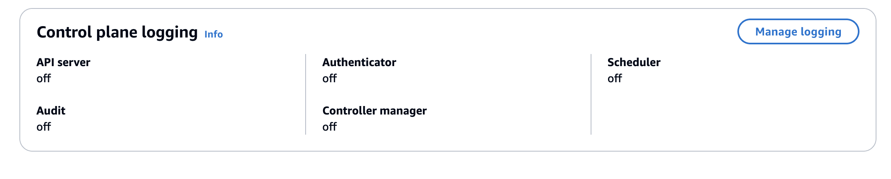
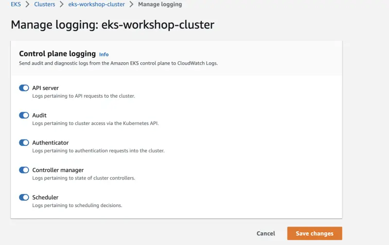

각 클러스터 로그 유형을 개별적으로 활성화할 수 있으며, 이 실습에서는 모든 것을 활성화하고 있습니다.

EKS 콘솔에서 이 구성을 살펴보겠습니다:

<ConsoleButton url="https://console.aws.amazon.com/eks/home#/clusters/eks-workshop?selectedTab=cluster-logging-tab" service="eks" label="Open EKS console"/>

**로깅** 탭은 클러스터의 컨트롤 플레인 로그에 대한 현재 구성을 보여줍니다:




**관리** 버튼을 클릭하여 로깅 구성을 변경할 수 있습니다:


EKS API를 통해 클러스터별로 EKS 컨트롤 플레인 로그를 활성화할 수도 있습니다. 이는 주로 Terraform이나 CloudFormation을 사용하여 구성되지만, 이 실습에서는 AWS CLI를 사용하여 기능을 활성화할 수 있습니다:

```bash hook=cluster-logging
$ aws eks update-cluster-config \
    --region $AWS_REGION \
    --name $EKS_CLUSTER_NAME \
    --logging '{"clusterLogging":[{"types":["api","audit","authenticator","controllerManager","scheduler"],"enabled":true}]}'
{
    "update": {
        "id": "6d73515c-f5e7-4288-9e55-480e9c6dd084",
        "status": "InProgress",
        "type": "LoggingUpdate",
        "params": [
            {
                "type": "ClusterLogging",
                "value": "{\"clusterLogging\":[{\"types\":[\"api\",\"audit\",\"authenticator\",\"controllerManager\",\"scheduler\"],\"enabled\":true}]}"
            }
        ],
        "createdAt": "2023-05-25T19:33:16.622000+00:00",
        "errors": []
    }
}
$ sleep 30
$ aws eks wait cluster-active --name $EKS_CLUSTER_NAME
```

보시다시피 각 클러스터 로그 유형을 개별적으로 활성화할 수 있으며, 이 실습에서는 모든 것을 활성화하고 있습니다.

EKS 콘솔에서 이 구성을 살펴보겠습니다:

<ConsoleButton url="https://console.aws.amazon.com/eks/home#/clusters/eks-workshop?selectedTab=cluster-logging-tab" service="eks" label="Open EKS console"/>

**로깅** 탭은 클러스터의 컨트롤 플레인 로그에 대한 현재 구성을 보여줍니다:


**관리** 버튼을 클릭하여 로깅 구성을 변경할 수 있습니다:



:::info
CDK Observability Accelerator를 사용하는 경우 [CDK Observability Builder](https://aws-quickstart.github.io/cdk-eks-blueprints/builders/observability-builder/#supported-methods)를 확인하세요. 이는 EKS 클러스터의 모든 컨트롤 플레인 로깅 기능을 활성화하고 CloudWatch에 저장하는 것을 지원합니다.
:::