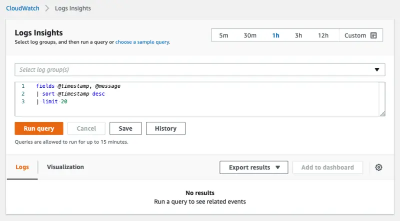
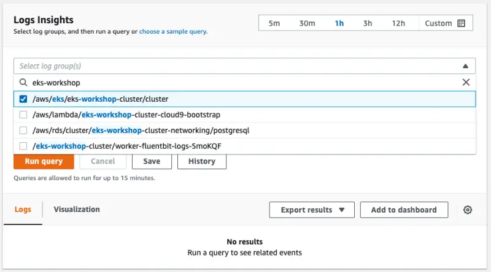
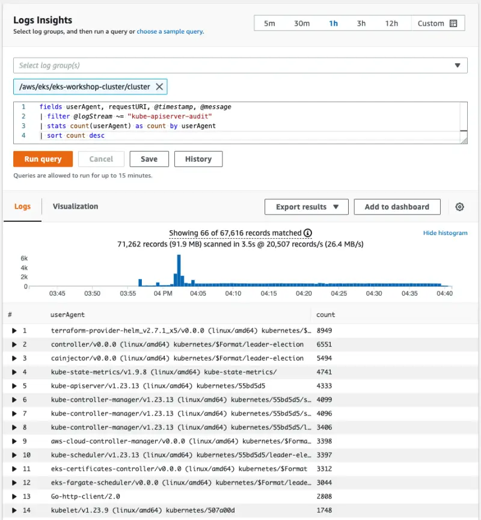

CloudWatch Logs Insights를 사용하면 CloudWatch Logs에서 로그 데이터를 대화식으로 검색하고 분석할 수 있습니다. 운영 문제에 더 효율적이고 효과적으로 대응하는 데 도움이 되는 쿼리를 수행할 수 있습니다. 문제가 발생하면 CloudWatch Logs Insights를 사용하여 잠재적 원인을 식별하고 배포된 수정 사항을 검증할 수 있습니다. 몇 가지 간단하지만 강력한 명령이 포함된 목적에 맞게 설계된 쿼리 언어를 포함하고 있습니다.

이 실습에서는 CloudWatch Log Insights를 사용하여 EKS 컨트롤 플레인 로그를 쿼리하는 예제를 살펴보겠습니다. 먼저 콘솔에서 CloudWatch Log Insights로 이동합니다:

<ConsoleButton url="https://console.aws.amazon.com/cloudwatch/home#logsV2:logs-insights" service="cloudwatch" label="Open CloudWatch console"/>

다음과 같은 화면이 표시됩니다:



CloudWatch Log Insights의 일반적인 사용 사례는 Kubernetes API 서버에 대량의 요청을 보내는 EKS 클러스터 내의 구성 요소를 식별하는 것입니다. 이를 위한 한 가지 방법은 다음 쿼리를 사용하는 것입니다:

```blank
fields userAgent, requestURI, @timestamp, @message
| filter @logStream ~= "kube-apiserver-audit"
| stats count(userAgent) as count by userAgent
| sort count desc
```

이 쿼리는 Kubernetes 감사 로그를 확인하고 `userAgent`별로 그룹화된 API 요청 수를 계산하여 내림차순으로 정렬합니다. Log Insights 콘솔에서 EKS 클러스터의 로그 그룹을 선택합니다:



쿼리를 콘솔에 복사하고 **Run query**를 누르면 결과가 반환됩니다:



이 정보는 어떤 구성 요소가 API 서버로 요청을 보내는지 이해하는 데 매우 유용할 수 있습니다.

:::info
CDK Observability Accelerator를 사용하는 경우 [CloudWatch Insights Add-on](https://aws-quickstart.github.io/cdk-eks-blueprints/addons/aws-cloudwatch-insights/)을 확인하세요. 이는 EKS의 컨테이너화된 애플리케이션과 마이크로서비스에서 메트릭과 로그를 수집, 집계 및 요약합니다.
:::