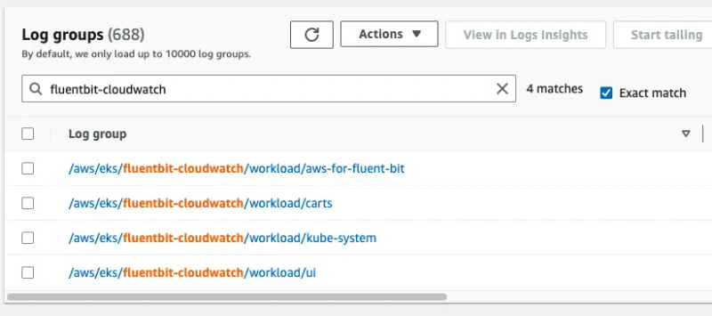
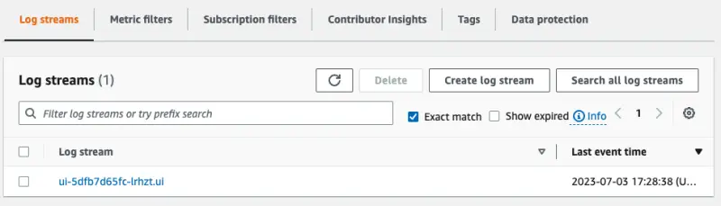
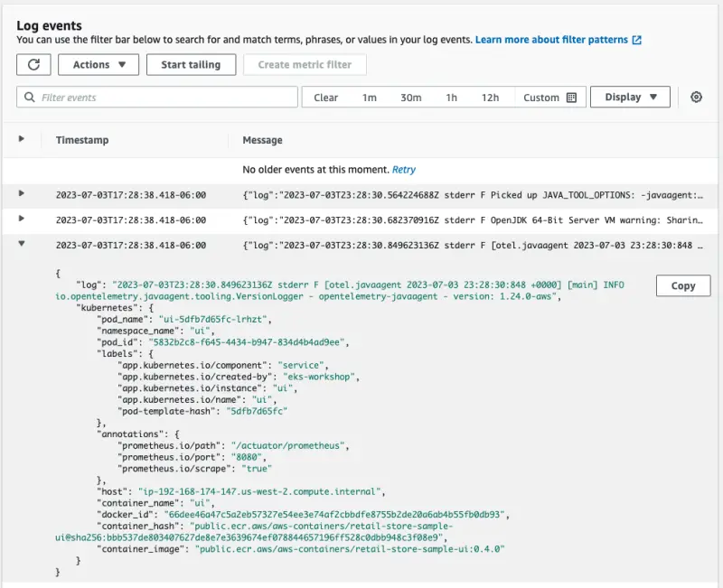

이 실습에서는 각 노드에 배포된 Fluent Bit 에이전트가 Amazon CloudWatch Logs로 전달한 Kubernetes 파드 로그를 확인하는 방법을 살펴보겠습니다. 배포된 애플리케이션 컴포넌트는 로그를 `stdout`에 작성하며, 이는 각 노드의 `/var/log/containers/*.log` 경로에 저장됩니다.

먼저, Fluent Bit을 활성화한 이후 새로운 로그가 작성되도록 `ui` 컴포넌트의 파드들을 재시작해보겠습니다:

```bash
$ kubectl delete pod -n ui --all
$ kubectl rollout status deployment/ui \
  -n ui --timeout 30s
deployment "ui" successfully rolled out
```

이제 `kubectl logs`를 직접 사용하여 `ui` 컴포넌트가 로그를 생성하고 있는지 확인할 수 있습니다:

```bash
$ kubectl logs -n ui deployment/ui
Picked up JAVA_TOOL_OPTIONS: -javaagent:/opt/aws-opentelemetry-agent.jar
OpenJDK 64-Bit Server VM warning: Sharing is only supported for boot loader classes because bootstrap classpath has been appended
[otel.javaagent 2023-07-03 23:39:18:499 +0000] [main] INFO io.opentelemetry.javaagent.tooling.VersionLogger - opentelemetry-javaagent - version: 1.24.0-aws

  .   ____          _            __ _ _
 /\\ / ___'_ __ _ _(_)_ __  __ _ \ \ \ \
( ( )\___ | '_ | '_| | '_ \/ _` | \ \ \ \
 \\/  ___)| |_)| | | | | || (_| |  ) ) ) )
  '  |____| .__|_| |_|_| |_\__, | / / / /
 =========|_|==============|___/=/_/_/_/
 :: Spring Boot ::                (v3.0.6)

2023-07-03T23:39:20.472Z  INFO 1 --- [           main] c.a.s.u.UiApplication                    : Starting UiApplication v0.0.1-SNAPSHOT using Java 17.0.7 with PID 1 (/app/app.jar started by appuser in /app)
2023-07-03T23:39:20.488Z  INFO 1 --- [           main] c.a.s.u.UiApplication                    : No active profile set, falling back to 1 default profile: "default"
2023-07-03T23:39:24.985Z  WARN 1 --- [           main] o.s.b.a.e.EndpointId                     : Endpoint ID 'fail-cart' contains invalid characters, please migrate to a valid format.
2023-07-03T23:39:25.132Z  INFO 1 --- [           main] o.s.b.a.e.w.EndpointLinksResolver        : Exposing 15 endpoint(s) beneath base path '/actuator'
2023-07-03T23:39:25.567Z  INFO 1 --- [           main] o.s.b.w.e.n.NettyWebServer               : Netty started on port 8080
2023-07-03T23:39:25.599Z  INFO 1 --- [           main] c.a.s.u.UiApplication                    : Started UiApplication in 5.877 seconds (process running for 7.361)
```

CloudWatch Logs 콘솔을 열어 이러한 로그들이 나타나는지 확인합니다:

<ConsoleButton url="https://console.aws.amazon.com/cloudwatch/home?#logsV2:log-groups" service="cloudwatch" label="Open CloudWatch console"/>

Fluent Bit이 생성한 로그 그룹을 찾기 위해 **fluentbit-cloudwatch**로 필터링합니다:



`/aws/eks/fluentbit-cloudwatch/workload/ui`를 선택하여 로그 스트림을 확인합니다. 각 스트림은 개별 파드에 해당합니다:



로그 항목 중 하나를 확장하여 전체 JSON 페이로드를 확인할 수 있습니다:

