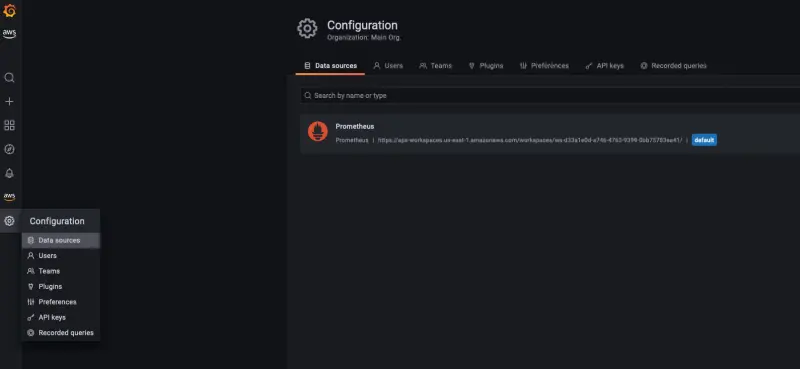

Grafana 인스턴스가 EKS 클러스터에 사전 설치되어 있습니다. 접근하려면 먼저 URL을 검색해야 합니다:

```bash hook=check-grafana
$ kubectl get ingress -n grafana grafana -o=jsonpath='{.status.loadBalancer.ingress[0].hostname}{"\n"}'
k8s-grafana-grafana-123497e39be-2107151316.us-west-2.elb.amazonaws.com
```

이 URL을 브라우저에서 열면 로그인 화면이 나타납니다.


사용자 자격 증명을 검색하려면 Grafana helm 차트에서 생성한 시크릿을 쿼리하세요:

```bash
$ kubectl get -n grafana secrets/grafana -o=jsonpath='{.data.admin-user}' | base64 -d; printf "\n"
$ kubectl get -n grafana secrets/grafana -o=jsonpath='{.data.admin-password}' | base64 -d; printf "\n"
```

Grafana 콘솔에 로그인한 후, 데이터소스 섹션을 살펴보겠습니다. Amazon Managed Service for Prometheus 워크스페이스가 이미 데이터소스로 구성되어 있는 것을 볼 수 있습니다.

