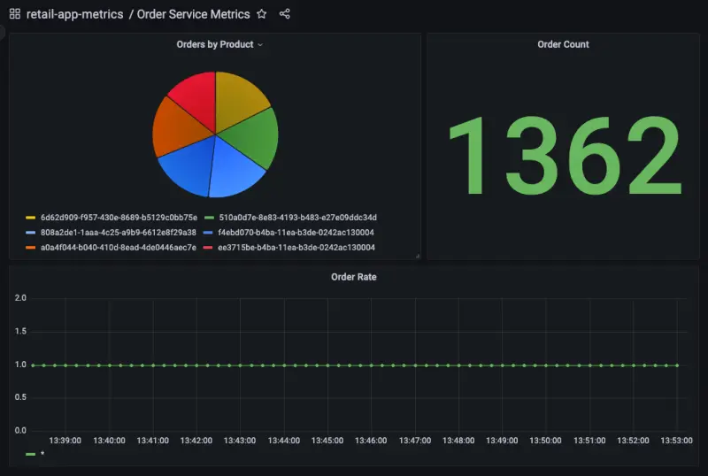

이 섹션에서는 우리의 워크로드가 노출하는 메트릭에 대한 인사이트를 얻는 방법을 살펴보겠습니다. 이러한 예시들은 다음과 같을 수 있습니다:

- Java 힙 메트릭이나 데이터베이스 연결 풀 상태와 같은 시스템 메트릭
- 비즈니스 KPI와 관련된 애플리케이션 메트릭

AWS Distro for OpenTelemetry를 사용하여 애플리케이션 메트릭을 수집하고 Grafana를 사용하여 메트릭을 시각화하는 방법을 살펴보겠습니다.

이 워크샵의 각 컴포넌트는 특정 프로그래밍 언어나 프레임워크와 관련된 라이브러리를 사용하여 Prometheus 메트릭을 제공하도록 계측되었습니다. 주문 서비스의 이러한 메트릭 예시를 다음과 같이 볼 수 있습니다:

```bash
$ kubectl -n orders exec deployment/orders -- curl http://localhost:8080/actuator/prometheus
[...]
# HELP jdbc_connections_idle Number of established but idle connections.
# TYPE jdbc_connections_idle gauge
jdbc_connections_idle{name="reader",} 10.0
jdbc_connections_idle{name="writer",} 10.0
[...]
# HELP watch_orders_total The number of orders placed
# TYPE watch_orders_total counter
watch_orders_total{productId="510a0d7e-8e83-4193-b483-e27e09ddc34d",} 2.0
watch_orders_total{productId="808a2de1-1aaa-4c25-a9b9-6612e8f29a38",} 1.0
watch_orders_total{productId="*",} 3.0
watch_orders_total{productId="6d62d909-f957-430e-8689-b5129c0bb75e",} 1.0
```

이 명령의 출력은 상세하므로 위의 예시는 다음을 보여주기 위해 정리되었습니다:

- 시스템 메트릭 - 얼마나 많은 JDBC 연결이 유휴 상태인지
- 애플리케이션 메트릭 - 소매점을 통해 얼마나 많은 주문이 이루어졌는지

다른 컴포넌트에 대해서도 유사한 요청을 실행할 수 있습니다. 예를 들어 체크아웃 서비스:

```bash
$ kubectl -n checkout exec deployment/checkout -- curl http://localhost:8080/metrics
[...]
# HELP nodejs_heap_size_total_bytes Process heap size from Node.js in bytes.
# TYPE nodejs_heap_size_total_bytes gauge
nodejs_heap_size_total_bytes 48668672
[...]
```

이 실습에서는 ADOT를 활용하여 모든 컴포넌트의 메트릭을 수집하고 주문된 수를 보여주는 대시보드를 탐색할 것입니다. 애플리케이션 파드에서 메트릭을 스크랩하는 데 사용된 OpenTelemetry 구성을 살펴보겠습니다. 특히 이 섹션을 보겠습니다:

```bash
$ kubectl -n other get opentelemetrycollector adot -o jsonpath='{.spec.config}' \
  | yq '.receivers.prometheus.config.scrape_configs[2]'
job_name: 'kubernetes-pods'
honor_labels: true
kubernetes_sd_configs:
  - role: pod
relabel_configs:
  - source_labels: [__meta_kubernetes_pod_annotation_prometheus_io_scrape]
    action: keep
    regex: true
  - source_labels: [__meta_kubernetes_pod_annotation_prometheus_io_scrape_slow]
    action: drop
    regex: true
  - source_labels: [__meta_kubernetes_pod_annotation_prometheus_io_scheme]
    action: replace
    regex: (https?)
    target_label: __scheme__
  - source_labels: [__meta_kubernetes_pod_annotation_prometheus_io_path]
    action: replace
    target_label: __metrics_path__
    regex: (.+)
  - action: labelmap
    regex: __meta_kubernetes_pod_annotation_prometheus_io_param_(.+)
    replacement: __param_$1
  - action: labelmap
    regex: __meta_kubernetes_pod_label_(.+)
  - source_labels: [__meta_kubernetes_namespace]
    action: replace
    target_label: namespace
  - source_labels: [__meta_kubernetes_pod_name]
    action: replace
    target_label: pod
  - source_labels: [__meta_kubernetes_pod_phase]
    regex: Pending|Succeeded|Failed|Completed
    action: drop
```

이 구성은 Prometheus의 [Kubernetes 서비스 디스커버리](https://prometheus.io/docs/prometheus/latest/configuration/configuration/#kubernetes_sd_config) 메커니즘을 활용하여 특정 어노테이션이 있는 모든 파드를 자동으로 발견합니다. 이 특정 구성은 `prometheus.io/scrape` 어노테이션이 있는 모든 파드를 발견하고, 스크랩하는 메트릭을 네임스페이스와 파드 이름과 같은 Kubernetes 메타데이터로 보강합니다.

주문 컴포넌트 파드의 어노테이션을 확인할 수 있습니다:

```bash
$ kubectl get -o yaml -n orders deployment/orders | yq '.spec.template.metadata.annotations'
prometheus.io/path: /actuator/prometheus
prometheus.io/port: "8080"
prometheus.io/scrape: "true"
```

클러스터 메트릭 섹션에서 보았듯이, 이러한 파드 메트릭도 동일한 OpenTelemetry 익스포터를 사용하여 AMP로 전송됩니다.

다음으로 아래 스크립트를 사용하여 로드 생성기를 실행하여 스토어를 통해 주문을 하고 애플리케이션 메트릭을 생성합니다:

```bash test=false
$ cat <<EOF | kubectl apply -f -
apiVersion: v1
kind: Pod
metadata:
  name: load-generator
  namespace: other
spec:
  containers:
  - name: artillery
    image: artilleryio/artillery:2.0.0-31
    args:
    - "run"
    - "-t"
    - "http://ui.ui.svc"
    - "/scripts/scenario.yml"
    volumeMounts:
    - name: scripts
      mountPath: /scripts
  initContainers:
  - name: setup
    image: public.ecr.aws/aws-containers/retail-store-sample-utils:load-gen.0.4.0
    command:
    - bash
    args:
    - -c
    - "cp /artillery/* /scripts"
    volumeMounts:
    - name: scripts
      mountPath: "/scripts"
  volumes:
  - name: scripts
    emptyDir: {}
EOF
```

이전 섹션에서 했던 것처럼 Grafana를 엽니다:


대시보드 페이지로 이동하여 **Order Service Metrics** 대시보드를 클릭하여 대시보드 내의 패널을 검토합니다:



"Orders by Product" 패널의 제목 위에 마우스를 올리고 "Edit" 버튼을 클릭하여 AMP를 쿼리하도록 대시보드가 어떻게 구성되었는지 볼 수 있습니다:


이 패널을 만드는 데 사용된 PromQL 쿼리가 페이지 하단에 표시됩니다:


이 경우 우리는 다음 쿼리를 사용하고 있습니다:

```text
sum by(productId) (watch_orders_total{productId!="*"})
```

이 쿼리는 다음을 수행합니다:

- `watch_orders_total` 메트릭을 쿼리합니다
- `productId` 값이 `*`인 메트릭을 무시합니다
- 이러한 메트릭을 합산하고 `productId`로 그룹화합니다

다른 패널들도 유사하게 탐색하여 어떻게 생성되었는지 이해할 수 있습니다.

메트릭 관찰에 만족하셨다면, 아래 명령을 사용하여 로드 생성기를 중지할 수 있습니다.

```bash timeout=180 test=false
$ kubectl delete pod load-generator -n other
```