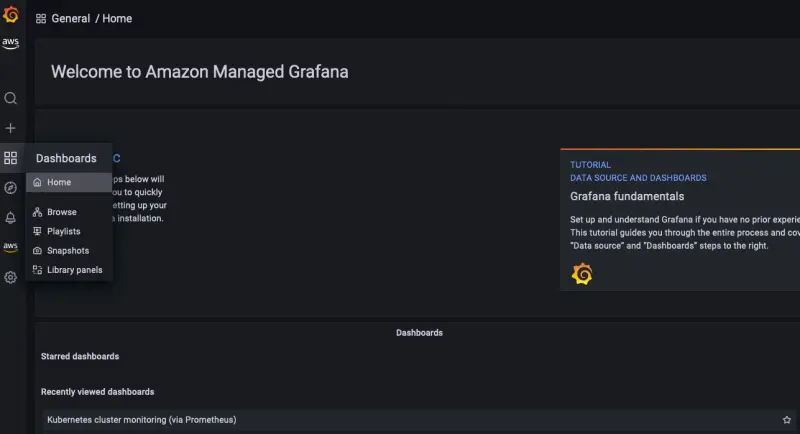
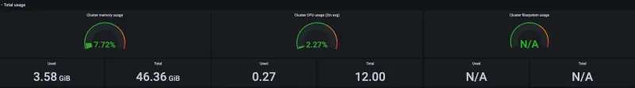

대시보드 섹션으로 이동하여 AWS Distro for Opentelemetry에서 수집한 EKS 클러스터 메트릭을 시각화해 보겠습니다.

**Kubernetes Cluster Monitoring** 대시보드를 클릭하고 대시보드 내의 패널을 살펴보겠습니다.

Total Usage 패널은 CPU, 메모리 및 파일 시스템 사용량 측면에서 전체 클러스터 활용도를 보여줍니다.

