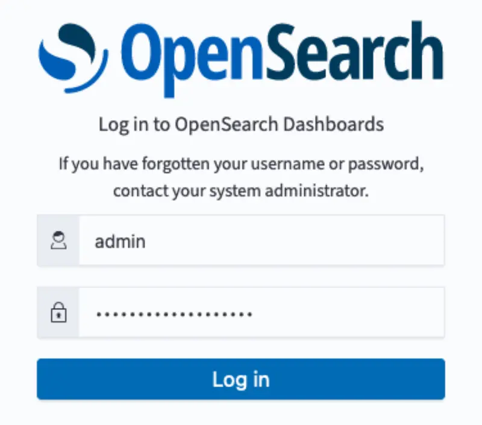
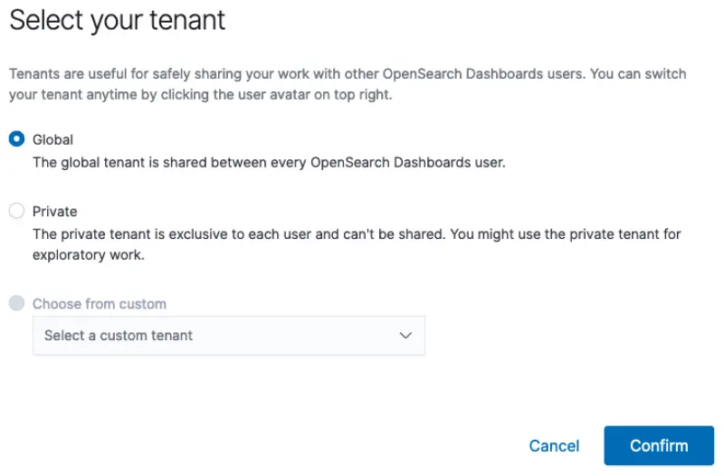
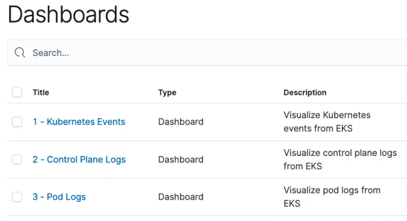

이 섹션에서는 AWS Systems Manager Parameter Store에서 OpenSearch 자격 증명을 검색하고, Kubernetes 이벤트와 파드 로그를 위해 미리 생성된 OpenSearch 대시보드를 로드하고 OpenSearch에 대한 접근을 확인할 것입니다.

OpenSearch 도메인에 대한 자격 증명은 프로비저닝 과정에서 AWS Systems Manager Parameter Store에 저장되었습니다. 이 정보를 검색하고 필요한 환경 변수를 설정하세요.

```bash
$ export OPENSEARCH_HOST=$(aws ssm get-parameter \
      --name /eksworkshop/$EKS_CLUSTER_NAME/opensearch/host \
      --region $AWS_REGION | jq -r .Parameter.Value)
$ export OPENSEARCH_USER=$(aws ssm get-parameter \
      --name /eksworkshop/$EKS_CLUSTER_NAME/opensearch/user  \
      --region $AWS_REGION --with-decryption | jq -r .Parameter.Value)
$ export OPENSEARCH_PASSWORD=$(aws ssm get-parameter \
      --name /eksworkshop/$EKS_CLUSTER_NAME/opensearch/password \
      --region $AWS_REGION --with-decryption | jq -r .Parameter.Value)
$ export OPENSEARCH_DASHBOARD_FILE=~/environment/eks-workshop/modules/observability/opensearch/opensearch-dashboards.ndjson
```

Kubernetes 이벤트와 파드 로그를 표시하기 위해 미리 생성된 OpenSearch 대시보드를 로드합니다. 대시보드는 Kubernetes 이벤트와 파드 로그를 위한 OpenSearch 인덱스 패턴, 시각화 및 대시보드를 포함하는 [파일](https://github.com/VAR::MANIFESTS_OWNER/VAR::MANIFESTS_REPOSITORY/tree/VAR::MANIFESTS_REF/manifests/modules/observability/opensearch/opensearch-dashboards.ndjson)에서 사용할 수 있습니다.

```bash
$ curl -s https://$OPENSEARCH_HOST/_dashboards/auth/login \
      -H 'content-type: application/json' -H 'osd-xsrf: osd-fetch' \
      --data-raw '{"username":"'"$OPENSEARCH_USER"'","password":"'"$OPENSEARCH_PASSWORD"'"}' \
      -c dashboards_cookie | jq .
{
  "username": "admin",
  "tenants": {
    "global_tenant": true,
    "admin": true
  },
  "roles": [
    "security_manager",
    "all_access"
  ],
  "backendroles": []
}

$ curl -s -X POST https://$OPENSEARCH_HOST/_dashboards/api/saved_objects/_import?overwrite=true \
        --form file=@$OPENSEARCH_DASHBOARD_FILE \
        -H "osd-xsrf: true" -b dashboards_cookie | jq .
{
  "successCount": 7,
  "success": true,
  "successResults": [
    {
      "type": "index-pattern",
      "id": "79cc3180-6c51-11ee-bdf2-9d2ccb0785e7",
      "meta": {
        "title": "eks-kubernetes-events*",
        "icon": "indexPatternApp"
      }
    },
    ...
  ]
}
```

앞서 검색한 OpenSearch 서버 좌표와 자격 증명을 확인하고 OpenSearch 대시보드에 접근 가능한지 확인합니다.

```bash
$ printf "\nOpenSearch dashboard: https://%s/_dashboards/app/dashboards \nUserName: %q \nPassword: %q \n\n" \
      "$OPENSEARCH_HOST" "$OPENSEARCH_USER" "$OPENSEARCH_PASSWORD"

OpenSearch dashboard: <OpenSearch Dashboard URL>
Username: <user name>
Password: <password>
```

위의 OpenSearch 대시보드 URL로 브라우저를 이동하고 자격 증명을 사용하여 로그인하세요.



아래와 같이 Global 테넌트를 선택하세요. OpenSearch의 테넌트는 인덱스 패턴, 시각화 및 대시보드와 같은 리소스를 안전하게 공유하는 데 사용될 수 있습니다.



이전 단계에서 로드한 두 개의 대시보드(Kubernetes 이벤트와 파드 로그용)가 보일 것입니다. OpenSearch에 아직 데이터가 없기 때문에 대시보드는 현재 비어 있습니다. 이 브라우저 탭을 열어두거나 대시보드 URL을 저장하세요. 다음 섹션에서 대시보드로 돌아올 것입니다.

