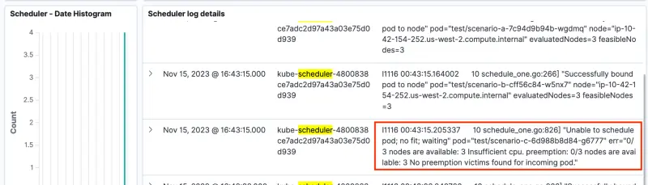

앞서 살펴본 [EKS의 로깅](https://www.eksworkshop.com/docs/observability/logging/cluster-logging/) 섹션에서 보았듯이, Amazon EKS 컨트롤 플레인 로깅은 Amazon EKS 컨트롤 플레인에서 직접 사용자 계정의 CloudWatch Logs로 감사 및 진단 로그를 제공합니다. 이러한 컨트롤 플레인 로그를 CloudWatch Logs에서 OpenSearch로 전달하여 이전 설정을 확장합니다. CloudWatch Logs를 내보내기 위한 Lambda 함수는 이 모듈의 `prepare-environment` 단계의 일부로 설정되었습니다. 이 섹션에서는 모든 EKS 컨트롤 플레인 로깅을 활성화하고, Lambda 함수를 트리거할 CloudWatch Logs 구독 필터를 추가하고 OpenSearch 컨트롤 플레인 로그 대시보드를 살펴볼 것입니다.

다음 두 단락은 EKS의 컨트롤 플레인 로깅에 대한 개요를 제공합니다. EKS의 로깅에 대한 이전 섹션을 이미 살펴보았다면 이 개요를 건너뛰어도 됩니다.

사용 가능한 다섯 가지 유형의 컨트롤 플레인 로그가 있습니다. 개별적으로 활성화하거나 비활성화할 수 있는 각 로그 유형은 Kubernetes 컨트롤 플레인의 구성 요소에 해당합니다. 이러한 구성 요소에 대해 자세히 알아보려면 [Kubernetes 문서](https://kubernetes.io/docs/concepts/overview/components/)의 Kubernetes 구성 요소와 [Amazon EKS 컨트롤 플레인 로깅 문서](https://docs.aws.amazon.com/eks/latest/userguide/control-plane-logs.html)를 참조하세요.

* **Kubernetes API 서버 구성 요소 로그(api)** - 클러스터의 API 서버는 Kubernetes API를 노출하는 컨트롤 플레인 구성 요소입니다
* **감사(audit)** - Kubernetes 감사 로그는 클러스터에 영향을 미친 개별 사용자, 관리자 또는 시스템 구성 요소의 기록을 제공합니다
* **인증자(authenticator)** - 인증자 로그는 Amazon EKS에만 고유합니다. 이러한 로그는 Amazon EKS가 IAM 자격 증명을 사용하여 Kubernetes [역할 기반 액세스 제어](https://kubernetes.io/docs/reference/access-authn-authz/rbac/)(RBAC) 인증에 사용하는 컨트롤 플레인 구성 요소를 나타냅니다
* **컨트롤러 관리자(controllerManager)** - 컨트롤러 관리자는 Kubernetes와 함께 제공되는 핵심 제어 루프를 관리합니다
* **스케줄러(scheduler)** - 스케줄러 구성 요소는 클러스터에서 파드를 언제 어디서 실행할지 관리합니다

다음 다이어그램은 이 섹션의 설정 개요를 제공합니다. 왼쪽에서 오른쪽으로 흐름은 다음과 같습니다:

1. Amazon EKS에서 컨트롤 플레인 로그가 활성화되어 CloudWatch Logs로 로그를 전송합니다
2. CloudWatch Logs 구독 필터가 Lambda 함수를 트리거하고 로그 메시지를 전송합니다
3. Lambda 함수가 컨트롤 플레인 로그를 OpenSearch 인덱스에 기록합니다
4. `eks-control-plane-logs`라는 단일 OpenSearch 인덱스가 모든 컨트롤 플레인 로그를 저장합니다. 실습 후반부에서 OpenSearch 대시보드 내에서 다양한 로그 유형을 필터링하는 방법을 살펴볼 것입니다


EKS 컨트롤 플레인 로그는 EKS API를 통해 클러스터별로 활성화됩니다. 이는 주로 Terraform이나 CloudFormation을 사용하여 구성되지만, 이 실습에서는 AWS CLI를 사용하여 기능을 활성화할 것입니다. 보시다시피 각 클러스터 로그 유형을 개별적으로 활성화할 수 있으며, 이 실습에서는 모든 것을 활성화하고 있습니다.

```bash
$ aws eks update-cluster-config \
    --region $AWS_REGION \
    --name $EKS_CLUSTER_NAME \
    --logging '{"clusterLogging":[{"types":["api","audit","authenticator","controllerManager","scheduler"],"enabled":true}]}'
{
    "update": {
        "id": "6d73515c-f5e7-4288-9e55-480e9c6dd084",
        "status": "InProgress",
        "type": "LoggingUpdate",
        "params": [
            {
                "type": "ClusterLogging",
                "value": "{\"clusterLogging\":[{\"types\":[\"api\",\"audit\",\"authenticator\",\"controllerManager\",\"scheduler\"],\"enabled\":true}]}"
            }
        ],
        "createdAt": "2023-05-25T19:33:16.622000+00:00",
        "errors": []
    }
}
$ sleep 30
$ aws eks wait cluster-active --name $EKS_CLUSTER_NAME
```

선택적으로 AWS 콘솔을 사용하여 EKS 컨트롤 플레인 로깅 설정을 검사할 수 있습니다:

<ConsoleButton url="https://console.aws.amazon.com/eks/home#/clusters/eks-workshop?selectedTab=cluster-logging-tab" service="cloudwatch" label="Open CloudWatch console"/>

**로깅** 탭은 AWS 콘솔 내 EKS 클러스터의 컨트롤 플레인 로그에 대한 현재 구성을 보여줍니다:

`/aws/eks/eks-workshop/cluster`라는 CloudWatch 로그 그룹에 액세스하세요

<ConsoleButton url="https://console.aws.amazon.com/cloudwatch/home#logsV2:log-groups/log-group/$252Faws$252Feks$252Feks-workshop$252Fcluster" service="cloudwatch" label="Open CloudWatch console"/>

각 컨트롤 플레인 로그 유형과 관련된 최소 하나의 로그 스트림을 찾을 수 있습니다:

* Kubernetes API 서버 로그용 `kube-apiserver-*`
* 감사 로그용 `*-audit-*`
* 인증자 로그용 `authenticator-*`
* 컨트롤러 관리자 로그용 `kube-controller-manager-*`
* 스케줄러 로그용 `kube-scheduler-*

컨트롤 플레인 로그를 내보내기 위해 `prepare-environment` 단계 동안 사전 프로비저닝된 [eks-workshop-control-plane-logs](https://console.aws.amazon.com/lambda/home#/functions/eks-workshop-control-plane-logs) Lambda 함수로 이동하세요. 현재 Lambda 함수에 설정된 트리거가 없다는 점에 주목하세요.

위의 개요 다이어그램에 표시된 대로 Lambda 함수를 CloudWatch Logs 및 OpenSearch에 연결하는 데는 두 단계가 있습니다:

1. Lambda 함수가 `eks-control-plane-logs`라는 OpenSearch 인덱스에 쓸 수 있도록 하는 OpenSearch 역할 설정
2. Lambda 함수를 대상으로 하는 CloudWatch 로그 그룹에 대한 구독 필터 구성

Lambda 함수 ARN과 해당 IAM 역할 ARN은 이미 환경 변수로 사용 가능합니다:

```bash
$ echo $LAMBDA_ARN
$ echo $LAMBDA_ROLE_ARN
```

Lambda 내보내기 함수에 `eks-control-plane-logs`라는 OpenSearch 인덱스를 생성하고 쓸 수 있는 권한을 부여합니다. 첫 번째 명령은 필요한 권한이 있는 OpenSearch 도메인 내에 새 역할을 생성합니다. 두 번째 명령은 Lambda 함수의 실행 역할 ARN을 지정하는 역할 매핑을 추가합니다.

```bash
$ curl -s -XPUT "https://${OPENSEARCH_HOST}/_plugins/_security/api/roles/lambda_role" \
    -u $OPENSEARCH_USER:$OPENSEARCH_PASSWORD -H 'Content-Type: application/json' \
    --data-raw '{"cluster_permissions": ["*"], "index_permissions": [{"index_patterns": ["eks-control-plane-logs*"], "allowed_actions": ["*"]}]}' \
    | jq .
{
  "status": "CREATED",
  "message": "'lambda_role' created."
}

$ curl -s -XPUT "https://${OPENSEARCH_HOST}/_plugins/_security/api/rolesmapping/lambda_role" \
    -u $OPENSEARCH_USER:$OPENSEARCH_PASSWORD -H 'Content-Type: application/json' \
    --data-raw '{"backend_roles": ["'"$LAMBDA_ROLE_ARN"'"]}' | jq .
{
  "status": "CREATED",
  "message": "'lambda_role' created."
}
```

Lambda 함수를 대상으로 하는 CloudWatch 로그 그룹에 대한 구독 필터를 설정합니다. 명령이 `/aws/eks/eks-workshop/cluster` 로그 그룹 이름과 Lambda 함수 ARN을 지정하는 것에 주목하세요. 첫 번째 명령은 필터를 생성하고 두 번째 명령은 필터 세부 정보를 검색합니다.

```bash
$ aws logs put-subscription-filter \
    --log-group-name /aws/eks/$EKS_CLUSTER_NAME/cluster \
    --filter-name "${EKS_CLUSTER_NAME}-Control-Plane-Logs-To-OpenSearch" \
    --filter-pattern "" \
    --destination-arn $LAMBDA_ARN

$ aws logs describe-subscription-filters \
    --log-group-name /aws/eks/$EKS_CLUSTER_NAME/cluster | jq .
{
  "subscriptionFilters": [
    {
      "filterName": "${EKS_CLUSTER_NAME} EKS Control Plane Logs to OpenSearch",
      "logGroupName": "/aws/eks/eks-workshop/cluster",
      "filterPattern": "",
      "destinationArn": "arn:aws:lambda:us-west-2:1234567890:function:control-plane-logs",
      "distribution": "ByLogStream",
      "creationTime": 1699659802922
    }
  ]
}
```

Lambda 함수 [eks-workshop-control-plane-logs](https://console.aws.amazon.com/lambda/home#/functions/eks-workshop-control-plane-logs)로 돌아가세요. 구독 필터가 추가된 후 CloudWatch Logs가 이제 Lambda 함수의 트리거로 표시됩니다.

이것으로 EKS에서 OpenSearch로 컨트롤 플레인 로그를 전달하는 데 필요한 단계가 완료되었습니다.

이전에 본 대시보드 랜딩 페이지에서 컨트롤 플레인 로그 대시보드에 액세스하거나 아래 명령을 사용하여 해당 좌표를 얻으세요:

```bash
$ printf "\nPod logs dashboard: https://%s/_dashboards/app/dashboards#/view/1a1c3a70-831a-11ee-8baf-a5d5c77ada98 \
        \nUserName: %q \nPassword: %q \n\n" \
        "$OPENSEARCH_HOST" "$OPENSEARCH_USER" "$OPENSEARCH_PASSWORD"

Pod logs dashboard: <OpenSearch Dashboard URL>
Username: <user name>
Password: <password>
```

대시보드는 다섯 가지 컨트롤 플레인 로그 유형(알파벳 순) - Kubernetes API 서버 구성 요소 로그, 감사 로그, 인증자 로그, 컨트롤러 관리자 로그 및 스케줄러 로그에 대한 히스토그램과 상세 메시지를 제공합니다.

1. 날짜/시간 범위. 이 대시보드로 탐색하는 시간 범위를 사용자 지정할 수 있습니다(이 예에서는 마지막 1시간)
2. API 서버 로그에 대한 분당 메시지 수
3. API 서버에 대한 로그 메시지
4. 대시보드의 로그 스트림 필드는 이전에 AWS 콘솔에서 본 CloudWatch 로그 스트림 이름과 동일합니다. 로그 스트림 필드는 다섯 가지 컨트롤 플레인 로그 유형 각각에 대한 인덱스를 필터링하는 데 사용됩니다. 이 경우 필터는 API 서버 로그만 표시합니다
5. 나머지 네 가지 로그 유형에 대한 분당 메시지 수와 로그 메시지가 표시됩니다

:::tip

EKS 클러스터 활동 수준에 따라 선택한 시간 범위 내에 해당 유형의 로그 활동이 없는 경우 일부 컨트롤 플레인 로그 패널에 `결과를 찾을 수 없음`이 표시될 수 있습니다. 이러한 상황이 발생하면 지침을 계속 진행하고 'OpenSearch를 사용한 관찰성' 섹션을 떠나기 전에 컨트롤 플레인 로그 대시보드로 돌아오시면 됩니다.
:::


스케줄러 로그는 페이지 끝에 표시됩니다. 스케줄러 로그 메시지가 `scenario-c`에 대해 `파드를 스케줄링할 수 없음; 적합하지 않음; 대기 중`을 나타내는 것을 확인하세요. 이 스케줄 로그 메시지는 이전 페이지에서 본 `scenario-c`에 대한 Kubernetes 이벤트와 유사합니다.



행을 확장하면 테이블 형식이나 JSON 형식으로 세부 정보를 자세히 볼 수 있습니다.


