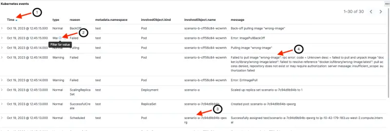

이 섹션에서는 Kubernetes 이벤트를 OpenSearch로 내보내고 OpenSearch를 사용하여 EKS 클러스터의 관찰 가능성을 향상시키는 방법을 보여줍니다. Kubernetes [events exporter](https://github.com/resmoio/kubernetes-event-exporter)를 배포하여 이벤트를 OpenSearch로 전달하고, 테스트 워크로드를 생성하여 추가 Kubernetes 이벤트를 생성하며, OpenSearch Kubernetes 이벤트 대시보드를 탐색하고, 문제를 식별하고 선택적으로 Kubernetes 클러스터 내의 이벤트를 탐색할 것입니다.

[Kubernetes 이벤트](https://kubernetes.io/docs/reference/kubernetes-api/cluster-resources/event-v1/)는 애플리케이션 및 클러스터 상태를 모니터링하고, 장애에 대응하며 진단을 수행하는 데 사용할 수 있는 풍부한 정보 소스를 제공합니다. 이벤트는 일반적으로 어떤 상태 변화를 나타냅니다. 예를 들어 파드 생성, 레플리카 추가 및 리소스 스케줄링 등이 있습니다. 각 이벤트에는 성공 또는 실패를 나타내는 Normal 또는 Warning으로 설정된 `type` 필드가 포함됩니다.

리소스에 대해 `kubectl describe`를 실행한 적이 있다면 이미 Kubernetes 이벤트를 다룬 경험이 있습니다. 아래와 같이 `kubectl describe`의 출력 마지막 섹션에 해당 리소스와 관련된 Kubernetes 이벤트가 표시됩니다.

```shell
kubectl describe pod nginx
...
Events:
  Type    Reason     Age   From               Message
  ----    ------     ----  ----               -------
  Normal  Scheduled  5s    default-scheduler  Successfully assigned default/nginx to ip-10-42-179-183.us-west-2.compute.internal
  Normal  Pulling    4s    kubelet            Pulling image "nginx"
  Normal  Pulled     4s    kubelet            Successfully pulled image "nginx" in 627.545722ms (627.553403ms including waiting)
  Normal  Created    4s    kubelet            Created container nginx
  Normal  Started    3s    kubelet            Started container nginx
```

Kubernetes 이벤트는 지속적으로 생성되지만 클러스터 내에서는 1시간 동안만 유지됩니다. 이 보존 기간은 Kubernetes 업스트림 기본 이벤트 유효 기간(TTL)인 60분과 일치합니다. OpenSearch는 이러한 이벤트의 수집, 분석 및 시각화를 단순화하는 지속적인 저장소를 제공합니다.

다음 다이어그램은 이 섹션의 설정 개요를 제공합니다. `kubernetes-events-exporter`가 `opensearch-exporter` 네임스페이스에 배포되어 이벤트를 OpenSearch 도메인으로 전달합니다. 이벤트는 OpenSearch의 `eks-kubernetes-events` 인덱스에 저장됩니다. 이전에 로드한 OpenSearch 대시보드는 이벤트를 시각화하는 데 사용됩니다.


Kubernetes 이벤트 내보내기를 배포하고 OpenSearch 도메인으로 이벤트를 보내도록 구성합니다. 기본 구성은 [여기](https://github.com/VAR::MANIFESTS_OWNER/VAR::MANIFESTS_REPOSITORY/tree/VAR::MANIFESTS_REF/manifests/modules/observability/opensearch/config/events-exporter-values.yaml)에서 확인할 수 있습니다. 이전에 검색한 OpenSearch 자격 증명을 사용하여 내보내기를 구성합니다. 두 번째 명령은 Kubernetes 이벤트 파드가 실행 중인지 확인합니다.

```bash timeout=120 wait=30
$ helm install events-to-opensearch \
    oci://registry-1.docker.io/bitnamicharts/kubernetes-event-exporter \
    --namespace opensearch-exporter --create-namespace \
    -f ~/environment/eks-workshop/modules/observability/opensearch/config/events-exporter-values.yaml \
    --set="config.receivers[0].opensearch.username"="$OPENSEARCH_USER" \
    --set="config.receivers[0].opensearch.password"="$OPENSEARCH_PASSWORD" \
    --set="config.receivers[0].opensearch.hosts[0]"="https://$OPENSEARCH_HOST" \
    --wait
...
NAME: events-to-opensearch
LAST DEPLOYED: Fri Oct 20 01:04:56 2023
NAMESPACE: opensearch-exporter
...

$ kubectl get pods -n opensearch-exporter
NAME                                                              READY   STATUS    RESTARTS      AGE
events-to-opensearch-kubernetes-event-exporter-67fc698978-2f9wc   1/1     Running   0             10s
```

이제 `Normal` 및 `Warning` 이벤트를 보여주기 위해 `test` 네임스페이스 내에 `scenario-a, scenario-b 및 scenario-c`로 레이블이 지정된 세 개의 배포를 시작하여 추가 Kubernetes 이벤트를 생성할 것입니다. 각 배포에는 의도적으로 오류가 포함되어 있습니다.

```bash
$ kubectl apply -k ~/environment/eks-workshop/modules/observability/opensearch/scenarios/events/base
namespace/test created
secret/some-secret created
deployment.apps/scenario-a created
deployment.apps/scenario-b created
deployment.apps/scenario-c created
```

:::tip

이전 단계에서 시작한 Kubernetes 이벤트 내보내기는 지난 1시간 동안의 이벤트와 새로운 이벤트를 OpenSearch로 보냅니다. 따라서 다음 명령을 실행하고 OpenSearch 대시보드를 검사할 때 볼 수 있는 정확한 이벤트 목록은 지난 1시간 동안의 EKS 클러스터 활동에 따라 다를 수 있습니다.

:::

이전 페이지에서 사용한 OpenSearch 대시보드로 돌아가 OpenSearch Kubernetes 이벤트 대시보드를 탐색합니다. 이전에 본 대시보드 랜딩 페이지에서 Kubernetes 이벤트 대시보드에 액세스하거나 아래 명령을 사용하여 해당 좌표를 얻을 수 있습니다:

```bash
$ printf "\nKubernetes Events dashboard: https://%s/_dashboards/app/dashboards#/view/06cca640-6a05-11ee-bdf2-9d2ccb0785e7 \
        \nUserName: %q \nPassword: %q \n\n" \
        "$OPENSEARCH_HOST" "$OPENSEARCH_USER" "$OPENSEARCH_PASSWORD"

Kubernetes Events dashboard: <OpenSearch Dashboard URL>
Username: <user name>
Password: <password>
```

실시간 대시보드는 아래 이미지와 유사하게 보이지만 숫자와 메시지는 클러스터 활동에 따라 다를 수 있습니다. 대시보드 섹션과 필드에 대한 설명은 다음과 같습니다.

1. [헤더] 날짜/시간 범위를 표시합니다. 이 대시보드로 탐색하는 시간 범위를 사용자 정의할 수 있습니다(이 예에서는 최근 30분).
2. [상단 섹션] 이벤트의 날짜 히스토그램(Normal 및 Warning 이벤트로 구분)
3. [중간 섹션] Kubernetes 이벤트는 총 이벤트 수(Normal 및 Warning)를 보여줍니다.
4. [중간 섹션] 선택한 시간 간격 동안 발생한 Warning 이벤트.
5. [중간 섹션] 네임스페이스별로 분류된 Warning. 이 예에서는 모든 Warning이 `test` 네임스페이스에 있습니다.
6. [하단 섹션] 가장 최근 이벤트부터 시작하는 상세 이벤트 및 메시지


다음 이미지는 이벤트 세부 정보가 포함된 하단 섹션에 초점을 맞춥니다:

1. 이벤트의 마지막 타임스탬프
2. 이벤트 유형(normal 또는 warning). 필드 위에 마우스를 올리면 해당 값으로 필터링할 수 있습니다(예: Warning 이벤트로 필터링)
3. Kubernetes 리소스의 이름(객체 유형 및 네임스페이스 포함)
4. 사람이 읽을 수 있는 메시지



다음 이미지와 같이 전체 이벤트 세부 정보를 자세히 살펴볼 수 있습니다:

1. 각 이벤트 옆의 '>'를 클릭하면 새 섹션이 열립니다
2. 전체 이벤트 문서는 테이블 또는 JSON 형식으로 볼 수 있습니다

Kubernetes 이벤트 내의 데이터 필드에 대한 설명은 [kubernetes.io](https://kubernetes.io/docs/reference/kubernetes-api/cluster-resources/event-v1)에서 찾거나 `kubectl explain events`를 실행하여 확인할 수 있습니다.


Kubernetes 이벤트 대시보드를 사용하여 세 개의 배포(`scenario-a, scenario-b 및 scenario-c`)가 문제를 겪고 있는 이유를 식별할 수 있습니다. 이전에 배포한 모든 파드는 `test` 네임스페이스에 있습니다.

**scenario-a:** 대시보드에서 `scenario-a`의 이유가 `FailedMount`이고 메시지가 `MountVolume.SetUp failed for volume "secret-volume" : secret "misspelt-secret-name" not found`인 것을 볼 수 있습니다. 파드가 존재하지 않는 시크릿을 마운트하려고 시도하고 있습니다.


**scenario-b:** `scenario-b`는 `Failed to pull image "wrong-image": rpc error: code = Unknown desc = failed to pull and unpack image "docker.io/library/wrong-image:latest": failed to resolve reference "docker.io/library/wrong-image:latest": pull access denied, repository does not exist or may require authorization: server message: insufficient_scope: authorization failed.`라는 메시지와 함께 실패했습니다. 존재하지 않는 이미지를 참조하기 때문에 파드가 생성되지 않고 있습니다.


**scenario-c:** 대시보드에 `FailedScheduling` 이유와 `0/3 nodes are available: 3 Insufficient cpu. preemption: 0/3 nodes are available: 3 No preemption victims found for incoming pod.`라는 메시지가 표시됩니다. 이 배포는 현재 클러스터 노드가 제공할 수 있는 것보다 많은 CPU를 요청하고 있습니다. (이 EKS 워크샵 모듈에서는 클러스터 자동 확장 기능을 활성화하지 않았습니다.)


문제를 해결하고 OpenSearch 대시보드를 다시 방문하여 변경 사항을 확인합니다

```bash
$ kubectl apply -k ~/environment/eks-workshop/modules/observability/opensearch/scenarios/events/fix
namespace/test unchanged
secret/some-secret unchanged
deployment.apps/scenario-a configured
deployment.apps/scenario-b configured
deployment.apps/scenario-c configured
```

OpenSearch 대시보드로 돌아가서 이전 문제가 해결되었음을 확인합니다. 업데이트된 배포는 성공적인 새 파드를 시작하고 이전에 생성된 파드(오류 포함)는 삭제됩니다.

:::tip
문제가 해결되면 새로운 Normal Kubernetes 이벤트가 생성됩니다. 이전 이벤트(Normal 또는 Warning)는 기록의 일부로 남아 있습니다. 따라서 Normal 및 Warning 이벤트의 수는 항상 _증가합니다_.
:::

선택적으로 EKS 클러스터 내에서 Kubernetes 이벤트를 탐색할 수 있습니다. OpenSearch 대시보드 내에서 탐색한 이벤트는 클러스터 내에서 사용 가능한 정보를 반영합니다.

클러스터에서 가장 최근의 5개 이벤트를 검색합니다.

```bash
$ kubectl get events --sort-by='.lastTimestamp' -A | head -5
NAMESPACE             LAST SEEN   TYPE      REASON              OBJECT                                                                 MESSAGE
catalog               44m         Normal    SuccessfulCreate    replicaset/catalog-857f89d57d                                          Created pod: catalog-857f89d57d-xl4xc
assets                44m         Normal    Scheduled           pod/assets-7ccc84cb4d-k5btz                                            Successfully assigned assets/assets-7ccc84cb4d-k5btz to ip-10-42-153-25.us-west-2.compute.internal
orders                44m         Normal    Scheduled           pod/orders-5696b978f5-gk2d7                                            Successfully assigned orders/orders-5696b978f5-gk2d7 to ip-10-42-104-177.us-west-2.compute.internal
ui                    44m         Normal    Scheduled           pod/ui-5dfb7d65fc-7l94z                                                Successfully assigned ui/ui-5dfb7d65fc-7l94z to ip-10-42-190-29.us-west-2.compute.internal

```

경고 또는 실패 상태의 이벤트를 확인합니다.

```bash
$ kubectl get events --sort-by='.lastTimestamp' --field-selector type!=Normal -A | head -5
NAMESPACE   LAST SEEN   TYPE      REASON             OBJECT                            MESSAGE
orders      44m         Warning   Unhealthy          pod/orders-5696b978f5-gk2d7       Readiness probe failed: Get "http://10.42.127.4:8080/actuator/health/liveness": dial tcp 10.42.127.4:8080: connect: connection refused
test        7m6s        Warning   FailedScheduling   pod/scenario-c-6d988b8d84-gghjv   0/3 nodes are available: 3 Insufficient cpu. preemption: 0/3 nodes are available: 3 No preemption victims found for incoming pod.
test        6m39s       Warning   Failed             pod/scenario-b-cff56c84-xn9hh     Error: ImagePullBackOff
test        6m28s       Warning   Failed             pod/scenario-b-cff56c84-xn9hh     Failed to pull image "wrong-image": rpc error: code = Unknown desc = failed to pull and unpack image "docker.io/library/wrong-image:latest": failed to resolve reference "docker.io/library/wrong-image:latest": pull access denied, repository does not exist or may require authorization: server message: insufficient_scope: authorization failed

```

JSON 형식으로 가장 최근의 이벤트(모든 네임스페이스에 걸쳐)를 확인합니다. 출력이 OpenSearch 인덱스 내의 세부 정보와 매우 유사함을 알 수 있습니다. (OpenSearch 문서에는 OpenSearch 내 인덱싱을 용이하게 하는 추가 필드가 있습니다.)

```bash
$ kubectl get events --sort-by='.lastTimestamp' -o json -A | jq '.items[-1]'
{
  "apiVersion": "v1",
  "count": 1,
  "eventTime": null,
  "firstTimestamp": "2023-10-19T21:49:44Z",
  "involvedObject": {
    "apiVersion": "apps/v1",
    "kind": "Deployment",
    "name": "scenario-c",
    "namespace": "test",
    "resourceVersion": "1485908",
    "uid": "7b12f29b-2c83-4b3b-8aa3-a4c8b22d8a38"
  },
  "kind": "Event",
  "lastTimestamp": "2023-10-19T21:49:44Z",
  "message": "Scaled down replica set scenario-c-6d988b8d84 to 0 from 1",
  "metadata": {
    "creationTimestamp": "2023-10-19T21:49:44Z",
    "name": "scenario-c.178fa09ddad7c5e3",
    "namespace": "test",
    "resourceVersion": "1485955",
    "uid": "e56aa6b2-9808-45a8-8863-ec9112f23822"
  },
  "reason": "ScalingReplicaSet",
  "reportingComponent": "deployment-controller",
  "reportingInstance": "",
  "source": {
    "component": "deployment-controller"
  },
  "type": "Normal"
}
```