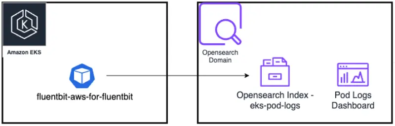
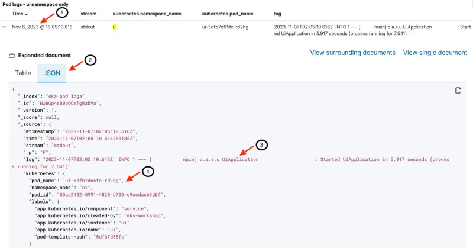

이 섹션에서는 pod 로그를 OpenSearch로 내보내는 방법을 보여줍니다. pod 로그를 OpenSearch로 내보내기 위해 [AWS for Fluent Bit](https://github.com/aws/aws-for-fluent-bit)를 배포하고, 로그 항목을 생성한 다음 OpenSearch pod 로그 대시보드를 살펴볼 것입니다.

다음 네 단락은 Kubernetes의 pod 로깅과 Fluent Bit 사용에 대한 개요를 제공합니다. 이전에 [EKS의 Pod 로깅](https://www.eksworkshop.com/docs/observability/logging/pod-logging/) 섹션을 이미 따라했다면 이 개요를 건너뛰어도 됩니다.

현대적인 애플리케이션 아키텍처의 골드 스탠다드를 제공하는 [Twelve-Factor App 선언](https://12factor.net/)에 따르면, 컨테이너화된 애플리케이션은 [로그를 stdout과 stderr로 출력](https://12factor.net/logs)해야 합니다. 이는 Kubernetes에서도 모범 사례로 간주되며 클러스터 수준의 로그 수집 시스템은 이 전제를 기반으로 구축됩니다.

Kubernetes 로깅 아키텍처는 세 가지 distinct 수준을 정의합니다:

- 기본 수준 로깅: kubectl을 사용하여 pod 로그를 가져오는 기능 (예: `kubectl logs myapp` - 여기서 `myapp`은 내 클러스터에서 실행 중인 pod입니다)
- 노드 수준 로깅: 컨테이너 엔진이 애플리케이션의 `stdout`과 `stderr`에서 로그를 캡처하고 로그 파일에 기록합니다.
- 클러스터 수준 로깅: 노드 수준 로깅을 기반으로 구축됩니다. 로그 캡처 에이전트가 각 노드에서 실행됩니다. 에이전트는 로컬 파일 시스템에서 로그를 수집하여 OpenSearch와 같은 중앙 집중식 로깅 대상으로 전송합니다. 에이전트는 두 가지 유형의 로그를 수집합니다:
  - 노드의 컨테이너 엔진에 의해 캡처된 컨테이너 로그
  - 시스템 로그

Kubernetes 자체는 로그를 수집하고 저장하는 네이티브 솔루션을 제공하지 않습니다. 컨테이너 런타임이 JSON 형식으로 로컬 파일 시스템에 로그를 저장하도록 구성합니다. Docker와 같은 컨테이너 런타임은 컨테이너의 stdout과 stderr 스트림을 로깅 드라이버로 리디렉션합니다. Kubernetes에서 컨테이너 로그는 노드의 `/var/log/pods/*.log`에 기록됩니다. Kubelet과 컨테이너 런타임은 자체 로그를 `/var/logs` 또는 systemd가 있는 운영 체제에서는 journald에 기록합니다. 그런 다음 Fluentd와 같은 클러스터 전체 로그 수집기 시스템이 노드에서 이러한 로그 파일을 tail하고 보존을 위해 로그를 전송할 수 있습니다. 이러한 로그 수집기 시스템은 일반적으로 작업자 노드에서 DaemonSet으로 실행됩니다.

[Fluent Bit](https://fluentbit.io/)는 경량 로그 프로세서 및 포워더로, 다양한 소스에서 데이터와 로그를 수집하고 필터로 보강한 다음 CloudWatch, Kinesis Data Firehose, Kinesis Data Streams 및 Amazon OpenSearch Service와 같은 여러 대상으로 전송할 수 있습니다.

다음 다이어그램은 이 섹션의 설정 개요를 제공합니다. Fluent Bit는 `opensearch-exporter` 네임스페이스에 배포되며 pod 로그를 OpenSearch 도메인으로 전달하도록 구성됩니다. pod 로그는 OpenSearch의 `eks-pod-logs` 인덱스에 저장됩니다. 이전에 로드한 OpenSearch 대시보드는 pod 로그를 검사하는 데 사용됩니다.



Fluent Bit를 [Daemon Set](https://kubernetes.io/docs/concepts/workloads/controllers/daemonset/)으로 배포하고 pod 로그를 OpenSearch 도메인으로 보내도록 구성합니다. 기본 구성은 [여기](https://github.com/VAR::MANIFESTS_OWNER/VAR::MANIFESTS_REPOSITORY/tree/VAR::MANIFESTS_REF/manifests/modules/observability/opensearch/config/fluentbit-values.yaml)에서 확인할 수 있습니다. 이전에 검색한 OpenSearch 자격 증명은 Fluent Bit를 구성하는 데 사용됩니다. 마지막 명령은 Fluent Bit가 세 개의 클러스터 노드 각각에 하나의 pod로 실행되고 있는지 확인합니다.

```bash wait=60
$ helm repo add eks https://aws.github.io/eks-charts
"eks" has been added to your repositories

$ helm upgrade fluentbit eks/aws-for-fluent-bit --install \
    --namespace opensearch-exporter --create-namespace \
    -f ~/environment/eks-workshop/modules/observability/opensearch/config/fluentbit-values.yaml \
    --set="opensearch.host"="$OPENSEARCH_HOST" \
    --set="opensearch.awsRegion"=$AWS_REGION \
    --set="opensearch.httpUser"="$OPENSEARCH_USER" \
    --set="opensearch.httpPasswd"="$OPENSEARCH_PASSWORD" \
    --wait

$ kubectl get daemonset -n opensearch-exporter

NAME                           DESIRED   CURRENT   READY   UP-TO-DATE   AVAILABLE   NODE SELECTOR   AGE
fluentbit-aws-for-fluent-bit   3         3         3       3            3           <none>          60s

```

먼저 Fluent Bit를 활성화한 이후 새로운 로그가 작성되도록 ui 컴포넌트의 pod를 재시작하겠습니다:

```bash
$ kubectl delete pod -n ui --all
$ kubectl rollout status deployment/ui -n ui --timeout 30s
deployment "ui" successfully rolled out
```

이제 `kubectl logs`를 직접 사용하여 `ui` 컴포넌트가 로그를 생성하고 있는지 확인할 수 있습니다. 로그의 타임스탬프는 현재 시간(UTC 형식으로 표시)과 일치해야 합니다.

```bash
$ kubectl logs -n ui deployment/ui
Picked up JAVA_TOOL_OPTIONS: -javaagent:/opt/aws-opentelemetry-agent.jar
OpenJDK 64-Bit Server VM warning: Sharing is only supported for boot loader classes because bootstrap classpath has been appended
[otel.javaagent 2023-11-07 02:05:03:383 +0000] [main] INFO io.opentelemetry.javaagent.tooling.VersionLogger - opentelemetry-javaagent - version: 1.24.0-aws

  .   ____          _            __ _ _
 /\\ / ___'_ __ _ _(_)_ __  __ _ \ \ \ \
( ( )\___ | '_ | '_| | '_ \/ _` | \ \ \ \
 \\/  ___)| |_)| | | | | || (_| |  ) ) ) )
  '  |____| .__|_| |_|_| |_\__, | / / / /
 =========|_|==============|___/=/_/_/_/
 :: Spring Boot ::                (v3.0.6)

2023-11-07T02:05:05.512Z  INFO 1 --- [           main] c.a.s.u.UiApplication                    : Starting UiApplication v0.0.1-SNAPSHOT using Java 17.0.7 with PID 1 (/app/app.jar started by appuser in /app)
2023-11-07T02:05:05.524Z  INFO 1 --- [           main] c.a.s.u.UiApplication                    : No active profile set, falling back to 1 default profile: "default"
2023-11-07T02:05:09.906Z  WARN 1 --- [           main] o.s.b.a.e.EndpointId                     : Endpoint ID 'fail-cart' contains invalid characters, please migrate to a valid format.
2023-11-07T02:05:10.060Z  INFO 1 --- [           main] o.s.b.a.e.w.EndpointLinksResolver        : Exposing 15 endpoint(s) beneath base path '/actuator'
2023-11-07T02:05:10.590Z  INFO 1 --- [           main] o.s.b.w.e.n.NettyWebServer               : Netty started on port 8080
2023-11-07T02:05:10.616Z  INFO 1 --- [           main] c.a.s.u.UiApplication                    : Started UiApplication in 5.917 seconds (process running for 7.541)

```

동일한 로그 항목이 OpenSearch에서도 볼 수 있음을 확인할 수 있습니다. 이전에 본 대시보드 랜딩 페이지에서 pod 로그 대시보드에 접근하거나 아래 명령을 사용하여 해당 좌표를 얻을 수 있습니다:

```bash
$ printf "\nPod logs dashboard: https://%s/_dashboards/app/dashboards#/view/31a8bd40-790a-11ee-8b75-b9bb31eee1c2 \
        \nUserName: %q \nPassword: %q \n\n" \
        "$OPENSEARCH_HOST" "$OPENSEARCH_USER" "$OPENSEARCH_PASSWORD"

Pod logs dashboard: <OpenSearch Dashboard URL>
Username: <user name>
Password: <password>
```

대시보드 섹션과 필드에 대한 설명은 다음과 같습니다.

1. [헤더] 날짜/시간 범위를 표시합니다. 이 대시보드로 탐색하는 시간 범위를 사용자 정의할 수 있습니다(이 예에서는 최근 15분).
2. [상단 섹션] `stdout`과 `stderr` 스트림 간의 분할을 보여주는 로그 메시지의 날짜 히스토그램(모든 네임스페이스 포함)
3. [중간 섹션] 모든 클러스터 네임스페이스에 걸친 분할을 보여주는 로그 메시지의 날짜 히스토그램
4. [하단 섹션] 가장 최근 메시지가 먼저 표시되는 데이터 테이블. 스트림 이름(`stdout` 및 `stderr`)이 pod 이름과 같은 세부 정보와 함께 표시됩니다. 시연을 위해 이 섹션은 `ui` 네임스페이스의 로그만 표시하도록 필터링되었습니다.
5. [하단 섹션] 개별 pod에서 수집된 로그 메시지. 이 예에서 가장 최근의 로그 메시지는 `2023-11-07T02:05:10.616Z  INFO 1 --- [           main] c.a.s.u.UiApplication                    : Started UiApplication in 5.917 seconds (process running for 7.541)`로, 이는 이전 단계에서 `kubectl logs -n ui deployment/ui`를 실행한 출력의 마지막 줄과 일치합니다.


로그 항목을 자세히 살펴보면 전체 JSON 페이로드를 볼 수 있습니다:

1. 각 이벤트 옆의 '>'를 클릭하면 새 섹션이 열립니다
2. 전체 이벤트 문서는 테이블 또는 JSON 형식으로 볼 수 있습니다
3. `log` 속성에는 pod에서 생성된 로그 메시지가 포함됩니다
4. pod 이름, 네임스페이스 및 pod 레이블을 포함한 로그 메시지에 대한 메타데이터가 포함됩니다

