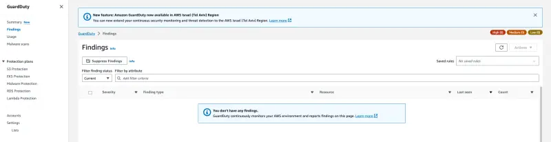

이 실습에서는 Amazon GuardDuty EKS Protection을 활성화할 것입니다. 이를 통해 클러스터를 보호하는 데 도움이 되는 EKS 감사 로그 모니터링 및 EKS 런타임 모니터링에 대한 위협 탐지 범위를 제공합니다.

EKS 감사 로그 모니터링은 Kubernetes 감사 로그를 사용하여 사용자, Kubernetes API를 사용하는 애플리케이션 및 잠재적으로 의심스러운 활동을 검색하는 컨트롤 플레인의 시간순 활동을 캡처합니다.

EKS 런타임 모니터링은 운영 체제 수준의 이벤트를 사용하여 Amazon EKS 노드와 컨테이너에서 잠재적인 위협을 탐지하는 데 도움을 줍니다.

AWS CLI를 사용하여 GuardDuty를 활성화해 보겠습니다:

```bash test=false
$ aws guardduty create-detector --enable --features '[{"Name" : "EKS_AUDIT_LOGS", "Status" : "ENABLED"}, {"Name" : "EKS_RUNTIME_MONITORING", "Status" : "ENABLED", "AdditionalConfiguration" : [{"Name" : "EKS_ADDON_MANAGEMENT", "Status" : "ENABLED"}]}]'
{
    "DetectorId": "1qaz0p2wsx9ol3edc8ik4rfv7ujm5tgb6yhn"
}
```

몇 분 후에 EKS 클러스터에서 `aws-guardduty-agent` Pod 배포를 확인합니다.

```bash test=false
$ kubectl -n amazon-guardduty get pods
NAME                        READY   STATUS    RESTARTS   AGE
aws-guardduty-agent-h7qg5   1/1     Running   0          58s
aws-guardduty-agent-hgbsg   1/1     Running   0          58s
aws-guardduty-agent-k7x2b   1/1     Running   0          58s
```

그런 다음 GuardDuty 콘솔의 **Findings** 섹션으로 이동합니다:

<ConsoleButton url="https://console.aws.amazon.com/guardduty/home#/findings?macros=current" service="guardduty" label="Open GuardDuty console"/>

아직 사용 가능한 결과가 없음을 확인할 수 있습니다.

