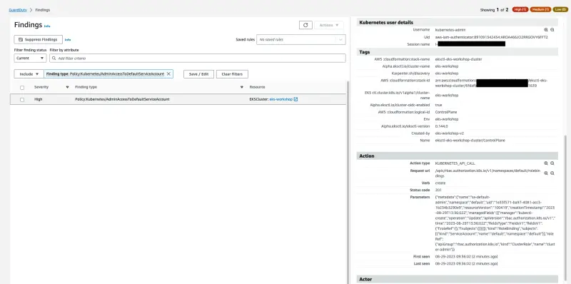

이번 실습에서는 서비스 계정에 클러스터 관리자 권한을 부여할 것입니다. 이는 모범 사례가 아닙니다. 이 서비스 계정을 사용하는 Pod가 의도치 않게 관리자 권한으로 실행될 수 있으며, 이러한 Pod에 `exec` 접근 권한이 있는 사용자가 권한을 상승시켜 클러스터에 대한 제한 없는 접근 권한을 얻을 수 있기 때문입니다.

이를 시뮬레이션하기 위해 `default` 네임스페이스의 `default` 서비스 계정에 `cluster-admin` 클러스터 롤을 바인딩할 것입니다.

```bash
$ kubectl -n default create rolebinding sa-default-admin --clusterrole cluster-admin --serviceaccount default:default
```

몇 분 내에 [GuardDuty Findings 콘솔](https://console.aws.amazon.com/guardduty/home#/findings)에서 `Policy:Kubernetes/AdminAccessToDefaultServiceAccount` 발견 항목을 확인할 수 있습니다. 발견 항목의 세부 정보, 조치 및 탐지 조사를 분석하는 데 시간을 할애하십시오.



다음 명령을 실행하여 문제가 되는 롤 바인딩을 삭제하십시오.

```bash
$ kubectl -n default delete rolebinding sa-default-admin
```