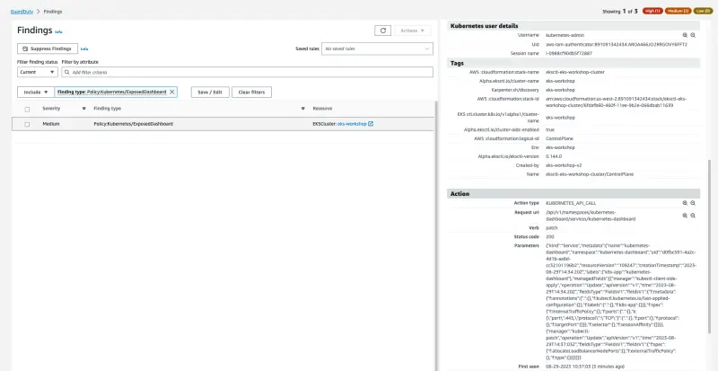

이 발견은 EKS 클러스터 대시보드가 로드 밸런서 서비스를 통해 인터넷에 노출되었음을 알려줍니다. 노출된 대시보드는 클러스터의 관리 인터페이스를 인터넷에서 공개적으로 접근할 수 있게 만들며, 악의적인 행위자가 존재할 수 있는 인증 및 접근 제어의 허점을 악용할 수 있게 합니다.

이를 시뮬레이션하기 위해 Kubernetes 대시보드 컴포넌트를 설치해야 합니다. [릴리스 노트](https://github.com/kubernetes/dashboard/releases/tag/v2.7.0)에 따르면 EKS 클러스터 vVAR::KUBERNETES_VERSION과 호환되는 최신 버전인 v2.7.0 버전의 대시보드를 사용할 것입니다.
그 후 서비스 타입 `LoadBalancer`를 사용하여 대시보드를 인터넷에 노출할 수 있으며, 이는 AWS 계정에 네트워크 로드 밸런서(NLB)를 생성할 것입니다.

다음 명령어를 실행하여 Kubernetes 대시보드 컴포넌트를 설치하세요. 이는 `kubernetes-dashboard`라는 새로운 네임스페이스를 생성하고, 모든 리소스가 여기에 배포될 것입니다.

```bash
$ kubectl apply -f https://raw.githubusercontent.com/kubernetes/dashboard/v2.7.0/aio/deploy/recommended.yaml
$ kubectl -n kubernetes-dashboard rollout status deployment/kubernetes-dashboard
$ kubectl -n kubernetes-dashboard get pods
NAME                                         READY   STATUS    RESTARTS   AGE
dashboard-metrics-scraper-64bcc67c9c-tt9vl   1/1     Running   0          66s
kubernetes-dashboard-5c8bd6b59-945zj         1/1     Running   0          66s
```

이제 새로 생성된 `kubernetes-dashboard` 서비스를 타입 `LoadBalancer`로 패치하겠습니다.

```bash
$ kubectl -n kubernetes-dashboard patch svc kubernetes-dashboard -p='{"spec": {"type": "LoadBalancer"}}'
```

몇 분 후, NLB가 생성되고 `kubernetes-dashboard` 서비스에 공개적으로 접근 가능한 주소가 표시될 것입니다.

```bash
$ kubectl -n kubernetes-dashboard get svc
NAME                        TYPE           CLUSTER-IP       EXTERNAL-IP                                                               PORT(S)         AGE
dashboard-metrics-scraper   ClusterIP      172.20.8.169     <none>                                                                    8000/TCP        3m
kubernetes-dashboard        LoadBalancer   172.20.218.132   ad0fbc5914a2c4d1baa8dcc32101196b-2094501166.us-west-2.elb.amazonaws.com   443:32762/TCP   3m1s
```

[GuardDuty Findings 콘솔](https://console.aws.amazon.com/guardduty/home#/findings)로 돌아가면, `Policy:Kubernetes/ExposedDashboard` 발견을 볼 수 있습니다. 다시 한번 발견 세부사항, 조치, 탐지 조사를 분석하는데 시간을 할애하세요.



다음 명령어를 실행하여 Kubernetes 대시보드 컴포넌트를 제거하세요:

```bash
$ kubectl delete -f https://raw.githubusercontent.com/kubernetes/dashboard/v2.7.0/aio/deploy/recommended.yaml
```