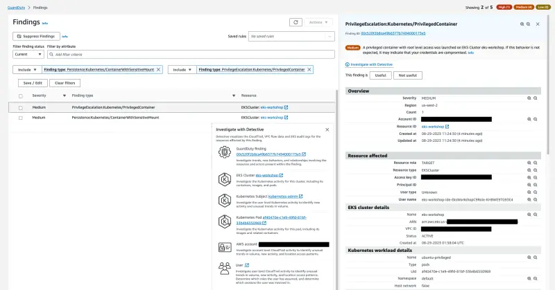

이 실습에서는 EKS 클러스터의 `default` 네임스페이스에서 루트 레벨 접근 권한을 가진 `privileged` 보안 컨텍스트로 컨테이너를 생성할 것입니다. 이 권한 있는 컨테이너는 호스트의 민감한 디렉토리도 볼륨으로 마운트되어 컨테이너 내에서 접근할 수 있습니다.

이 실습은 두 가지 다른 발견을 생성할 것입니다. 컨테이너가 권한 있는 권한으로 실행되었음을 나타내는 `PrivilegeEscalation:Kubernetes/PrivilegedContainer`와 민감한 외부 호스트 경로가 컨테이너 내부에 마운트되었음을 나타내는 `Persistence:Kubernetes/ContainerWithSensitiveMount`입니다.

발견을 시뮬레이션하기 위해 이미 특정 매개변수가 설정된 사전 구성된 매니페스트를 사용할 것입니다. `SecurityContext: privileged: true`와 함께 `/etc` 호스트 디렉토리를 `/host-etc` 파드 볼륨 마운트에 매핑하는 `volume` 및 `volumeMount` 옵션이 설정되어 있습니다.

```file
manifests/modules/security/Guardduty/mount/privileged-pod-example.yaml
```

다음 명령으로 위에 표시된 매니페스트를 적용하세요:

```bash
$ kubectl apply -f ~/environment/eks-workshop/modules/security/Guardduty/mount/privileged-pod-example.yaml
```

_이 파드는 `Completed` 상태에 도달할 때까지 한 번만 실행됩니다_

몇 분 내에 [GuardDuty Findings 콘솔](https://console.aws.amazon.com/guardduty/home#/findings)에서 `PrivilegeEscalation:Kubernetes/PrivilegedContainer`와 `Persistence:Kubernetes/ContainerWithSensitiveMount` 두 가지 발견을 확인할 수 있습니다.




다시 한 번 발견 세부 사항, 조치 및 탐지 조사를 분석하는 시간을 가지세요.

아래 명령을 실행하여 파드를 정리하세요:

```bash
$ kubectl delete -f ~/environment/eks-workshop/modules/security/Guardduty/mount/privileged-pod-example.yaml
```