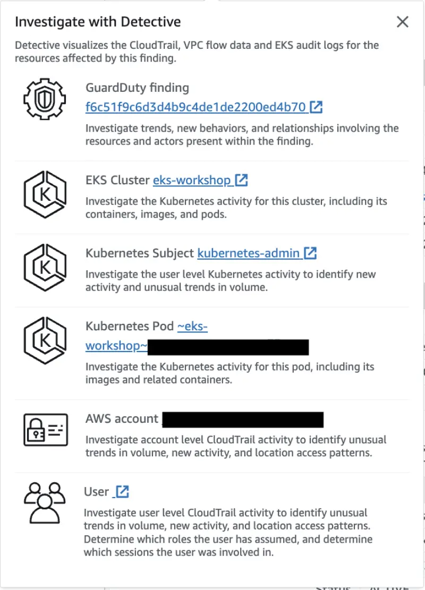

이 발견은 EKS 클러스터의 `kube-system` 네임스페이스 내 Pod에서 명령어가 실행되었음을 나타냅니다.

먼저 셸 환경에 접근할 수 있는 Pod를 `kube-system` 네임스페이스에서 실행해보겠습니다.

```bash
$ kubectl -n kube-system run nginx --image=nginx
$ kubectl wait --for=condition=ready pod nginx -n kube-system
$ kubectl -n kube-system get pod nginx
NAME    READY   STATUS    RESTARTS   AGE
nginx   1/1     Running   0          28s
```

그런 다음 아래 명령어를 실행하여 `Execution:Kubernetes/ExecInKubeSystemPod` 발견을 생성합니다:

```bash
$ kubectl -n kube-system exec nginx -- pwd
/
```

몇 분 내에 [GuardDuty Findings 콘솔](https://console.aws.amazon.com/guardduty/home#/findings)에서 `Execution:Kubernetes/ExecInKubeSystemPod` 발견을 확인할 수 있습니다.


발견을 클릭하면 화면 오른쪽에 탭이 열리며, 발견 세부 정보와 간단한 설명을 확인할 수 있습니다.


또한 Amazon Detective를 사용하여 발견을 조사할 수 있는 옵션도 제공됩니다.



발견의 **Action**을 확인하면 `KUBERNETES_API_CALL`과 관련되어 있음을 알 수 있습니다.


발견을 생성하는데 사용한 문제의 Pod를 정리합니다:

```bash
$ kubectl -n kube-system delete pod nginx
```