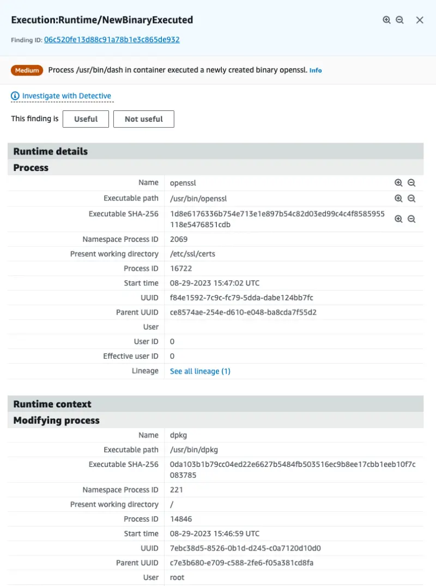
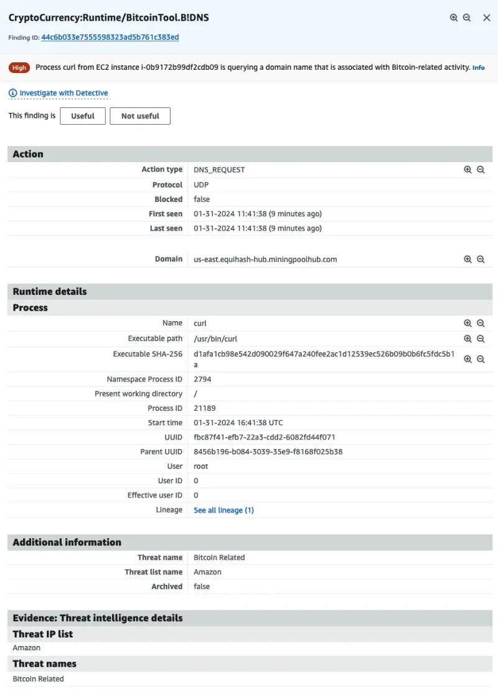

이 발견은 Pod 내부에서 컨테이너가 암호화폐 채굴을 시도했음을 나타냅니다.

이 발견을 시뮬레이션하기 위해 `default` 네임스페이스에서 `ubuntu` 이미지 Pod를 실행하고, 그곳에서 암호화폐 채굴 프로세스 다운로드를 시뮬레이션하는 몇 가지 명령어를 실행할 것입니다.

아래 명령어를 실행하여 Pod를 시작하세요:

```bash
$ kubectl run crypto -n other --image ubuntu --restart=Never --command -- sleep infinity
$ kubectl wait --for=condition=ready pod crypto -n other
```

이제 `kubectl exec`를 사용하여 Pod 내부에서 일련의 명령어를 실행할 수 있습니다. 먼저 `curl` 유틸리티를 설치해 보겠습니다:

```bash
$ kubectl exec crypto -n other -- bash -c 'apt update && apt install -y curl'
```

다음으로 암호화폐 채굴 프로세스를 다운로드하되 출력을 `/dev/null`로 보내보겠습니다:

```bash test=false
$ kubectl exec crypto -n other -- bash -c 'curl -s -o /dev/null http://us-east.equihash-hub.miningpoolhub.com:12026 || true && echo "Done!"'
```

이러한 명령어들은 [GuardDuty Findings 콘솔](https://console.aws.amazon.com/guardduty/home#/findings)에서 세 가지 다른 발견을 트리거할 것입니다.

첫 번째는 `Execution:Runtime/NewBinaryExecuted`로, APT 도구를 통해 설치된 `curl` 패키지와 관련이 있습니다.



이 발견의 세부 사항을 자세히 살펴보세요. GuardDuty 런타임 모니터링과 관련이 있기 때문에 런타임, 컨텍스트 및 프로세스에 대한 구체적인 정보를 보여줍니다.

두 번째와 세 번째는 `CryptoCurrency:Runtime/BitcoinTool.B!DNS` 발견과 관련이 있습니다. 발견 세부 사항에서 이번에는 다른 정보를 제공하는데, `DNS_REQUEST` 작업과 **위협 인텔리전스 증거**를 보여주고 있습니다.

