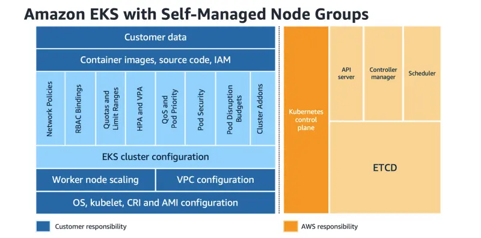

AWS에서 보안은 최우선 순위이며, AWS와 고객 간의 공동 책임입니다. Amazon EKS와 같은 관리형 서비스를 사용할 때, AWS는 클라우드 "자체"의 보안을 책임지고, 고객인 귀하는 클라우드 "내부"의 보안을 책임집니다.

이 장에서는 Amazon EKS와 관련된 다양한 보안 측면을 살펴보겠습니다. EKS 보안에 대해 자세히 알아보려면 [EKS 모범 사례 가이드](https://aws.github.io/aws-eks-best-practices/security/docs/)를 참조하십시오.

---

