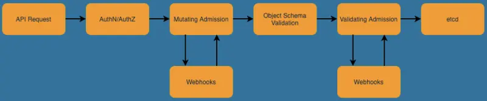
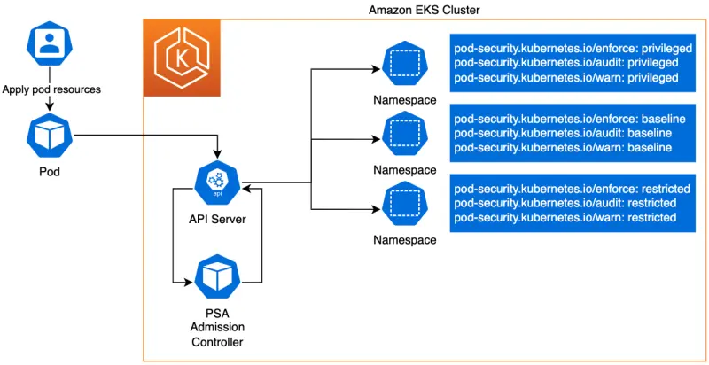

::required-time

:::tip 시작하기 전에
이 섹션을 위해 환경을 준비하세요:

```bash
$ prepare-environment security/pss-psa
```

:::

Kubernetes를 안전하게 도입하는 것에는 클러스터에 대한 원치 않는 변경을 방지하는 것이 포함됩니다. 원치 않는 변경은 클러스터 운영, 워크로드 동작을 방해하고 심지어 전체 환경의 무결성을 손상시킬 수 있습니다. 올바른 보안 구성이 없는 Pod를 도입하는 것은 원치 않는 클러스터 변경의 한 예입니다. Pod 보안을 제어하기 위해 Kubernetes는 [Pod Security Policy / PSP](https://kubernetes.io/docs/concepts/policy/pod-security-policy/) 리소스를 제공했습니다. PSP는 Pod가 클러스터에서 생성되거나 업데이트되기 전에 충족해야 하는 일련의 보안 설정을 지정합니다. 그러나 Kubernetes 버전 1.21부터 PSP는 더 이상 사용되지 않으며, Kubernetes 버전 1.25에서 제거될 예정입니다.

Kubernetes에서 PSP는 [Pod Security Admission / PSA](https://kubernetes.io/docs/concepts/security/pod-security-admission/)로 대체되고 있습니다. PSA는 [Pod Security Standards / PSS](https://kubernetes.io/docs/concepts/security/pod-security-standards/)에 설명된 보안 제어를 구현하는 내장 승인 컨트롤러입니다. Kubernetes 버전 1.23부터 PSA와 PSS는 모두 베타 기능 상태에 도달했으며, Amazon Elastic Kubernetes Service(EKS)에서 기본적으로 활성화되어 있습니다.

### Pod Security Standards (PSS)와 Pod Security Admission (PSA)

Kubernetes 문서에 따르면, PSS는 "보안 스펙트럼을 광범위하게 다루는 세 가지 다른 정책을 정의합니다. 이 정책들은 누적적이며 매우 허용적인 것부터 매우 제한적인 것까지 범위를 가집니다."

정책 수준은 다음과 같이 정의됩니다:

* **Privileged:** 제한 없는 (안전하지 않은) 정책으로, 가능한 가장 넓은 수준의 권한을 제공합니다. 이 정책은 알려진 권한 상승을 허용합니다. 이는 정책이 없는 상태입니다. 로깅 에이전트, CNI, 스토리지 드라이버 및 기타 시스템 전체 애플리케이션과 같이 권한이 필요한 애플리케이션에 적합합니다.
* **Baseline:** 알려진 권한 상승을 방지하는 최소한의 제한적 정책입니다. 기본 (최소한으로 지정된) Pod 구성을 허용합니다. 기준 정책은 hostNetwork, hostPID, hostIPC, hostPath, hostPort 사용을 금지하고, Linux 기능을 추가할 수 없게 하며, 기타 여러 제한 사항을 포함합니다.
* **Restricted:** 현재의 Pod 강화 모범 사례를 따르는 매우 제한적인 정책입니다. 이 정책은 기준 정책을 상속하고 root로 실행하거나 root 그룹으로 실행할 수 없는 등의 추가 제한을 둡니다. 제한된 정책은 애플리케이션의 기능에 영향을 줄 수 있습니다. 주로 보안이 중요한 애플리케이션을 실행하는 데 사용됩니다.

PSA 승인 컨트롤러는 아래 나열된 세 가지 작동 모드를 통해 PSS 정책에 설명된 제어를 구현합니다.

* **enforce:** 정책 위반 시 Pod가 거부됩니다.
* **audit:** 정책 위반 시 [감사 로그](https://kubernetes.io/docs/tasks/debug/debug-cluster/audit/)에 기록된 이벤트에 감사 주석이 추가되지만, 그 외에는 허용됩니다.
* **warn:** 정책 위반 시 사용자에게 경고가 표시되지만, 그 외에는 허용됩니다.

### 내장 Pod Security 승인 시행

Kubernetes 버전 1.23부터 PodSecurity [기능 게이트](https://kubernetes.io/docs/reference/command-line-tools-reference/feature-gates/)가 Amazon EKS에서 기본적으로 활성화됩니다. 업스트림 Kubernetes 버전 1.23의 기본 [PSS 및 PSA 설정](https://kubernetes.io/docs/tasks/configure-pod-container/enforce-standards-admission-controller/#configure-the-admission-controller)도 Amazon EKS에서 사용되며, 아래와 같이 나열됩니다.

> _PodSecurity 기능 게이트는 Kubernetes v1.23 및 v1.24에서 베타 버전(apiVersion: v1beta1)이며, Kubernetes v1.25에서 정식 출시(GA, apiVersion: v1)되었습니다._

```yaml
defaults:
  enforce: "privileged"
  enforce-version: "latest"
  audit: "privileged"
  audit-version: "latest"
  warn: "privileged"
  warn-version: "latest"
exemptions:
  # Array of authenticated usernames to exempt.
  usernames: []
  # Array of runtime class names to exempt.
  runtimeClasses: []
  # Array of namespaces to exempt.
  namespaces: []
```

위의 설정은 다음과 같은 클러스터 전체 시나리오를 구성합니다:

- Kubernetes API 서버 시작 시 PSA 예외가 구성되지 않습니다.
- Privileged PSS 프로필이 모든 PSA 모드에 대해 기본적으로 구성되며, 최신 버전으로 설정됩니다.

### 네임스페이스를 위한 Pod Security Admission 레이블

위의 기본 구성을 고려할 때, PSA와 PSS가 제공하는 Pod 보안을 네임스페이스에 적용하려면 Kubernetes 네임스페이스 수준에서 특정 PSS 프로필과 PSA 모드를 구성해야 합니다. Pod 보안에 사용할 승인 제어 모드를 정의하도록 네임스페이스를 구성할 수 있습니다. [Kubernetes 레이블](https://kubernetes.io/docs/concepts/overview/working-with-objects/labels)을 사용하여 주어진 네임스페이스의 Pod에 사용할 미리 정의된 PSS 수준을 선택할 수 있습니다. 선택한 레이블은 잠재적인 위반이 감지될 때 PSA가 취할 조치를 정의합니다. 아래에서 볼 수 있듯이, 모든 모드 또는 일부 모드를 구성하거나 심지어 다른 모드에 대해 다른 수준을 설정할 수도 있습니다. 각 모드에 대해 정책을 결정하는 두 가지 가능한 레이블이 있습니다.

```text
# The per-mode level label indicates which policy level to apply for the mode.
#
# MODE must be one of `enforce`, `audit`, or `warn`.
# LEVEL must be one of `privileged`, `baseline`, or `restricted`.
*pod-security.kubernetes.io/<MODE>*: <LEVEL>

# Optional: per-mode version label that can be used to pin the policy to the
# version that shipped with a given Kubernetes minor version (for example v1.24).
#
# MODE must be one of `enforce`, `audit`, or `warn`.
# VERSION must be a valid Kubernetes minor version, or `latest`.
*pod-security.kubernetes.io/<MODE>-version*: <VERSION>
```

아래는 테스트에 사용할 수 있는 PSA 및 PSS 네임스페이스 구성의 예입니다. 선택적인 PSA 모드-버전 레이블은 포함하지 않았습니다. 기본적으로 구성된 클러스터 전체 설정인 latest를 사용했습니다. 아래에서 원하는 레이블의 주석을 해제하여 각 네임스페이스에 필요한 PSA 모드와 PSS 프로필을 활성화할 수 있습니다.

```yaml
apiVersion: v1
kind: Namespace
metadata:
  name: psa-pss-test-ns
  labels:
    # pod-security.kubernetes.io/enforce: privileged
    # pod-security.kubernetes.io/audit: privileged
    # pod-security.kubernetes.io/warn: privileged

    # pod-security.kubernetes.io/enforce: baseline
    # pod-security.kubernetes.io/audit: baseline
    # pod-security.kubernetes.io/warn: baseline

    # pod-security.kubernetes.io/enforce: restricted
    # pod-security.kubernetes.io/audit: restricted
    # pod-security.kubernetes.io/warn: restricted
```

### 검증 승인 컨트롤러

Kubernetes에서 승인 컨트롤러는 Kubernetes API 서버로의 요청을 etcd에 지속되기 전에 가로채는 코드 조각입니다. 승인 컨트롤러는 변경(mutating), 검증(validating) 또는 둘 다의 유형일 수 있습니다. PSA의 구현은 검증 승인 컨트롤러이며, 지정된 PSS에 대한 적합성을 위해 들어오는 Pod 사양 요청을 확인합니다.

아래 흐름에서 [변경 및 검증 동적 승인 컨트롤러](https://kubernetes.io/docs/reference/access-authn-authz/extensible-admission-controllers/), 일명 승인 웹훅은 웹훅을 통해 Kubernetes API 서버 요청 흐름에 통합됩니다. 이러한 웹훅은 특정 유형의 API 서버 요청에 응답하도록 구성된 서비스를 호출합니다. 예를 들어, 웹훅을 사용하여 동적 승인 컨트롤러를 구성하여 Pod의 컨테이너가 비root 사용자로 실행되고 있는지 또는 컨테이너가 신뢰할 수 있는 레지스트리에서 소싱되었는지 검증할 수 있습니다.



### PSA 및 PSS 사용

PSA는 PSS에 설명된 정책을 시행하며, PSS 정책은 일련의 Pod 보안 프로필을 정의합니다. 아래 다이어그램에서는 PSA와 PSS가 Pod 및 네임스페이스와 함께 작동하여 Pod 보안 프로필을 정의하고 해당 프로필을 기반으로 승인 제어를 적용하는 방법을 설명합니다. 아래 다이어그램에서 볼 수 있듯이, PSA 시행 모드와 PSS 정책은 대상 네임스페이스의 레이블로 정의됩니다.


